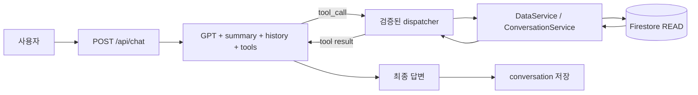
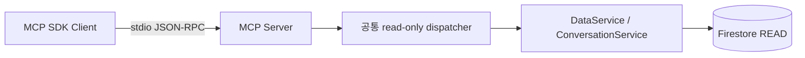

# FitLog AI

날짜별 운동 기록을 저장하고, 실제 기록에서 계산한 통계를 로컬 AI 분석 및 데이터 기반 GPT 채팅에 사용하는 개인용 개발 프로젝트입니다. 건강 진단이나 운동 처방을 제공하지 않습니다.

## 주요 기능
운동 요약, 최근 7개 기록, 날짜 조회, 기록 추가, 7일·30일·전체 운동시간 그래프와 수동 AI 분석을 제공합니다. 휴식일의 0분도 통계와 그래프에 포함합니다.

## 구조와 기술
브라우저 → FastAPI → Firestore → Python 통계 → FACTS → Ollama → 응답 검증 → AI 또는 규칙 기반 피드백 순서입니다.
Python 3.10 이상, FastAPI, Uvicorn, Firebase Admin SDK, httpx, Pydantic과 HTML/CSS/Vanilla JavaScript를 사용합니다. 그래프는 Canvas로 직접 그리며 CDN이나 빌드 시스템은 없습니다.

## 파일 구조
```text
FitLog-AI/
├── backend/
│   ├── main.py
│   ├── firebase.py
│   ├── workout_analysis.py
│   ├── workout_facts.py
│   ├── ai_feedback.py
│   ├── test_*.py
│   └── data/
├── frontend/
│   ├── index.html
│   ├── styles.css
│   ├── app.js
│   ├── chart.js
│   └── ai.js
├── requirements.txt
├── .env.example
└── .gitignore
```

## 설치
Windows PowerShell에서 프로젝트 루트로 이동합니다. 기존 가상환경이 있으면 재생성하지 않습니다.
```powershell
cd C:\Users\userr\Desktop\FitLog-AI
python -m venv .venv
.\.venv\Scripts\python.exe -m pip install -r requirements.txt
```
선택적으로 `.\.venv\Scripts\Activate.ps1`로 활성화할 수 있습니다. 실행 정책으로 활성화가 제한되어도 아래처럼 Python 경로를 직접 사용하면 됩니다. requirements.txt는 기존 환경의 고정 버전 목록입니다. STEP 12 채팅은 설치된 OpenAI Python SDK로 코디세이의 OpenAI-compatible API를 호출합니다. 공식 OpenAI endpoint는 사용하지 않습니다.

## Firebase 준비
기존 프로젝트의 Firestore와 서비스 계정을 사용합니다. 키는 `backend/firebase-service-account.json`에 로컬로 두며 내용은 출력하거나 Git에 추가하지 않습니다. 브라우저는 키를 사용하지 않고 FastAPI만 호출합니다. 기존 데이터가 있는 환경에서 `upload_sample_data.py`를 재실행하지 마세요. 이 스크립트는 동일 날짜의 샘플 문서를 덮어쓸 수 있습니다.

## Ollama 준비
이미 설치된 Ollama 서비스와 `hermes3:8b`를 사용합니다.
```powershell
ollama --version
ollama list
Invoke-RestMethod http://127.0.0.1:11434/api/version
```
기본 주소는 `http://127.0.0.1:11434`입니다. 선택 설정은 프로세스 환경변수 `OLLAMA_BASE_URL`, `OLLAMA_MODEL`이며 loopback HTTP 주소만 허용합니다. `.env.example`은 참고 파일이고 `.env`를 자동으로 읽지 않습니다. 모델 다운로드는 실행 과정에서 자동으로 하지 않습니다.

## 실행
각 명령을 별도 터미널에서 프로젝트 루트 기준으로 실행합니다.
```powershell
.\.venv\Scripts\python.exe -m uvicorn backend.main:app --host 127.0.0.1 --port 8000
```
```powershell
.\.venv\Scripts\python.exe -m http.server 5500 --bind 127.0.0.1 --directory frontend
```
대시보드: http://127.0.0.1:5500 / API 문서: http://127.0.0.1:8000/docs
종료는 해당 터미널에서 Ctrl+C입니다. CORS는 localhost와 127.0.0.1의 5500 포트만 허용하며 GET·POST·PUT·DELETE를 지원합니다.

## 사용 방법
날짜·운동시간·메모를 입력하여 저장합니다. 같은 날짜는 덮어쓰지 않고 오류로 안내합니다. 저장 후 요약·최근 기록·그래프가 자동 갱신됩니다. 그래프 범위는 마지막 기록 날짜 기준입니다. 마우스·터치 또는 초점을 맞춘 뒤 좌우 방향키로 상세 기록을 확인합니다. AI 분석은 버튼을 눌러야 실행되며 새 기록 저장 후 다시 분석해야 합니다.

## API
| 요청 | 기능 |
|---|---|
| GET / | 서버 안내 |
| GET /health | 서버 생존 확인(외부 서비스 검사는 아님) |
| GET /workouts | 날짜 오름차순 전체 기록 |
| GET /workouts/summary | 전체 기록 수·기간·평균·최소·최대 |
| GET /workouts/{date} | 날짜 조회, 없으면 404 |
| POST /workouts | 신규 기록, 성공 201·중복 409·입력 오류 422 |
| GET /workouts/ai-analysis | 최근 30일 통계와 피드백, 빈 기록 404 |

POST 본문은 `{"date":"YYYY-MM-DD","value":60,"memo":"웨이트"}`입니다. 날짜는 실제 날짜, 운동시간은 0~1440의 정수, 메모는 앞뒤 공백 제거 후 최대 500자입니다. 저장은 날짜 ID에 create를 사용하여 기존 문서를 덮어쓰지 않습니다. 저장 실패 시 기록을 조회한 뒤 재시도하세요.

## AI 분석과 안전장치
최신 기록일 포함 30일의 통계는 Python이 계산합니다. 기록 없는 날짜는 휴식일로 간주하지 않습니다. 원문 메모나 인증정보는 모델에 보내지 않고 확정된 FACTS만 전달합니다. 모델은 허용된 문장을 네 필드(summary, strength, improvement, next_workout)에 선택·정리합니다.
JSON 구조, 숫자, 외국어, 금지 판단 및 필드별 허용 문장을 검사합니다. 연결·시간 초과·모델·JSON·내용 검증 실패 시 같은 형태의 안전한 규칙 기반 응답으로 전환합니다. 화면에는 로컬 AI 분석 또는 안전한 규칙 기반 분석을 표시합니다. 연결 시간 제한 5초, 읽기 제한 45초이며 자동 재시도는 없습니다.

## 보안
`.env`, 가상환경과 Firebase 서비스 계정 키는 Git에서 제외합니다. 키·인증 헤더·전체 예외 객체는 출력하지 않습니다. GPT 채팅은 서버 환경변수의 코디세이 virtual key를 사용하며 키를 프론트엔드에 전달하지 않습니다. 프론트엔드에는 관리자 인증정보를 넣지 않습니다. 이 앱은 사용자 인증이 없는 로컬 개발용이며 외부 네트워크에 공개하지 않습니다.

## 테스트
```powershell
.\.venv\Scripts\python.exe -m unittest discover -s backend -p "test_*.py" -v
```
저장·중복·입력 검증·오류·CORS·통계·AI 검증과 fallback을 모의 저장소/HTTP로 검증합니다. 실제 Firestore 데이터는 테스트에서 수정하지 않습니다.

## 한계
활동은 메모 키워드로 단순 분류합니다. 강도·건강·운동 효과를 판단하지 않습니다. 허용 문장 검증이 엄격하여 정상적인 바꿔쓰기라도 규칙 기반 응답이 선택될 수 있습니다. 로컬 모델 속도는 PC 환경에 따라 다릅니다. Canvas의 전체 기록은 날짜별 조회로도 확인할 수 있습니다.

## 향후 개선
사용자 인증과 권한, 수정·삭제 시 확인 절차, 더 다양한 기록 분류 및 검증된 AI 표현을 별도 단계에서 검토할 수 있습니다.

## STEP 11: 미션08 Backend 기반

기존 대시보드와 `/workouts` API는 계속 **workouts** 컬렉션을 사용합니다. 새 `/api/data` API는 **data** 컬렉션만 사용합니다. 조회 시 workouts를 섞거나 자동 복제하지 않습니다. 따라서 data가 비어 있으면 목록은 `[]`, summary의 count는 0입니다. 기존 121개 기록이 새 API에 즉시 보이는 것은 아닙니다. 두 API의 저장소가 독립적이므로 새 API로 추가·수정·삭제해도 기존 대시보드 데이터는 바뀌지 않습니다.

### 역할 분리

```text
backend/
├── main.py                      # 기존 API 유지, 새 라우터/CORS/오류 처리 등록
├── routers/
│   ├── data.py                  # HTTP 요청/응답과 의존성 주입
│   └── conversations.py
├── schemas/
│   ├── data.py                  # 기존/신규 API 공통 운동 입력 검증
│   └── conversation.py          # 대화 입력/응답 검증
├── services/
│   ├── data_service.py          # 날짜 정책, 정렬, Python 요약
│   ├── conversation_service.py  # 대화 ID·시간·목록 정책
│   └── repository.py            # Firestore 접근과 안전한 오류 변환
├── migrate_workouts.py          # 명시적으로 실행하는 복사 도구
└── test_mission_api.py           # 네트워크 없는 모의 저장소 테스트
```

라우터는 HTTP와 Swagger, 서비스는 업무 규칙, 저장소는 Firestore 접근을 담당합니다. 서비스는 저장소 인터페이스를 받아 STEP 12 채팅에서도 재사용할 수 있습니다. 테스트에서는 가짜 저장소를 주입합니다. Pydantic은 요청을 저장 전에 검증하고 동일한 규칙을 Swagger에 노출합니다. 숫자 문자열·실수·불리언은 운동시간으로 받지 않으며 추가 필드도 거부합니다.

### 데이터 CRUD

| 요청 | 성공 | 정책 |
|---|---|---|
| POST /api/data | 201 | date/value/memo 입력, 날짜 ID create, 중복 409 |
| GET /api/data | 200 | id/date/value/memo 배열, 날짜 오름차순 |
| PUT /api/data/{id} | 200 | 세 필드 전체 입력, 없는 ID 404 |
| DELETE /api/data/{id} | 204 | 본문 없음, 없는 ID 404 |
| GET /api/data/summary | 200 | 전체 기간·수치와 최근 주간 추세 |

ID는 `YYYY-MM-DD`입니다. PUT의 본문 date와 URL id가 다르면 422이며 날짜 이동은 지원하지 않습니다. 날짜는 실제 날짜, value는 정수 0~1440분, memo는 문자열·공백 제거 후 최대 500자입니다. 문서 ID가 id를 제공하고 Firestore 데이터에는 date/value/memo를 저장합니다. update는 존재하는 문서에만 적용하며 삭제는 트랜잭션으로 존재 확인과 삭제를 묶습니다. 저장소 장애는 내부 예외를 노출하지 않는 503으로 반환합니다.

summary의 `period.start/end`, `count`, `metrics.total/average/max/min`은 data 전체 기준입니다. 평균은 휴식일을 포함한 기록일 기준, 소수 둘째 자리까지 반올림합니다. 빈 데이터는 기간·평균·최소·최대가 null, count·total은 0입니다.

`trend`는 기존 `analyze_workouts`를 재사용하여 최신 기록일 포함 최근 7일과 그 직전 7일의 총 운동시간을 비교합니다. `direction`은 increase/decrease/stable, 빈 데이터는 no_data입니다. `absolute_change`는 최근 합계−이전 합계로 음수도 가능하며, `percent_change`는 이전 합계가 0이면 null입니다. 두 기간의 날짜·합계·실제 기록 개수를 함께 반환합니다. 누락일을 휴식일로 채우지 않으므로 기록 개수가 적으면 해석에 주의합니다. 표현할 수 없는 서기 1년 이전의 기간 경계도 null로 표시합니다. AI 호출은 없습니다.

### 기존 기록 복사: 이번 단계에서는 실행하지 않음

새 CRUD를 시작하는 데 migration은 필수가 아닙니다. 기존 workouts 기록도 과제용 data에 표시하려면 추후 명시적인 복사가 필요합니다. 도구는 먼저 원본 전체를 검증하고, 기존 data 문서는 값이 달라도 건너뜁니다. workouts를 수정하지 않으며 create만 사용하여 동시 생성도 덮어쓰지 않습니다.

별도로 이전하기로 결정한 경우에만 아래 순서로 실행합니다. 기본 실행과 `--dry-run`은 읽기만 합니다.
```powershell
.\.venv\Scripts\python.exe -m backend.migrate_workouts --dry-run
# 결과를 검토하고 실제 복사를 결정한 경우에만:
.\.venv\Scripts\python.exe -m backend.migrate_workouts --apply
```
복사는 전체 원자적 작업이 아닙니다. 중간 장애로 일부 생성될 수 있지만 재실행 시 이미 있는 문서는 건너뜁니다. 일회성 복사이며 이후 양쪽 컬렉션을 자동 동기화하지 않습니다.

### 대화 저장

| 요청 | 성공 | 내용 |
|---|---|---|
| POST /api/conversations | 201 | title/messages 저장, 전체 대화 반환 |
| GET /api/conversations | 200 | 최신 updated_at 순, 본문 대신 message_count 포함 |
| GET /api/conversations/{id} | 200 | messages를 포함한 상세 대화 |
| DELETE /api/conversations/{id} | 204 | 본문 없음 |

conversations 문서는 `id`, `title`, `messages`, `created_at`, `updated_at`을 저장합니다. 서버가 32자리 소문자 UUID hex ID와 UTC 시간을 생성하며 최초 두 시간은 같습니다. 입력 title은 공백 제거 후 1~100자, messages는 1~50개입니다. 메시지 role은 user/assistant만 허용하며 content는 공백 제거 후 1~4000자입니다. POST /api/conversations는 대화 전체 스냅샷 저장입니다. STEP 12의 POST /api/chat은 기존 대화에 새 질문과 답변을 자동 추가합니다. 없는 유효 ID는 404, 잘못된 ID 형식과 요청은 422입니다. Function Calling과 MCP는 아직 구현하지 않았습니다.

### 패키지와 검증

기존 requirements.txt와 가상환경에 fastapi 0.141.1, uvicorn 0.54.0, firebase-admin 7.7.0, openai 3.19.2, python-dotenv 1.2.3이 있습니다. STEP 11~12에서 설치·업그레이드는 하지 않았습니다. STEP 12 채팅에서 OpenAI SDK를 사용합니다.

전체 테스트는 위의 unittest discover 명령으로 실행합니다. 신규 테스트는 CRUD, 날짜 불일치, 중복, 빈 summary, 추세와 0분모, 대화 검증, 저장소 실패, CORS, Swagger 및 모의 migration을 검증합니다. 실제 Firestore 쓰기는 하지 않습니다. Swagger는 `/docs`, 기계 판독 스키마는 `/openapi.json`에서 확인합니다. Swagger의 POST/PUT/DELETE 실행은 실제 저장 작업이므로 기존 데이터에 시험하지 마세요.

STEP 11.5에서 workouts의 121개를 data로 복사하고 전체 일치를 검증했습니다. 이후 두 컬렉션은 자동 동기화되지 않습니다. conversations는 첫 저장 시 생성됩니다. 이 API도 인증 없는 로컬 개발용이며 배포·계정별 권한은 후속 작업입니다.


## STEP 12: 데이터 기반 GPT 채팅

본 프로젝트는 교육과정에서 제공된 OpenAI-compatible API를 통해 GPT 모델을 호출한다.

`POST /api/chat` → `DataService.summary()` 직접 호출 → system prompt에 요약 주입 → 코디세이 GPT 호출 → conversations 자동 저장 순서입니다. 백엔드가 자기 자신의 summary URL을 HTTP로 호출하지 않습니다. 기존 Ollama `/workouts/ai-analysis`는 유지하며 STEP 13에서 채팅 UI를 추가했습니다.

### 설정

실행할 서버 프로세스에 다음 환경변수를 설정합니다. 실제 키를 명령 출력·README·Git·스크린샷에 노출하지 마세요. 코디세이 콘솔에서 발급한 virtual key를 Windows 환경변수로 설정한 후 새 터미널/서버를 시작합니다. `.env`는 자동 로딩하지 않으며 `.env.example`만 공개 예시입니다.

- `OPENAI_API_KEY`: 코디세이 virtual key, 필수. 예시 파일에는 빈 값만 둡니다.
- `OPENAI_BASE_URL`: 기본 `https://copa.codyssey.kr/v1`
- `OPENAI_MODEL`: 기본 `gpt-5-mini`

다른 호스트나 모델은 현재 지원하지 않습니다. SDK `OpenAI(api_key=..., base_url=...)`의 `chat.completions.create`를 사용하며 실제 경로는 `https://copa.codyssey.kr/v1/chat/completions`입니다. Responses API나 공식 OpenAI endpoint를 사용하지 않습니다. GPT 사용 시 교육과정 API의 토큰이 차감될 수 있습니다. 토큰 잔액 API는 조회하지 않습니다.

### 요청과 응답

```json
{"message":"최근 운동 추세를 간단히 알려줘.","conversation_id":null}
```

message는 공백 제거 후 1~4000자 문자열입니다. conversation_id는 생략/null이면 새 대화, 있으면 기존 대화 ID입니다. 유효한 형식의 없는 ID는 404, 형식 오류나 빈 질문은 422입니다.

성공 응답은 `conversation_id`, `answer`, `provider: codyssey-openai-compatible`, `model: gpt-5-mini`와 해당 요청에 사용한 `summary`를 반환합니다. Swagger `/docs`에 요청·응답 스키마가 있습니다.

### Context Injection과 저장

system prompt에는 period, count, metrics(total/average/max/min), trend(최근/이전 7일 합계, 변화량·변화율·방향·기록 개수)를 JSON으로 주입합니다. 초기 system prompt에는 raw 운동 문서와 원문 메모를 넣지 않습니다. STEP 15에서는 필요한 경우 읽기 전용 tool 결과(제한된 최근 기록과 메모 또는 지정한 대화)가 추가로 전달됩니다. 확정된 통계를 바꾸거나 없는 날짜를 추측하지 말고, 알 수 없는 정보는 알 수 없다고 답하며, 사실과 일반 설명을 구분하도록 지시합니다. 의료 진단을 금지하고 한국어로 짧게 답하도록 합니다. 프롬프트는 완벽한 사실 검증을 보장하지 않으므로 답변은 실제 요약과 대조해야 합니다.

최근 대화 10개 메시지와 현재 질문만 전송합니다. 저장된 history는 자르지 않으며 전체 50개 메시지 한도에 도달하면 GPT를 호출하기 전에 새 대화를 요청합니다. 성공 시 user/assistant 메시지 두 개를 저장합니다. 새 title은 첫 질문 앞 100자로 만들며 추가 GPT 호출은 없습니다. 기존 대화는 created_at/title을 유지하고 updated_at을 갱신합니다. 저장 트랜잭션에서 변경 여부를 확인해 동시 요청의 기록 유실을 막습니다. GPT 호출은 트랜잭션 밖에서 수행합니다. STEP 15의 tool round에서는 후속 GPT 요청이 발생할 수 있습니다.

### 비용과 오류

STEP 12.5의 최소 요청은 `model`과 `messages`였습니다. STEP 15 채팅은 여기에 표준 `tools`를 추가합니다. 선택 옵션 `max_completion_tokens`와 `reasoning_effort`는 제거했습니다. 어느 옵션이 이전 실패를 일으켰는지는 개별 실호출로 확정하지 않았습니다. 간결한 답변은 system prompt로 지시하며 API 수준의 출력 토큰 상한은 현재 없습니다. 자동 재시도 0회, 네트워크 timeout 60초, 리다이렉트/환경 프록시 미사용입니다. 잘린 응답·빈 응답·4000자 초과 답변은 502로 처리하고 저장하지 않습니다. 이 길이 검증은 이미 사용된 토큰을 제한하거나 환불하지 않습니다.

| 상황 | HTTP |
|---|---|
| 키 누락·주소/모델 설정 오류 | 503 |
| 대화 없음 | 404 |
| 인증·권한·연결·기타 API 오류 | 502 |
| 사용 한도·rate limit | 429 |
| timeout | 504 |
| GPT 성공 후 대화 저장 실패 또는 동시 변경 | 503 |

오류 객체, 키, 헤더를 출력하지 않습니다. 저장 실패여도 GPT 사용 토큰은 이미 차감될 수 있으므로 대화 목록을 확인하고 자동 재시도하지 마세요. 네트워크 단절 직전 저장 성공 여부가 불명확할 수도 있습니다. GPT 오류 시 Ollama로 자동 전환하거나 추가 호출하지 않습니다.

### 테스트와 보안

전체 unittest 명령은 기존과 같습니다. `backend/test_chat.py`는 가짜 저장소와 SDK MockTransport로 새 대화, 이어쓰기, summary 주입, raw 데이터 제외, history 제한, 오류, 동시 저장, 정확한 요청 URL과 재시도 금지를 검증합니다. 자동 테스트는 실제 Firestore나 GPT에 쓰기/호출하지 않습니다. 실제 E2E는 별도 승인된 질문 1회로 수행하며 conversations에 대화 하나를 남길 수 있습니다. `.env`·`.env.*`·서비스 계정 키는 `.gitignore`로 보호하고 실제 키를 소스에 넣지 않습니다.

오류 진단 로그는 upstream HTTP 상태, SDK 예외 클래스, 오류 type/code와 정제된 message만 기록합니다. 실제 키·인증 헤더·비공개 키 표현은 제거하며 전체 예외/응답/헤더는 출력하지 않습니다.


## STEP 13: 프론트엔드 통합

주 화면은 data 기반 요약·7/30일/전체 그래프·GPT 채팅·이전 대화·CRUD 관리입니다. 기존 workouts 화면과 로컬 분석은 아래에 보존합니다. 새 기록 관리의 변경은 data와 GPT 요약에만 반영되며 workouts와 자동 동기화되지 않습니다. GPT는 전송 버튼을 눌러야 호출됩니다. 이전 대화 불러오기와 새 대화 초기화는 GPT를 호출하지 않습니다.

`frontend/config.js`의 공개 `API_BASE_URL`만 바꾸면 백엔드 주소를 변경할 수 있습니다(배포 시 백엔드 CORS도 별도 설정 필요). 프론트엔드에 인증키를 넣지 않습니다. 상세 실행·검증은 [frontend README](frontend/README.md)를 참고하세요. `node --test tests/frontend.test.cjs`로 네트워크 없는 화면 로직 회귀 테스트를 실행합니다.


## STEP 14 Bonus 2: Insight / UX Enhancement

`GET /api/data/summary`는 기존 period/count/metrics/trend를 유지하고 `insights`를 추가합니다. 전체 기록 기간 기준으로 Python에서 운동일(value > 0), 휴식일(value = 0), 운동일 평균(소수 둘째 자리), 최장 연속 운동일을 계산합니다. 날짜 누락과 휴식일은 연속 운동을 끊습니다. 운동일이 없으면 평균은 null, 최장 연속일은 0입니다. 기존 분석 함수는 최근 30일 전용이므로 전체 기간 계산을 무리하게 합치지 않았습니다.

- **추가 인사이트**: 요약 카드에 4개 지표를 표시하며 CRUD 성공 후 함께 갱신합니다.
- **운동 그래프**: 기존 Canvas 7일/30일/전체 범위를 유지하며 테마 전환 시 축·글자·선·선택점을 다시 그립니다.
- **CSV 다운로드**: frontend/export.js가 현재 불러온 전체 data 기록을 재사용합니다. 페이지나 그래프 선택 범위와 무관하게 날짜 오름차순의 date,value,memo만 포함합니다. UTF-8 BOM, CRLF 행 구분, 큰따옴표 필드 감싸기와 따옴표 이중화로 쉼표·줄바꿈·한국어를 보존합니다. 스프레드시트 수식으로 해석될 수 있는 셀에는 작은따옴표를 앞에 붙입니다. 원본 데이터는 변경하지 않습니다. 파일명은 브라우저의 로컬 날짜 기준 fitlog-data-YYYY-MM-DD.csv입니다. 최신 기록은 데이터 새로고침 후 다운로드하세요. 추가 export API나 JSON 다운로드는 만들지 않았습니다.
- **다크모드**: 키보드로 누를 수 있는 토글과 aria-pressed 상태 표시를 제공합니다. localStorage의 fitlog-theme(light/dark)를 우선 복원하고, 설정이 없으면 시스템 색상 선호를 사용합니다. 저장소 접근이 차단되어도 현재 페이지의 테마 전환은 동작합니다.

검증 명령:
```powershell
.venv\Scripts\python.exe -m unittest discover -s backend -p "test_*.py" -q
node --test tests/frontend.test.cjs tests/bonus.test.cjs
```
실제 Firestore 검증은 READ만 수행합니다. GPT 호출이나 실제 CRUD 쓰기는 하지 않습니다. 화면 논리 테스트는 mock DOM 기반이며 실제 브라우저의 Excel 파일 열기·모바일 시각 검증을 대체하지 않습니다.


## STEP 15 Bonus 1: Function Calling + MCP

Function Calling은 모델이 필요한 도구와 JSON 인수를 선택하고, 서버가 검증한 Python 함수만 실행하여 결과를 모델에 돌려주는 방식입니다. 요약만으로 답할 수 없는 최근 날짜별 기록을 추측하는 대신 실제 기록을 읽기 위해 사용합니다. 코디세이 Chat Completions의 `tools`/`tool_calls`를 사용하며 외부 서비스의 호환 여부는 실제 검증 결과와 구분합니다. 도구 없는 일반 답변도 그대로 처리합니다.

| 도구 | 입력 JSON | 반환 |
|---|---|---|
| get_data_summary | `{}` | period, count, metrics, trend, insights |
| get_recent_records | `{"limit":3}` (생략 시 7, 정수 1~30) | 최신 날짜순 date/value/memo 배열 |
| get_conversation | `{"conversation_id":"32자리 소문자 16진수 ID"}` | id/title/messages/created_at/updated_at |

`backend/services/ai_tools.py`의 allowlist와 Pydantic 검증을 공통으로 사용합니다. 알 수 없는 도구, 잘못된 JSON/인수, 없는 대화는 각각 `unknown_tool`, `invalid_arguments`, `not_found` 오류 결과를 반환합니다. 저장소 오류는 `service_unavailable`로 정리하며 예외 원문을 내보내지 않습니다. 임의 코드 실행과 쓰기 도구는 없습니다. get_recent_records는 서비스에서 읽은 전체 목록 중 제한된 결과만 GPT/MCP에 전달합니다.

`/api/chat`은 기존 summary Context Injection, 최근 history 10개, 최종 user/assistant 쌍 저장을 유지합니다. 성공한 도구 이름은 응답 `tools_used`에 중복 없이 담습니다. 중간 assistant tool_calls와 tool 메시지는 GPT 요청 내에서만 사용하며 대화 저장에는 넣지 않습니다. 도구 결과는 지시문이 아닌 데이터로 취급하도록 지시합니다.

도구 실행은 최대 **3라운드**, 라운드당 최대 3개입니다. 따라서 한 채팅에서 GPT 요청은 최대 4회이며, 4번째 응답이 또 도구를 요구하면 실행하지 않고 안전한 502로 종료합니다. API 자동 재시도는 0회입니다. 각 요청은 토큰을 사용할 수 있으며 총 응답 시간도 길어질 수 있습니다. 오류 시 tools 없이 자동 재호출하지 않습니다.



### 로컬 MCP 서버와 외부 SDK client

MCP는 외부 AI client가 표준 프로토콜로 도구를 발견하고 호출하는 인터페이스입니다. 공식 Python SDK **mcp 1.30.0**의 FastMCP를 사용하며 stdio만 엽니다. HTTP 포트나 배포는 추가하지 않습니다. 프로젝트 루트에서 실행합니다:

```powershell
.venv\Scripts\python.exe -m backend.mcp_server
```

직접 실행하면 JSON-RPC 입력을 기다리므로 일반 웹 페이지가 나오지 않습니다. SDK client가 서버를 자식 프로세스로 실행하는 실제 READ 검증:

```powershell
.venv\Scripts\python.exe -m backend.check_mcp --conversation-id 3380d3d0fb2f4ba0b6f15e84b4f40db5
```

client는 initialize → tools/list → summary → recent(limit=3) → conversation 순서로 검증하고 서버를 종료합니다. 대화 내용 대신 조회 성공 여부만 출력합니다. 이 명령은 Firestore를 실제로 읽지만 GPT와 쓰기 API는 호출하지 않습니다. Firebase 서비스 계정은 기존 백엔드 SDK가 사용하며 client 설정이나 stdout에 인증정보를 넣지 않습니다. MCP client는 OpenAI 키를 서버에 전달하지 않습니다.



이는 사용자 인증이 없는 개인 로컬 개발 앱입니다. MCP 서버 실행 권한이 있는 로컬 client는 운동 기록과 ID를 알고 있는 대화를 읽을 수 있습니다. 공용 서버로 노출하지 않습니다. 인증키는 환경변수와 Git 제외 파일로 관리하며 README·프론트엔드·로그에 넣지 않습니다.

### 검증

```powershell
.venv\Scripts\python.exe -m unittest discover -s backend -p "test_*.py" -q
node --test tests/frontend.test.cjs tests/bonus.test.cjs
.venv\Scripts\python.exe -m unittest backend.test_tools backend.test_mcp -v
```

자동 테스트는 SDK MockTransport/가짜 저장소를 사용합니다. MCP 자동 테스트는 별도 가짜 서버 프로세스와 실제 stdio 프로토콜을 사용하며 실제 Firestore에 접근하지 않습니다. 실제 GPT E2E는 별도 승인된 테스트에서만 수행하고 성공 시 대화 1개를 저장할 수 있습니다. data/workouts는 변경하지 않습니다.

참고: [공식 MCP Python SDK](https://github.com/modelcontextprotocol/python-sdk/tree/v1.x), [OpenAI Function Calling 형식](https://developers.openai.com/api/docs/guides/function-calling). GPT의 실제 제공자는 코디세이이며 공식 OpenAI endpoint를 호출하지 않습니다.

2026-10-02 실제 검증: 공식 SDK client의 stdio initialize/tools/list/tools/call 성공, summary count=121, 최근 3개 및 기존 대화 조회 성공. 코디세이 E2E는 GPT 요청 2회(자동 재시도 0회)로 HTTP 200을 반환했습니다. 실제 `get_recent_records(limit=3)` 호출과 `tools_used`를 확인했고, 답변의 2026-09-28/60분, 2026-09-27/65분, 2026-09-26/0분이 Firestore와 일치했습니다. data/workouts 각 121개와 기존 대화의 내용·수정 시각은 보존됐습니다. 허용된 새 대화 1개만 저장되어 conversations는 1개에서 2개가 됐습니다. 임시 웹 서버와 MCP 자식 프로세스는 검증 후 종료했습니다.


## STEP 16-A: Render/Vercel 배포 준비 (실제 배포 전)

Render는 Python Web Service로 프로젝트 루트를 사용합니다. Build Command는 `python -m pip install -r requirements.txt`, Start Command는 `python -m uvicorn backend.main:app --host 0.0.0.0 --port $PORT`입니다. Health Check Path는 `/health`입니다. `.python-version`으로 로컬과 같은 Python 3.12.10을 지정했습니다. `$PORT`는 Render가 제공합니다. 개발용 `--reload`와 MCP 서버 실행은 시작 명령에 넣지 않습니다.

### 배포 환경변수

Render Dashboard의 환경변수/secret 설정에서 다음 이름을 관리합니다. 실제 secret은 소스·문서·프론트엔드에 저장하지 않습니다.

- `OPENAI_API_KEY`
- `OPENAI_BASE_URL`
- `OPENAI_MODEL`
- `FIREBASE_SERVICE_ACCOUNT_JSON`
- `ALLOWED_ORIGINS`

Firebase 인증은 `FIREBASE_SERVICE_ACCOUNT_JSON`이 비어 있지 않으면 해당 JSON 객체를 우선 사용합니다. 잘못된 환경변수는 안전한 오류로 처리하며 로컬 파일로 묵시적으로 전환하지 않습니다. 환경변수가 없거나 비어 있으면 기존 로컬 서비스 계정 파일을 사용합니다. Render에는 해당 파일을 업로드하거나 Git에 포함하지 않고 환경변수로 인증정보를 설정해야 합니다. JSON 문자열은 유효한 JSON 형식으로 설정하며 private key의 개행은 JSON 규칙에 맞춰야 합니다. `.env.example`은 이름 참고용이며 `.env` 자동 로딩을 전제로 하지 않습니다.

`ALLOWED_ORIGINS`에는 실제 Vercel origin을 쉼표로 구분해 추가합니다. 앞뒤 공백·끝 슬래시는 정리하며 중복은 제거합니다. 전체 허용 `*`, 인증정보, 경로, query, fragment가 포함된 값은 거부합니다. 기존 localhost/127.0.0.1:5500은 유지됩니다. CORS는 사용자 인증을 대신하지 않습니다. 현재 앱에는 사용자별 인증이 없으므로 공개 배포 전 접근 범위를 별도로 결정해야 합니다.

### Vercel 정적 프론트엔드

Root Directory는 `frontend`, Framework Preset은 `Other`, Build Command는 비워두고 Output Directory는 `.`로 설정합니다. HTML/CSS/Vanilla JS를 그대로 제공하므로 npm 프로젝트나 추가 빌드 도구가 필요 없습니다. 프로젝트 전체를 정적 루트로 노출하지 않습니다.

실제 Render HTTPS 주소가 확정되면 `frontend/config.js`의 `API_BASE_URL` 한 값만 교체합니다. 현재는 로컬 개발 주소를 유지하며 가짜 배포 URL을 넣지 않았습니다. 정적 JS에 Vercel 환경변수가 자동 주입되지는 않습니다. Vercel origin을 Render의 `ALLOWED_ORIGINS`에 추가한 뒤 배포 단계에서 실제 CORS를 검증합니다.

MCP는 별도 로컬 stdio 프로세스이며 FastAPI 시작 시 실행되지 않습니다. requirements의 pywin32에는 Windows 전용 조건이 있어 Linux에서 제외됩니다. Ollama의 localhost 주소는 Render에서 사용자 PC를 가리키지 않으므로 기존 로컬 Ollama 기능은 클라우드에서 별도 연결 없이는 사용할 수 없습니다. 이번 단계에서는 이를 변경하거나 외부로 노출하지 않습니다.

로컬 의존성 검사와 mock 테스트는 Linux Render의 실제 패키지 설치·네트워크·런타임 검증을 대체하지 않습니다. 실제 배포는 다음 단계에서 별도 수행합니다.

공식 설정 참고: [Render FastAPI](https://render.com/docs/deploy-fastapi), [Render Python 버전](https://render.com/docs/python-version), [Vercel 정적 빌드 설정](https://vercel.com/docs/builds/configure-a-build).
