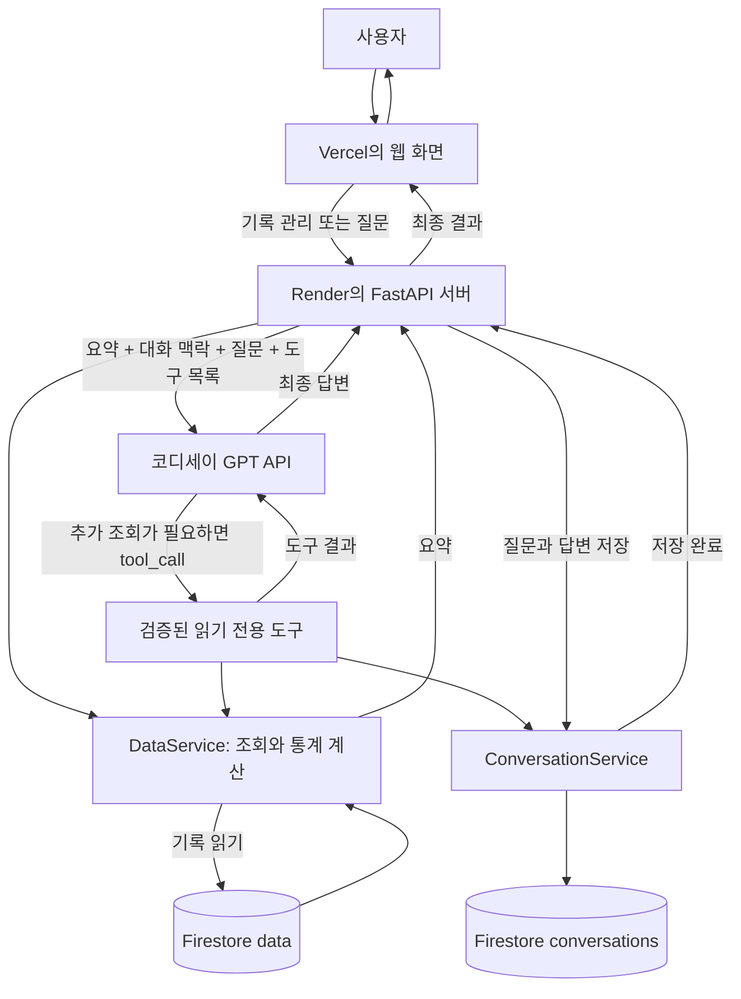
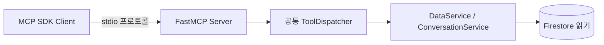
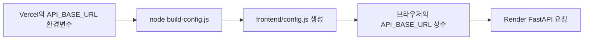

# FitLog-AI 발표·프로젝트 설명 자료

> 작성 기준: 2026-10-02, 제출용 `Mission08_AI_Agent_FitLog-AI`의 실제 소스와 README. 통계는 같은 날 공개된 읽기 전용 summary API에서 확인했다. 테스트 성적은 앞선 실행 결과와 현재 테스트 파일을 대조했다. 이 문서를 작성하는 동안 데이터 변경이나 GPT 호출은 하지 않았다.

## 1. 출발점: 일반 ChatGPT는 내 운동 기록을 모른다

**FitLog-AI는 저장된 운동 기록을 관리하고, 그 기록을 근거로 AI와 대화하는 개인 운동 기록 비서다.**

일반적인 ChatGPT에 “최근에 운동을 얼마나 했지?”라고 물어도, 내가 따로 기록을 알려주지 않았다면 내 상황을 알 수 없다. 물론 ChatGPT에도 기록을 직접 제공할 수 있다. FitLog-AI의 차이는 그 준비 과정을 서비스가 대신한다는 데 있다. 사용자가 기록을 남기면 서버가 저장·계산하고, 질문할 때 필요한 정보를 AI에게 전달한다.

운동 기록이 쌓여도 날짜별 숫자만 보면 변화가 잘 보이지 않는다. 그래서 기록을 한곳에 모으고, 요약과 그래프로 살펴보고, 자연스러운 말로 질문할 수 있게 만들었다. 목표는 AI에게 운동 기록을 ‘외우게 하는 것’이 아니라 **답변할 때 실제 기록을 참고하게 하는 것**이다.

이 서비스는 질병을 진단하거나 운동을 처방하지 않는다. 운동시간의 증가를 확인할 수는 있지만, 그것만으로 건강이나 체력이 좋아졌다고 단정하지 않는다.

## 2. 전체 구조: 화면, 서버, 저장소, AI가 나누어 일한다

- **Frontend**는 사용자가 보는 화면이다. 입력창, 목록, 그래프, 채팅을 제공한다.
- **FastAPI Backend**는 요청을 받아 일을 처리하는 서버다. 잘못된 입력을 검사하고, 기록을 가져오고, AI 호출과 대화 저장을 연결한다.
- **Firestore**는 인터넷을 통해 사용하는 데이터 저장소다. 운동 기록과 대화 기록을 보관한다.
- **GPT**는 서버가 전달한 요약과 필요한 조회 결과를 읽고 답변을 만든다.

브라우저가 Firestore나 GPT 관리자 인증정보를 가지고 직접 접근하는 구조가 아니다. 실제 통신은 서버가 담당한다. 기록 CRUD는 AI를 거치지 않고 저장소에서 처리된다.

## 3. 사용 기술: 각자 맡은 일이 다르다

| 기술                            | FitLog-AI에서 맡은 일                                                                                           |
| ------------------------------- | --------------------------------------------------------------------------------------------------------------- |
| Python 3.12.10                  | 통계 계산, 요청 처리, AI·저장소 연결. Python 3.10 이상 조건을 충족한다.                                        |
| venv                            | 프로젝트가 사용할 Python 패키지를 다른 작업과 분리한다.                                                         |
| FastAPI                         | `/api/data`, `/api/chat` 등의 요청 창구를 만든다.                                                           |
| Uvicorn                         | FastAPI 앱을 실행하고 HTTP 요청을 받는다.                                                                       |
| Pydantic                        | 날짜·운동시간·질문의 형식과 범위를 검사한다.                                                                  |
| firebase-admin / Firestore      | 서버가 인증하고 운동·대화 문서를 읽고 저장한다.                                                                |
| openai Python SDK               | 교육과정의 OpenAI-compatible API로 Chat Completions 요청을 보낸다.                                              |
| python-dotenv                   | requirements에 포함되어 있다.**현재 앱은 dotenv로 .env를 자동 로딩하지 않고 프로세스 환경변수를 읽는다.** |
| HTML / CSS / Vanilla JavaScript | 화면 구조, 스타일, 버튼 동작과 API 호출을 만든다. React 같은 프레임워크는 쓰지 않는다.                          |
| Canvas                          | 외부 차트 라이브러리 없이 운동시간 그래프를 그린다.                                                             |
| Node.js                         | 배포 직전에 공개 API 주소를 config.js로 생성하고 프론트엔드 테스트를 실행한다.                                  |
| MCP Python SDK                  | 외부 프로그램이 읽기 전용 도구를 표준 방식으로 호출하게 한다.                                                   |
| Render / Vercel                 | 각각 Python 서버와 정적 웹 화면을 인터넷에 제공한다.                                                            |

requirements.txt는 패키지 버전을 기록한다. `.python-version`은 Python 3.12.10을 지정한다. 프론트엔드 빌드에는 추가 npm 패키지가 필요 없다.

## 4. 운동 데이터를 날짜 순서로 준비한 이유

**시계열 데이터는 시간의 순서에 따라 쌓이는 데이터**다. 하루 운동시간을 날짜와 함께 저장하면 어느 때 많이 했는지, 최근에 늘었는지 비교할 수 있다.

| 필드  | 뜻                             | 예              |
| ----- | ------------------------------ | --------------- |
| date  | 운동 날짜                      | `2026-09-28`  |
| value | 하루 총 운동시간, 분 단위 정수 | `60`          |
| memo  | 운동 내용                      | `웨이트-가슴` |

하루에 문서 하나를 사용하고, 문서 ID도 날짜로 정한다. 휴식일은 0분으로 기록한다. **기록이 없는 날은 휴식일로 추측하지 않는다.**

저장소의 `backend/data/sample_workout_data.json`은 2026-05-31~2026-09-27의 연속된 **120개 합성 샘플**이며 합계는 4,410분이다. 실제 개인의 과거 일기라고 소개하면 안 된다. 개발 과정에서 사용자가 2026-09-28의 60분 기록을 추가했고, 현재 배포된 data 요약은 다음과 같다.

| 현재 API에서 확인한 항목 |                      값 |
| ------------------------ | ----------------------: |
| 기록 개수                |                   121개 |
| 기간                     | 2026-05-31 ~ 2026-09-28 |
| 총 운동시간              |                 4,470분 |
| 전체 기록일 평균         |                 36.94분 |
| 최대 / 최소              |              85분 / 0분 |

최소 100개 이상의 데이터를 준비한다는 조건을 넘어서, 휴식일과 다양한 운동시간이 있는 데이터로 변화도 확인할 수 있게 했다. 파일 속 120개와 서비스 속 121개는 다른 숫자이며, 발표에서는 구분해서 말한다. 위 통계는 확인 시점의 값으로, 사용자가 기록을 바꾸면 함께 변한다.

## 5. Firestore: 기록을 보관하는 두 개의 서랍

Firestore의 **컬렉션**은 비슷한 기록을 모아 둔 서랍, **문서**는 그 안의 기록 카드라고 생각하면 된다.

- `data`: 과제용 운동 기록. 문서에 date, value, memo를 저장하고 API 응답에는 문서 ID인 id도 붙인다.
- `conversations`: 대화 ID, 제목, 메시지 목록, 생성 시각, 수정 시각을 저장한다.
- `workouts`: 초기 개발 기능이 사용하는 기존 컬렉션이다. 과제용 data로 안전하게 복사한 뒤 원본을 유지했다.

data와 workouts는 자동 동기화되지 않는다. 주 화면의 과제용 데이터 관리와 GPT 요약은 data를 사용한다. 기존 workouts API와 로컬 Ollama 기능은 별도로 남아 있다. 둘을 하나의 실시간 복제본이라고 설명하면 안 된다.

## 6. CRUD: 기록을 쓰고, 보고, 고치고, 지운다

CRUD는 특별한 AI 용어가 아니라 데이터 관리의 네 가지 기본 행동이다.

| 행동         | API                       | 실제 동작                                              |
| ------------ | ------------------------- | ------------------------------------------------------ |
| Create: 추가 | `POST /api/data`        | 새 날짜 문서 생성. 성공 201, 같은 날짜는 409           |
| Read: 조회   | `GET /api/data`         | 날짜 오름차순 기록 배열 반환                           |
| Update: 수정 | `PUT /api/data/{id}`    | 기존 날짜의 시간·메모 수정. 날짜 이동은 허용하지 않음 |
| Delete: 삭제 | `DELETE /api/data/{id}` | 존재하는 기록 삭제. 성공 204                           |
| 요약 조회    | `GET /api/data/summary` | 기간·개수·기본 통계·추세·추가 통계 반환            |

화면에서 저장을 누르면 JavaScript가 FastAPI로 요청하고, 서버가 검증한 뒤 Firestore에 반영한다. 성공 후 화면은 목록과 summary를 다시 조회한다. 그래프도 같은 목록으로 다시 그리므로 페이지 전체를 새로고침하지 않아도 바뀐다.

같은 날짜의 추가 요청은 기존 데이터를 몰래 덮어쓰지 않는다. Firestore의 create 방식을 사용한다. 수정은 존재하는 문서에만 적용하고, 삭제 전에는 화면에서 확인을 받는다. 요청 중 버튼을 잠가 연속 클릭도 줄인다.

## 7. FastAPI 내부: 안내 데스크와 담당자를 분리한다

하나의 큰 파일에 모든 코드를 넣으면 수정할 때 어디를 고쳐야 하는지 찾기 어렵다. 현재 과제용 기능은 역할을 나누었다.

| 위치                               | 쉬운 설명                                                  |
| ---------------------------------- | ---------------------------------------------------------- |
| `backend/main.py`                | 서버를 만들고 라우터·CORS·공통 오류 처리를 연결하는 입구 |
| `backend/routers/`               | 어떤 URL 요청인지 확인하는 안내 데스크                     |
| `backend/schemas/`               | 입력·출력 형식을 정한 양식과 검사 규칙                    |
| `backend/services/`              | 통계, 대화, GPT 등 실제 업무를 수행하는 담당자             |
| `backend/services/repository.py` | Firestore에 실제 읽기·쓰기를 요청하는 저장 담당자         |

예를 들어 summary 계산은 DataService가 한다. GPT 채팅과 MCP도 이 담당자를 재사용한다. 같은 통계를 세 군데에서 따로 계산하지 않아 수정할 곳이 줄어든다. 초기 `/workouts` 기능 일부는 main.py에 남아 있으므로 모든 기능이 완전히 분리됐다고 하지는 않는다.

FastAPI는 입력·출력 Schema를 바탕으로 `/docs`에 Swagger UI를 제공한다. 이는 API 주소와 요청 형식을 보고 브라우저에서 시험할 수 있는 자동 문서다. 읽기뿐 아니라 쓰기 API도 있으므로 시연에서는 함부로 실행하지 않는다.

## 8. Pydantic: 잘못된 입력은 저장 전에 막는다

운동시간에 글자를 넣거나 존재하지 않는 날짜를 입력하면 저장된 통계도 틀어질 수 있다. Pydantic이 입구에서 확인한다.

- 날짜는 `YYYY-MM-DD` 형식이면서 실제로 존재해야 한다. 예를 들어 2026-02-30은 거부한다.
- 운동시간은 **정수 0~1440분**이다. 음수, 소수, 숫자처럼 보이는 문자열도 엄격하게 검사한다.
- memo는 문자열이며 앞뒤 공백을 정리하고 최대 500자로 제한한다. 빈 메모를 반드시 거부하는 규칙은 없다.
- 채팅 질문은 공백 제거 후 1~4000자다.
- 허용하지 않은 추가 필드는 거부한다.

입력 문제는 422, 없는 기록은 404, 날짜 중복은 409 등으로 구분한다. 저장소 장애는 안전한 메시지로 알리고 원본 예외나 인증정보를 사용자에게 돌려주지 않는다.

## 9. Summary: 숫자 계산은 Python이 한다

`GET /api/data/summary`는 긴 기록 목록을 짧은 성적표처럼 정리한다. period는 기간, count는 개수, metrics는 합계·평균·최대·최소, trend는 최근 변화, insights는 추가 해석용 지표다.

최근 추세는 **오늘이 아니라 최신 기록 날짜를 기준으로** 최근 7일과 이전 7일의 합계를 비교한다. 이번에 확인한 값은 다음과 같다.

- 최근 구간: 2026-09-22~09-28, 285분
- 이전 구간: 2026-09-15~09-21, 270분
- 변화: 15분 증가, 5.56% 증가

이전 합계가 0이면 나눗셈이 불가능하므로 변화율은 null, 즉 계산할 수 없는 값으로 둔다. 누락일은 0분 휴식 기록으로 만들어 넣지 않는다.

전체 평균 36.94분은 기록된 휴식일의 0분도 포함한다. 운동한 날만 평균을 낸 값과는 다르다. 이런 규칙을 Python에서 확정하고 GPT에는 결과를 설명하게 한다. 121개 전체를 기본 질문마다 보내지 않으면 불필요한 전송량을 줄이고 답변 기준도 명확하게 만들 수 있다.

## 10. Context Injection: 답변 전에 정보 메모를 건넨다

Context Injection은 **AI에게 답변 전에 사용자 상황을 정리한 메모를 보여주는 것**이다. 서버는 DataService.summary()를 직접 호출하고, 그 결과를 system prompt에 넣는다. system prompt는 AI에게 역할과 답변 원칙을 알려주는 안내문이다.

안내문에는 실제 통계에 근거할 것, 없는 숫자를 만들지 말 것, 알 수 없으면 모른다고 말할 것, 의료 진단을 하지 말 것 등이 들어 있다. 여기에 요약, 최근 대화 최대 10개 메시지, 현재 질문을 붙여 요청한다.

이것은 GPT를 새로 학습시키는 과정이 아니다. 질문할 때 최신 정보를 전달하는 과정이다. 또한 지시문만으로 모든 잘못된 답변을 완벽하게 막을 수는 없다. 중요한 숫자는 실제 summary와 비교해야 한다.

## 11. 한 번의 채팅은 어떻게 완성되는가

사용자가 “최근 운동 추세가 어때?”라고 질문하면 다음 순서로 처리된다.

1. 화면이 `POST /api/chat`으로 message와 선택적인 conversation_id를 보낸다.
2. 기존 대화라면 서버가 먼저 대화를 확인한다. 없는 ID면 404다.
3. 서버가 DataService에서 요약을 직접 받는다. 자기 서버의 summary URL을 다시 HTTP로 호출하지 않는다.
4. 요약·이력·현재 질문·도구 목록을 GPT에 전달한다.
5. 필요한 경우 읽기 도구를 실행하고 결과를 다시 GPT에 준다.
6. 최종 답변을 받으면 질문과 답변을 conversations에 저장한다.
7. 저장이 끝난 뒤 화면에 답변과 대화 ID를 반환한다.

사용하는 AI는 **교육과정에서 제공한 코디세이 OpenAI-compatible API의 gpt-5-mini**다. OpenAI Python SDK를 사용하지만 실제 주소는 `https://copa.codyssey.kr/v1/chat/completions`다. 공식 OpenAI endpoint나 Responses API를 직접 사용하는 것으로 설명하지 않는다.

답변을 기다리는 동안 “AI가 운동 기록을 분석하고 있습니다...”를 표시하고 전송 버튼을 비활성화한다. 실패하면 입력을 보관하고 이해할 수 있는 안내를 보여준다. 인증·연결 문제, 요청 한도, 시간 초과, 저장 실패를 구분한다. GPT 성공 후 저장에 실패하면 저장됐다고 응답하지 않는다.

## 12. Conversation: 대화도 서비스의 데이터다

conversations 문서는 id, title, messages, created_at, updated_at을 가진다. messages 안에는 user와 assistant의 발언을 순서대로 저장한다. 제목은 첫 질문의 앞 100자로 만들며 제목을 만들기 위한 추가 GPT 호출은 없다.

| API                                | 역할                                 |
| ---------------------------------- | ------------------------------------ |
| `POST /api/conversations`        | 제공한 대화 스냅샷을 새 문서로 저장  |
| `GET /api/conversations`         | 제목·시각·메시지 수 중심 목록 조회 |
| `GET /api/conversations/{id}`    | 선택한 대화의 메시지 조회            |
| `DELETE /api/conversations/{id}` | 해당 대화 삭제                       |

일반적인 화면 채팅에서는 POST /api/chat이 자동 저장을 담당한다. 목록의 제목을 선택하면 기존 질문과 답변이 화면에 다시 나타나며 이어서 질문할 수 있다. “새 대화”는 현재 선택을 초기화할 뿐 과거 대화를 삭제하지 않는다. **삭제 API는 있지만 현재 대화 목록 화면에 삭제 버튼이 구현된 것은 아니다.**

기존 대화에 답변을 추가할 때는 다른 요청이 먼저 바꿨는지도 확인한다. GPT에는 최근 10개 메시지만 보내지만 저장 이력은 그대로 두며, 전체 50개 메시지 한도에 도달하면 새 대화를 안내한다. 도구 호출의 중간 메시지는 저장하지 않고 최종 질문·답변 쌍만 저장한다.

## 13. Function Calling: 더 알아야 하면 조회 도구를 고른다

요약에는 전체 합계는 있어도 최근 세 날짜 각각의 기록은 없을 수 있다. 이때 숫자를 추측하게 하지 않고 **AI가 필요한 조회 도구를 선택하도록** 한다.

| 도구               | 역할과 예                                                                        |
| ------------------ | -------------------------------------------------------------------------------- |
| get_data_summary   | “전체 요약을 다시 확인해 줘.” → 기간·기본 통계·추세·추가 통계              |
| get_recent_records | “최근 운동 기록 3개를 알려줘.” → 최신순 날짜·분·메모. 기본 7개, 1~30개 제한 |
| get_conversation   | 알고 있는 대화 ID의 내용 조회. 없는 ID는 안전한 오류                             |

도구 Schema는 사용 가능한 도구의 이름과 인수 규칙을 적은 사용 설명서다. GPT는 tool_calls로 이름과 JSON 인수를 요청한다. **GPT가 직접 데이터베이스에 접속하는 것은 아니다.** Python dispatcher가 허용 목록과 인수를 검사한 다음 실제 서비스를 실행한다. 결과는 도구 호출 ID와 함께 GPT에 다시 전달되고, 최종 답변이 나온다.

Context Injection은 기본 요약을 미리 제공하는 방식이고, Function Calling은 부족한 세부 정보를 필요할 때 조회하는 방식이다. 도구를 사용하면 제한된 실제 기록과 메모, 또는 지정한 대화가 추가로 전달될 수 있다. 따라서 “원문 데이터는 절대 전송하지 않는다”는 설명은 정확하지 않다.

도구 실행은 최대 3라운드, 한 라운드 최대 3개다. GPT 요청은 최종 답변 요청을 포함해 최대 4회가 될 수 있다. 자동 재시도는 하지 않는다. 성공한 도구 이름은 tools_used에 담는다. 임의 코드 실행, 기록 추가·삭제 도구는 제공하지 않는다.

README의 과거 실제 E2E 기록에는 get_recent_records(limit=3)를 선택한 뒤 GPT 요청 2회로 답변을 완성한 사실이 남아 있다. 09-28의 60분, 09-27의 65분, 09-26의 0분이 실제 조회 결과와 일치했다. 이는 그때 확인한 결과이며 이번 문서 작성에서 GPT를 다시 호출한 것은 아니다.

## 14. MCP: 같은 도구를 외부 프로그램도 사용한다

MCP는 **도구를 외부 프로그램에도 공통 규칙으로 제공하는 연결 방식**이다. 충전기마다 다른 모양의 단자가 아니라 공통 단자를 마련하는 것에 비유할 수 있다.

`backend/mcp_server.py`는 공식 MCP Python SDK의 FastMCP로 세 도구를 제공한다. 통신은 stdio, 즉 두 로컬 프로세스의 표준 입출력을 이용한다. 별도의 공개 웹 API 서버로 배포한 것이 아니다. Render의 FastAPI 시작에 MCP 실행은 필요하지 않다.

`backend/check_mcp.py`는 외부 SDK client 역할을 한다. 별도 서버 프로세스를 시작하고 initialize, tools/list, tools/call 순서로 실제 프로토콜을 확인한다. 요약, 최근 3개, 기존 대화를 조회한 실제 READ 검증 결과가 README에 있다. 자동 테스트는 가짜 저장소로 같은 프로토콜을 확인한다.

Function Calling과 MCP는 같은 dispatcher와 Service를 재사용한다. 앞쪽 연결 규칙은 달라도 실제 조회 업무는 동일하다. 이 구조로 내부 GPT 도구 선택과 외부 client 연결을 모두 설명할 수 있다.

## 15. 숫자에서 패턴으로: 추가 통계와 그래프

추가 통계는 단순 합계만으로 보이지 않는 패턴을 보여준다. 현재 summary에서 확인한 값은 운동일 86일, 휴식일 35일, 운동한 날 평균 51.98분, 최장 연속 운동 10일이다.

운동일은 value가 0보다 큰 날, 휴식일은 기록된 value가 0인 날이다. 날짜가 빠지거나 휴식일을 만나면 연속 운동일 계산이 끊긴다. 누락일을 휴식일로 세지는 않는다. 전체 기록 기간의 Insight와 최근 7일 변화는 서로 다른 기준이다.

그래프는 Canvas로 그리며 기본 최근 30일, 선택 가능한 최근 7일·30일·전체를 제공한다. 날짜는 왼쪽에서 오른쪽으로 오래된 순서다. 최근 범위는 마지막 기록 날짜를 기준으로 한 달력 날짜 범위이며 단순히 마지막 N개를 자르는 것이 아니다. 0분도 그대로 남긴다. 마우스·터치·키보드로 날짜와 운동시간을 확인할 수 있다.

CRUD가 성공하면 목록·요약·Insight·그래프가 함께 갱신된다. 그래프용 별도 Firestore 컬렉션이나 API는 만들지 않았다.

## 16. CSV와 다크 모드: 실제 사용을 편하게 한다

CSV는 표 형태의 데이터를 저장하는 텍스트 파일이다. 화면에서 내려받으면 다른 표 프로그램에서도 기록을 살펴볼 수 있다. 현재 불러온 전체 data를 날짜 오름차순으로 내보내며 그래프의 7일 선택에 제한되지 않는다.

한글 처리를 위해 UTF-8 BOM을 넣고, 메모 속 쉼표·줄바꿈·따옴표가 표를 깨뜨리지 않도록 감싼다. 수식으로 해석될 수 있는 셀에는 보호 처리를 한다. 다운로드는 브라우저에서 만들며 원본 Firestore 기록을 수정하지 않는다.

다크 모드는 밝고 어두운 화면을 바꾸는 기능이다. 선택을 localStorage라는 브라우저 저장 공간에 기억한다. 저장소 접근이 막혀도 현재 화면 전환은 가능하다. 테마가 바뀌면 그래프의 글자와 선 색도 다시 그려 읽기 쉽게 유지한다.

## 17. 웹 화면에서 사용하는 순서

HTML은 화면 뼈대, CSS는 모양, Vanilla JavaScript는 동작을 담당한다. 프레임워크 없이 다음 흐름을 구현했다.

1. 접속하면 data 요약·추가 통계·그래프를 확인한다.
2. 목록에서 운동 기록을 보고 추가·수정·삭제한다. 과제용 목록은 한 페이지에 10개씩 표시한다.
3. AI 비서 입력창에 질문하고 처리 중 안내를 기다린다.
4. 답변과 답변 기준 기간·기록 수를 확인한다.
5. 이전 대화 목록에서 대화를 불러와 이어서 질문한다.
6. 필요하면 CSV를 내려받거나 테마를 바꾼다.

화면 아래에는 기존 workouts 기반 최근 7개 기록·날짜 조회·로컬 분석도 남아 있다. 이를 과제용 data 목록과 혼동하지 않는 것이 좋다. 초기 페이지 조회나 목록 새로고침만으로 GPT를 자동 호출하지 않는다.

## 18. 배포: 서버와 화면에 서로 다른 주소를 준다

Render는 Python FastAPI 서버를 실행하고, Vercel은 HTML/CSS/JS 화면을 제공한다. 실제 사용자가 접속하는 화면과 데이터 처리를 맡은 서버를 나눈 것이다.

| 역할         | 주소                                     |
| ------------ | ---------------------------------------- |
| Frontend     | https://fitlog-ai-ten.vercel.app         |
| Backend      | https://fitlog-ai-tfe9.onrender.com      |
| Swagger 문서 | https://fitlog-ai-tfe9.onrender.com/docs |

주소는 요청에 제시된 값과 현재 config.js를 대조했고, 문서 작성 중 세 주소의 HTTP 응답도 확인했다. Vercel/Render 관리 화면의 설정값 자체를 조회한 것은 아니다.

Render에서 프로젝트 디렉터리를 기준으로 `python -m uvicorn backend.main:app --host 0.0.0.0 --port $PORT`로 시작한다. `/health`는 서버 생존 확인용이며 Firebase·GPT 연결 성공까지 검사하지 않는다. 운동 데이터가 실제로 읽히는지는 summary 같은 별도 조회로 확인한다.

무료 Render Web Service는 유휴 상태에서 멈췄다가 첫 요청에 다시 켜질 수 있다. 이 시작 대기 시간을 cold start라고 한다. [Render 공식 설명](https://render.com/docs/free)에 따르면 무료 서비스의 유휴 중단과 재시작에는 지연이 있다. 이 앱은 로딩 안내와 오류·새로고침 동작으로 기다리는 상태를 알려준다. 일반 요청 제한은 40초, 채팅 요청은 120초다. **cold start 전용 자동 깨우기·재시도 기능은 현재 코드에서 확인되지 않는다.** 로딩 표시가 모든 대기 시간을 해결한다고 말하지 않는다.

로컬 Ollama는 Render에서 사용자 PC의 모델에 자동 연결되지 않는다. 기존 선택 기능은 보존돼 있지만, Production GPT 채팅의 모델을 Ollama라고 설명하면 안 된다.

## 19. API_BASE_URL: 배포할 때 주소를 설정 파일로 바꾼다

정적 JavaScript는 서버의 환경변수를 직접 읽을 수 없다. 따라서 배포 전에 Node.js가 공개 주소를 파일로 바꾸는 작은 단계를 추가했다.

Root Directory는 `Mission08_AI_Agent_FitLog-AI/frontend`, Build Command는 `node build-config.js`, Output Directory는 `.`이다. build-config.js는 process.env.API_BASE_URL만 읽는다. 비어 있거나 URL 형식이 틀리면 빌드를 실패시키고, 끝의 슬래시는 제거한다. 인증정보·경로·query·fragment가 붙은 주소는 거부한다. 검증 실패 시 기존 config.js를 덮어쓰지 않는다.

이 방식에서 config.js에 최종 주소 문자열이 보이는 것은 정상이다. 사람이 배포할 때마다 소스에 주소를 넣는 대신 **빌드 환경변수로 생성한 결과**이기 때문이다. 이번 Production config.js에서도 생성 주석과 Render 주소를 확인했다. 환경변수 변경은 이미 열린 브라우저에 즉시 반영되는 것이 아니라 다음 빌드에서 적용된다.

로컬은 기존 config.js를 사용해 정적 서버로 실행할 수 있다. 다른 API로 연결하려면 같은 빌드 스크립트로 공개 주소만 다시 생성하면 된다. 프론트엔드에 API 키를 넣는 작업은 아니다.

## 20. CORS와 비밀정보: 주소와 열쇠는 다르다

CORS는 브라우저가 다른 출처의 응답을 읽을 수 있는지 정하는 규칙이다. 허용할 웹사이트 주소를 적은 목록이라고 생각하면 쉽다. 현재는 localhost와 127.0.0.1의 5500 포트를 유지하고 ALLOWED_ORIGINS에 추가 주소를 쉼표로 넣을 수 있다. Production 읽기 응답에서 `https://fitlog-ai-ten.vercel.app`에 대한 허용 헤더를 확인했다.

**CORS는 로그인이나 접근 권한 검사를 대신하지 않는다.** 다른 프로그램의 직접 요청까지 차단하는 방화벽은 아니다. 현재 코드에는 사용자별 인증·권한 분리가 없으므로 교육용 개인 프로젝트를 다중 사용자 서비스로 확장하려면 별도 구현이 필요하다.

| 환경변수                       | 역할                             | 브라우저 공개 여부      |
| ------------------------------ | -------------------------------- | ----------------------- |
| OPENAI_API_KEY                 | 코디세이 호출 인증               | 비밀, 서버에만 보관     |
| FIREBASE_SERVICE_ACCOUNT_JSON  | 서버의 Firebase 인증             | 비밀, 서버에만 보관     |
| API_BASE_URL                   | 브라우저가 요청할 공개 서버 주소 | 공개 가능               |
| ALLOWED_ORIGINS                | 허용할 화면 출처 목록            | 인증키가 아닌 설정      |
| OPENAI_BASE_URL / OPENAI_MODEL | 코디세이 주소와 모델 선택        | 비밀키가 아닌 서버 설정 |

firebase.py는 환경변수 JSON 문자열을 파싱하여 서버 SDK에 전달한다. 환경변수가 없을 때만 기존 로컬 키 파일 방식을 사용한다. 잘못된 환경변수는 안전한 오류로 처리한다. 실제 인증정보는 이 자료에서 읽거나 보여주지 않는다.

.gitignore는 .env 계열, Firebase 서비스 계정 JSON 패턴, 가상환경 등을 제외하고 .env.example만 공개 예시로 둔다. ignore가 이미 추적한 secret을 자동 삭제하는 것은 아니므로 제출 전 추적 여부도 확인해야 한다. 화면은 응답을 textContent로 표시하며 인증키를 전달받지 않는다. SDK 오류도 필요한 진단 필드만 정제하고 전체 헤더·응답·예외를 내보내지 않는다.

## 21. 테스트: 바꾼 기능뿐 아니라 기존 기능도 지킨다

자동 테스트는 코드를 수정한 뒤 기존 동작이 깨지지 않았는지 반복해서 확인하는 과정이다. 마지막 실제 테스트 실행은 **Backend 69개, Frontend 22개, 합계 91개 모두 통과**였다. 이번 문서 작성에서는 테스트를 다시 실행하지 않았으며 현재 파일에 정의된 테스트 개수가 그 결과와 일치하는지 확인했다.

백엔드 테스트는 CRUD와 날짜 중복, Pydantic 검증, summary·Insight, 대화 저장·이어쓰기, GPT 오류 처리, 도구 호출 한도, MCP 통신, 환경변수 설정 등을 다룬다. 가짜 저장소와 모의 HTTP 응답을 사용하므로 자동 테스트가 실제 GPT를 호출하거나 Firestore 데이터를 바꾸지 않는다.

프론트엔드 22개는 기존 19개에 빌드 테스트 3개가 더해진 것이다. 가짜 화면 요소와 fetch를 사용해 채팅·로딩·중복 클릭 방지·CRUD 후 갱신·대화 불러오기·그래프 범위·CSV·다크 모드를 확인한다. 새 테스트는 환경변수 누락 실패, Render 주소 생성과 슬래시 제거, 잘못된 URL의 안전한 실패를 다룬다. 이는 실제 브라우저의 모든 디자인이나 모바일 화면 검사를 대신하지 않는다.

### 이번 문서 작성에서 확인한 Production READ

| 확인 대상                       | 확인 결과                              |
| ------------------------------- | -------------------------------------- |
| Vercel 메인 HTML                | HTTP 200, FitLog 화면 HTML 확인        |
| Vercel config.js                | HTTP 200, 생성 주석과 Render 주소 확인 |
| Render /health                  | HTTP 200, status ok                    |
| Render /docs                    | HTTP 200, Swagger UI용 HTML 확인       |
| Render /api/data/summary        | HTTP 200, 121개 및 통계 확인           |
| Vercel origin을 보낸 Render GET | 해당 origin 허용 응답 헤더 확인        |

이것은 읽기 전용 HTTP 검증이다. 이번에 브라우저를 조작해 전체 CRUD·채팅을 실행하거나 Swagger의 쓰기 버튼을 눌러 확인한 것은 아니다. 과거 README의 실제 GPT/MCP 성공 기록과 현재 Production READ를 구분한다.

제출 저장소에는 `docs/screenshots/01_ai_chat.png`, `02_data_crud.png`, `03_conversation_list.png`, `04_conversation_loaded.png`, `05_swagger.png`가 있다. 이번에는 파일 존재만 확인했으며 이미지 내용이나 촬영 시점을 검증한 증거로 사용하지 않는다.

## 22. 핵심 문제를 해결하며 배운 점

**기록은 있는데 GPT는 모른다.** 저장소와 GPT는 자동 연결되지 않기 때문이다. DataService가 계산한 요약을 system prompt에 넣어 해결했다. AI 답변 품질은 모델뿐 아니라 전달하는 데이터에도 달려 있다는 점을 배웠다.

**요약만으로 최근 세 날짜를 답할 수 없다.** 전체 평균에는 개별 기록이 없기 때문이다. 읽기 전용 Function Calling을 추가해 필요한 기록만 가져오게 했다. 미리 주는 정보와 필요할 때 조회하는 정보를 나누는 법을 배웠다.

**새 과제 구조로 옮기다가 원본을 손상할 수 있다.** 초기 workouts와 과제용 data가 달랐기 때문이다. migration은 기본 dry-run, 실제 복사는 create와 기존 ID 건너뛰기를 사용했다. README에 보존·재실행 검증 기록이 있으며, 데이터 이동은 파일 이름 변경만큼 단순하지 않다는 점을 배웠다.

**다른 AI 프로그램에서도 같은 조회를 쓰고 싶다.** GPT용 코드를 그대로 복사하면 계산 규칙이 달라질 수 있다. 공통 Service와 dispatcher 앞에 MCP 인터페이스를 연결했다. 기능을 재사용하려면 역할을 나누는 것이 중요했다.

**Vercel 환경변수를 등록했는데 정적 JS는 모른다.** 브라우저에는 서버의 process.env가 없기 때문이다. Node 빌드 단계에서 config.js를 생성해 해결했다. 빌드 시점과 브라우저 실행 시점은 다르다는 것을 배웠다.

**서로 다른 웹 주소와 인증정보를 관리해야 한다.** 화면과 서버가 다른 출처이므로 CORS가 필요하고, 공개 주소와 비밀키를 구분해야 한다. origin 설정과 서버 환경변수, Git 제외 규칙을 마련했다. CORS만으로 사용자 인증까지 해결되는 것은 아니라는 한계도 확인했다.

## 23. 이 프로젝트가 보여준 것

AI 서비스를 만든다는 것은 GPT API를 한 번 호출하는 것보다 넓은 일이다. 데이터를 준비하고, 저장하고, 검증하고, 분석한 뒤, 필요한 정보를 안전하게 AI에 전달하고, 사람이 사용할 화면으로 연결해야 한다. 배포 후에도 주소·로딩·오류·테스트를 확인해야 한다.

FitLog-AI는 그 흐름을 작은 운동 기록 서비스로 연결했다. 다만 로그인과 사용자별 권한, 모든 AI 답변의 사실 보장, cold start 전용 자동 복구는 완성한 기능이 아니다. 발표에서는 구현한 기능과 앞으로 개선할 부분을 구분하는 것이 더 정확하다.

### 로컬 실행을 설명할 때

제출용 프로젝트 디렉터리에서 별도 venv를 준비하고 requirements를 설치한 뒤 Uvicorn으로 backend.main:app을 실행한다. 화면은 frontend만 대상으로 정적 HTTP 서버를 실행한다. 원본 작업 폴더 경로를 제출 프로젝트의 실행 경로라고 소개하지 않는다. Firebase/GPT 설정은 서버 환경변수로 준비하되 실제 값을 발표 화면에 띄우지 않는다. 전체 프로젝트 루트를 정적 서버로 공개하지 않는다.

## 24. 구현 근거와 오래된 설명의 구분

| 설명 내용             | 확인한 근거                                                              |
| --------------------- | ------------------------------------------------------------------------ |
| 입력 형식·API        | backend/schemas/, backend/routers/, backend/main.py                      |
| 계산·저장            | backend/services/data_service.py, conversation_service.py, repository.py |
| GPT 맥락·도구        | chat_service.py, gpt_client.py, ai_tools.py                              |
| MCP                   | backend/mcp_server.py, check_mcp.py, test_mcp.py                         |
| UI·그래프·CSV·테마 | frontend/data.js, chat.js, chart.js, export.js, theme.js                 |
| 배포 설정 생성        | frontend/build-config.js, config.js, tests/build-config.test.cjs         |
| 설정·제외 규칙       | backend/settings.py, backend/firebase.py, .gitignore, .python-version    |
| 과거 실제 E2E         | README의 STEP 15 검증 기록                                               |
| 현재 수치·배포 READ  | 문서 작성 중 공개 GET 응답                                               |

README에는 개발 단계별 설명이 누적되어 있다. 초반의 ‘로컬 전용’, ‘빌드 시스템 없음’, ‘localhost만 허용’, ‘Function Calling/MCP 미구현’은 현재 구현 전체를 설명하지 못한다. 발표는 실제 코드와 후반 업데이트를 기준으로 정리했다. python-dotenv는 설치 목록에 있지만 실제 자동 로딩 기능으로 소개하지 않았다. 대화 개수는 새 질문마다 바뀔 수 있어 과거의 2개를 현재 최종값으로 고정하지 않았다. Production 주소 목록은 README만으로 충분히 확인되지 않아 사용자 제공 주소·config.js·실제 GET 결과로 보완했다.

# 5~7분 발표 대본

> 보통 속도로 읽고 화면을 짧게 가리키는 시간을 포함해 약 5~7분을 목표로 한 대본이다. 실제 시간은 리허설로 확인한다. 시연을 별도로 길게 하면 시간이 추가된다.

안녕하세요. 저는 내 운동 기록을 바탕으로 대화하는 AI 비서, FitLog-AI를 만들었습니다.

출발점은 간단했습니다. 일반 ChatGPT에 최근 운동을 얼마나 했는지 물어봐도 제 기록을 따로 알려주지 않으면 답할 수 없습니다. 그래서 운동 기록을 저장하고, 서버가 필요한 정보를 정리해서 AI에게 전달하는 서비스를 만들었습니다. 의료 진단이나 운동 처방을 하는 서비스는 아니고, 내가 남긴 기록을 이해하는 데 도움을 주는 서비스입니다.

먼저 데이터를 준비했습니다. 날짜, 운동시간, 메모를 하루 한 개씩 저장합니다. 이렇게 시간 순서대로 쌓인 데이터를 시계열 데이터라고 합니다. 처음에는 운동과 휴식이 섞인 샘플 120개를 만들었고, 이후 실제로 입력한 기록이 추가됐습니다. 현재 배포된 요약에서 확인한 기록은 121개입니다. 기간은 5월 31일부터 9월 28일까지이고, 총 4,470분, 평균 36.94분입니다. 샘플을 모두 실제 개인 기록이라고 소개하지는 않았습니다.

전체 구조를 보시면, 사용자는 Vercel에 있는 화면을 사용합니다. 화면이 요청을 보내면 Render에서 실행되는 FastAPI 서버가 처리하고, 운동 기록과 대화는 Firestore에 저장합니다. 화면이 데이터베이스나 GPT에 직접 접근하지 않고 서버를 거치도록 했습니다.

사용자는 기록을 추가하고, 조회하고, 수정하고, 삭제할 수 있습니다. 이것을 CRUD라고 합니다. 예를 들어 날짜가 잘못됐거나 운동시간이 음수이면 Pydantic이라는 검사 도구가 저장 전에 막습니다. 같은 날짜를 다시 추가하면 원래 기록을 덮어쓰지 않습니다. 수정이나 삭제가 끝나면 목록과 통계, 그래프를 다시 불러와 화면에 반영합니다.

서버 안에서는 역할도 나눴습니다. Router는 요청을 받는 안내 데스크, Service는 실제 일을 하는 담당자, Repository는 저장소와 통신하는 담당자입니다. 이렇게 나누니 AI와 일반 화면이 같은 통계 계산을 함께 사용할 수 있었습니다.

숫자 계산은 GPT가 아니라 Python이 합니다. 최근 변화는 마지막 기록 날짜를 기준으로 최근 7일과 그 이전 7일을 비교합니다. 확인된 값은 285분과 270분으로, 15분 늘었습니다. 기록이 없는 날을 마음대로 휴식일로 만들지는 않습니다.

그다음이 핵심인 Context Injection입니다. 말은 어렵지만, AI에게 답변 전에 사용자 상황을 적은 메모를 먼저 보여주는 것입니다. 서버는 기간, 개수, 평균, 최근 변화 같은 요약을 AI에게 전달합니다. 매번 모든 기록을 보내는 대신 필요한 정보를 정리하는 방식입니다. GPT를 새로 학습시키는 것이 아니라, 질문할 때 최신 정보를 참고하게 만드는 것입니다.

채팅은 교육과정에서 제공한 코디세이의 OpenAI-compatible API를 사용합니다. 사용자가 질문하면 서버가 요약과 최근 대화 이력을 전달하고 답변을 받습니다. 그다음 질문과 답변을 Firestore의 conversations에 저장합니다. 사용자는 이전 대화 목록에서 다시 불러오고 이어서 질문할 수 있습니다. 처리 중에는 안내를 보여주고 버튼을 잠가 중복 요청을 줄였습니다.

그런데 요약만으로는 답할 수 없는 질문도 있습니다. 예를 들어 최근 기록 세 개의 날짜와 시간을 물으면 평균만으로는 알 수 없습니다. 그래서 Function Calling을 추가했습니다. AI에게 요약 조회, 최근 기록 조회, 대화 조회라는 도구를 알려주고 필요한 도구를 선택하게 합니다. 실제 실행은 AI가 아니라 Python 서버가 인수를 검사한 뒤 수행합니다. 조회 결과를 다시 받은 AI가 최종 답변을 만듭니다. 무한히 반복하지 않도록 도구 실행은 최대 세 라운드로 제한했습니다.

이 도구들은 MCP로도 제공했습니다. MCP는 외부 프로그램이 도구를 공통 규칙으로 호출하는 연결 방식입니다. 별도의 client 프로그램으로 서버 초기화, 도구 목록 확인, 실제 조회까지 검증했습니다. GPT 도구와 MCP가 같은 담당 코드를 쓰므로 통계 로직을 따로 복사하지 않아도 됩니다. MCP는 로컬 연결이고 Render 웹 서버와는 별도입니다.

화면에는 운동일, 휴식일, 운동한 날 평균, 최장 연속 운동일도 표시합니다. 그래프는 최근 7일, 30일, 전체를 선택할 수 있고 휴식일의 0분도 남깁니다. CSV 다운로드는 한글과 쉼표가 깨지지 않도록 처리했고, 다크 모드는 선택을 기억하며 그래프 색도 바꿉니다. 이 화면은 React 없이 HTML, CSS, 일반 JavaScript로 만들었습니다.

배포에서는 화면의 API 주소를 관리하는 일이 중요했습니다. Vercel 환경변수는 브라우저가 직접 읽을 수 없기 때문에, 빌드 때 Node 스크립트가 API_BASE_URL을 config.js로 만들어 줍니다. 값이 없으면 빌드가 실패합니다. 이 주소는 공개 정보지만 GPT 키와 Firebase 인증정보는 서버에만 둡니다. CORS에는 허용할 화면 주소를 설정했습니다. 다만 CORS가 로그인이나 사용자 권한을 대신하는 것은 아닙니다.

무료 서버는 첫 접속이 늦을 수 있어 로딩과 오류 안내도 준비했습니다. 마지막 자동 테스트에서는 백엔드 69개, 프론트엔드 22개, 총 91개가 통과했습니다. 실제 데이터를 바꾸지 않는 모의 테스트와 별도의 실제 연결 검증을 구분했고, 이번에는 배포 화면과 서버 요약도 읽기 요청으로 확인했습니다.

이 프로젝트를 통해 AI 서비스를 만든다는 것은 GPT를 호출하는 일만은 아니라는 것을 배웠습니다. 데이터를 준비하고, 분석하고, 안전하게 전달하고, 사용자가 쓸 수 있는 화면과 배포 환경으로 연결해야 했습니다. FitLog-AI는 그 과정을 하나의 운동 기록 서비스로 만든 결과입니다. 감사합니다.

# 발표할 때 꼭 기억할 핵심 문장

1. FitLog-AI는 저장된 운동 기록을 근거로 대화하는 AI 비서다.
2. 일반 챗봇에 내가 직접 알려줘야 하는 기록을 서버가 준비해 전달한다.
3. 기록은 Firestore에, 계산과 검증은 FastAPI 백엔드에 맡긴다.
4. 숫자는 Python이 계산하고 GPT는 그 결과를 설명한다.
5. Context Injection은 답변 전에 사용자 상황 메모를 제공하는 방식이다.
6. Function Calling은 AI가 필요한 조회 도구를 선택하고 서버가 실행하는 방식이다.
7. MCP는 같은 읽기 도구를 외부 프로그램에도 표준 방식으로 제공한다.
8. 질문과 최종 답변은 자동 저장하며 과거 대화를 불러와 이어갈 수 있다.
9. Vercel의 공개 API 주소는 빌드에서 config.js로 만들고 비밀키는 서버에 둔다.
10. CORS는 사용자 인증을 대신하지 않으며 의료 진단도 이 서비스의 목적이 아니다.
11. 총 91개 테스트 통과 기록과 실제 Production READ 확인을 구분해 설명한다.
12. AI 서비스는 데이터부터 화면·배포·보안·검증까지 연결하는 작업이다.
