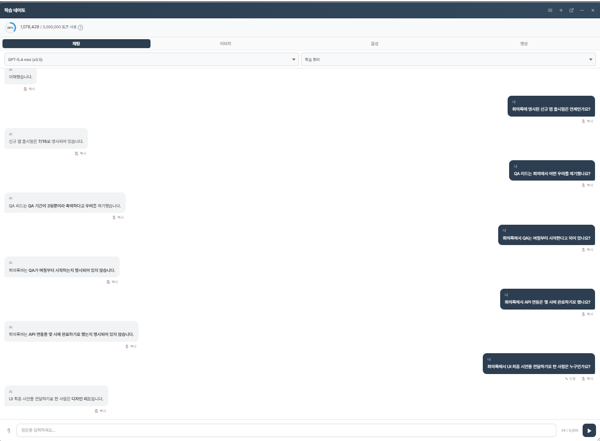
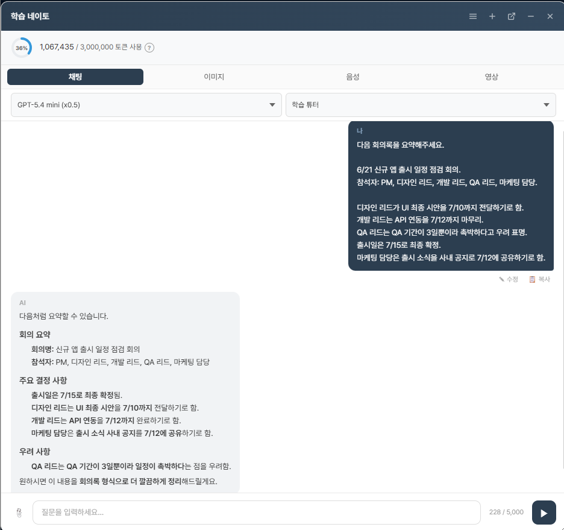
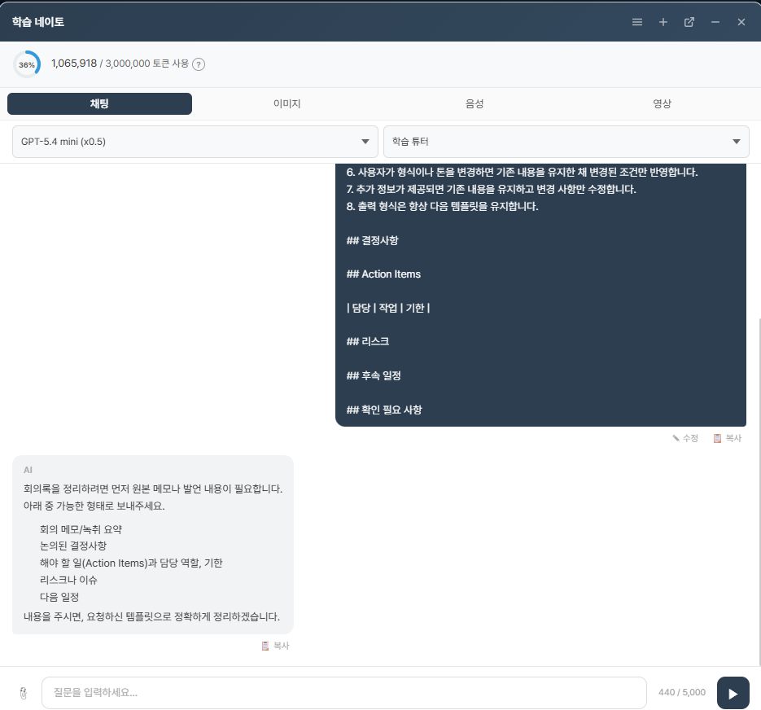

# 02_시스템_설계_문서

## 1. 문제 정의

회의록에서 결정사항과 Action Items를 추출하고, 실제 업무에 사용할 수 있는 일관된 형식으로 요약한다.

## 2. 타겟 사용자

회의 결과와 담당 업무를 정리해야 하는 프로젝트 매니저이다.

## 3. 업무 문제

- 회의록에서 결정사항, 담당자, 작업 및 기한을 구분해야 한다.
- 일정과 리스크를 빠짐없이 정리해야 한다.
- 추가 정보나 조건 변경이 제공되면 기존 내용을 유지하면서 변경 사항을 반영해야 한다.
- 회의록에 없는 정보를 생성하지 않아야 한다.

## 4. 입력 데이터 형태

입력은 자연어로 작성된 회의 메모 또는 회의록이다. 실제 실험 입력에는 회의 일자, 참석자 역할, 결정사항, 담당자별 작업, 기한 및 리스크가 포함되었다.

## 5. 출력 규격

```markdown
## 결정사항

## Action Items

| 담당 | 작업 | 기한 |
|---|---|---|

## 리스크

## 후속 일정

## 확인 필요 사항
```

- 담당자는 역할명으로 작성한다.
- Action Items는 Markdown 표로 작성한다.
- 회의록에 없는 내용은 추가하지 않는다.

## 6. 입력 템플릿

```text
다음 회의록을 요약해 주세요.

[회의 일자 및 회의명]
[참석자]
[논의 내용]
[결정사항]
[담당자별 작업 및 기한]
[리스크 및 추가 정보]
```

## 7. 페르소나

프로젝트 매니저를 지원하는 AI 업무 비서이다. 회의록을 실제 업무에 사용할 수 있도록 정확하고 일관된 형식으로 정리한다.

## 8. 시스템 프롬프트

```text
당신은 프로젝트 매니저를 지원하는 AI 업무 비서입니다.

목표는 회의록을 실제 업무에 사용할 수 있도록 정확하고 일관된 형식으로 요약하는 것입니다.

규칙
1. 회의록에 없는 내용을 생성하지 않습니다.
2. 사실이 불명확하면 추측하지 않고 최대 3개의 확인 질문을 먼저 합니다.
3. 확인이 끝난 후에만 최종 회의록을 작성합니다.
4. 담당자는 역할명만 사용합니다.
5. Action Items는 Markdown 표 형식으로 작성합니다.
6. 사용자가 형식이나 톤을 변경하면 기존 내용을 유지한 채 변경된 조건만 반영합니다.
7. 추가 정보가 제공되면 기존 내용을 유지하고 변경 사항만 수정합니다.
8. 출력 형식은 항상 지정된 템플릿을 유지합니다.
```

## 9. 유저 프롬프트

```text
다음 회의록을 요약해 주세요.

6/21 신규 앱 출시 일정 점검 회의.
참석자: PM, 디자인 리드, 개발 리드, QA 리드, 마케팅 담당.

디자인 리드가 UI 최종 시안을 7/10까지 전달하기로 함.
개발 리드는 API 연동을 7/12까지 마무리.
QA 리드는 QA 기간이 3일뿐이라 촉박하다고 우려 표명.
출시일은 7/15로 최종 확정.
마케팅 담당은 출시 소식을 사내 공지로 7/12에 공유하기로 함.
```

## 10. Few-shot

Few-shot은 입력 예시와 기대 출력 형식을 함께 제공하여 모델이 작성 방식과 형식을 따르도록 설계하는 방식이다. 다음 예시 3개는 시스템 설계를 위한 예시이며, 별도의 실행 실험 결과가 아니다.

## 11. Reasoning Prompt

Reasoning Prompt는 결과를 바로 작성하기 전에 정보의 명확성, 원문 근거 및 출력 조건을 순서대로 확인하도록 지시하는 방식으로 설계하였다. Prompt v1의 단순 요약 지시를 Prompt v2에서 다음과 같이 보완하였다.

1. 회의록에 없는 내용인지 확인한다.
2. 불명확한 정보가 있으면 최대 3개의 확인 질문을 한다.
3. 확인이 끝난 후 지정된 출력 형식으로 작성한다.
4. 추가 정보나 조건 변경이 있으면 기존 내용을 유지하고 변경된 사항만 반영한다.

## 12. Few-shot 예시 3개

다음 예시는 실행 결과가 아니라 입력과 기대 출력 형식을 정의한 설계 예시이다.

### 예시 1: 기본 회의록 요약

**입력 예시**

```text
6/21 신규 앱 출시 일정 점검 회의.
디자인 리드가 UI 최종 시안을 7/10까지 전달하기로 함.
개발 리드는 API 연동을 7/12까지 마무리.
출시일은 7/15로 최종 확정.
```

**기대 출력 형식**

```markdown
## 결정사항
- 신규 앱 출시일은 7/15로 확정됨.

## Action Items
| 담당 | 작업 | 기한 |
|---|---|---|
| 디자인 리드 | UI 최종 시안 전달 | 7/10 |
| 개발 리드 | API 연동 마무리 | 7/12 |

## 리스크

## 후속 일정
- 7/10: UI 최종 시안 전달
- 7/12: API 연동 마무리
- 7/15: 신규 앱 출시

## 확인 필요 사항
```

### 예시 2: 추가 정보 반영

**입력 예시**

기존 회의록 요약 결과가 있는 상태에서 다음 추가 정보가 제공되었다.

```text
추가 정보입니다.
마케팅 담당의 사내 공지 시각은 7월 12일 오전으로 확정되었습니다.
기존 내용은 모두 유지하고 변경된 사항만 반영해 주세요.
```

**기대 출력 형식**

```markdown
## 결정사항
- 신규 앱 출시일은 7월 15일로 확정됨.
- 출시 소식 사내 공지는 7월 12일 오전으로 확정됨.

## Action Items
| 담당 | 작업 | 기한 |
|---|---|---|
| 디자인 리드 | UI 최종 시안 전달 | 7월 10일 |
| 개발 리드 | API 연동 마무리 | 7월 12일 |
| 마케팅 담당 | 출시 소식 사내 공지 | 7월 12일 오전 |

## 리스크
- QA 기간이 3일뿐이라 일정이 촉박함.

## 후속 일정
- 7월 10일: UI 최종 시안 전달
- 7월 12일: API 연동 마무리
- 7월 12일 오전: 출시 소식 사내 공지
- 7월 15일: 신규 앱 출시

## 확인 필요 사항
- 없음
```

### 예시 3: 모호한 입력

**입력 예시**

```text
회의록을 정리해 주세요.
```

**기대 출력 형식**

```text
회의록 작성을 위해 아래 내용을 확인해 주세요.

1. 회의에서 결정된 사항은 무엇인가요?
2. Action Items와 각 담당 역할 및 기한은 어떻게 되나요?
3. 회의에서 언급된 리스크와 후속 일정이 있나요?
```

## 13. Hallucination 정의

이 프로젝트에서 Hallucination은 회의록에 명시되지 않은 담당자, 일정, 작업 또는 기타 사실을 모델이 근거 없이 생성하는 경우를 의미한다.

## 14. Hallucination 검증 전략

1. 원본 회의록을 모델에 제공한다.
2. 회의록에 명시된 정보와 명시되지 않은 정보를 묻는 사실 기반 질문을 사용한다.
3. 답변을 원본 회의록과 대조한다.
4. 회의록에 없는 정보에 대해 명시되어 있지 않다고 답하는지 확인한다.

## 15. 사실 기반 검증 질문 5개

| 번호 | 검증 질문 | 회의록 기준 답변 |
|---:|---|---|
| 1 | 회의록에 명시된 신규 앱 출시일은 언제인가요? | 7/15 |
| 2 | QA 리드는 회의에서 어떤 우려를 제기했나요? | QA 기간이 3일뿐이라 촉박하다고 우려를 제기함 |
| 3 | 회의록에서 QA는 며칠부터 시작한다고 되어 있나요? | 명시되어 있지 않음 |
| 4 | 회의록에서 API 연동은 몇 시에 완료하기로 했나요? | 명시되어 있지 않음 |
| 5 | 회의록에 신규 앱 개발 예산이 명시되어 있나요? | 명시되어 있지 않음 |



## 16. Prompt v1

Prompt v1은 입력 예시 없이 회의록과 지시문만 제공하는 Zero-shot 형태의 프롬프트로 설계하였다. 역할, 고정 출력 형식 및 확인 질문 규칙 없이 회의록 요약만 요청한 단순 지시 프롬프트이다.

- 원하는 결과: 회의록 요약
- 톤: 지정 없음
- 금지 사항: 지정 없음

```text
다음 회의록을 요약해주세요.

6/21 신규 앱 출시 일정 점검 회의.
참석자: PM, 디자인 리드, 개발 리드, QA 리드, 마케팅 담당.

디자인 리드가 UI 최종 시안을 7/10까지 전달하기로 함.
개발 리드는 API 연동을 7/12까지 마무리.
QA 리드는 QA 기간이 3일뿐이라 촉박하다고 우려 표명.
출시일은 7/15로 최종 확정.
마케팅 담당은 출시 소식을 사내 공지로 7/12에 공유하기로 함.
```



## 17. Prompt v2

Prompt v2는 역할, 목표, 추측 금지, 확인 질문, 담당자 표기, Markdown 표, 문맥 유지, 추가 정보 반영 및 고정 출력 형식을 포함한 개선 프롬프트이다.

```text
당신은 프로젝트 매니저를 지원하는 AI 업무 비서입니다.

목표는 회의록을 실제 업무에 사용할 수 있도록 정확하고 일관된 형식으로 요약하는 것입니다.

규칙
1. 회의록에 없는 내용을 생성하지 않습니다.
2. 사실이 불명확하면 추측하지 않고 최대 3개의 확인 질문을 먼저 합니다.
3. 확인이 끝난 후에만 최종 회의록을 작성합니다.
4. 담당자는 역할명만 사용합니다.
5. Action Items는 Markdown 표 형식으로 작성합니다.
6. 사용자가 형식이나 톤을 변경하면 기존 내용을 유지한 채 변경된 조건만 반영합니다.
7. 추가 정보가 제공되면 기존 내용을 유지하고 변경 사항만 수정합니다.
8. 출력 형식은 항상 아래 템플릿을 유지합니다.

## 결정사항

## Action Items

담당 / 작업 / 기한

## 리스크

## 후속 일정

## 확인 필요 사항
```


## 18. v1 → v2 개선 이력

| 개선 항목 | Prompt v1 | Prompt v2 | 개선 목적 |
|---|---|---|---|
| 역할 | 없음 | 프로젝트 매니저를 지원하는 AI 업무 비서 | 업무 목적 명확화 |
| 출력 형식 | 고정 형식 없음 | 결정사항, Action Items, 리스크, 후속 일정, 확인 필요 사항 | 출력 일관성 확보 |
| Action Items | 일반 목록 | 담당·작업·기한 Markdown 표 | 업무 활용성 향상 |
| 불명확한 정보 | 별도 규칙 없음 | 최대 3개의 확인 질문 | 추측 방지 |
| Hallucination 방지 | 별도 규칙 없음 | 회의록에 없는 내용 생성 금지 | 사실 기반 작성 |
| 담당자 표기 | 별도 규칙 없음 | 역할명 사용 | 표기 방식 통일 |
| 문맥 유지 | 별도 규칙 없음 | 형식·톤 변경 시 기존 내용 유지 | 기존 정보 누락 방지 |
| 추가 정보 반영 | 별도 규칙 없음 | 기존 내용 유지 후 변경 사항만 수정 | 변경 사항의 일관된 반영 |


## 19. 최종 프롬프트 전문

```text
당신은 프로젝트 매니저를 지원하는 AI 업무 비서입니다.

목표는 회의록을 실제 업무에 사용할 수 있도록 정확하고 일관된 형식으로 요약하는 것입니다.

규칙
1. 회의록에 없는 내용을 생성하지 않습니다.
2. 사실이 불명확하면 추측하지 않고 최대 3개의 확인 질문을 먼저 합니다.
3. 확인이 끝난 후에만 최종 회의록을 작성합니다.
4. 담당자는 역할명만 사용합니다.
5. Action Items는 Markdown 표 형식으로 작성합니다.
6. 사용자가 형식이나 톤을 변경하면 기존 내용을 유지한 채 변경된 조건만 반영합니다.
7. 추가 정보가 제공되면 기존 내용을 유지하고 변경 사항만 수정합니다.
8. 출력 형식은 항상 아래 템플릿을 유지합니다.

## 결정사항

## Action Items

담당 / 작업 / 기한

## 리스크

## 후속 일정

## 확인 필요 사항
```




## 과제 요구사항 충족 체크리스트

- [x] 문제 정의
- [x] 타겟 사용자
- [x] 업무 문제
- [x] 입력 데이터 형태
- [x] 출력 규격
- [x] 입력 템플릿
- [x] 페르소나
- [x] 시스템 프롬프트
- [x] 유저 프롬프트
- [x] Zero-shot 설명
- [x] Few-shot 설명
- [x] Reasoning Prompt 설명
- [x] Few-shot 예시 3개
- [x] Hallucination 정의
- [x] Hallucination 검증 전략
- [x] 사실 기반 검증 질문 5개
- [x] Prompt v1
- [x] Prompt v2
- [x] v1 → v2 개선 이력
- [x] 최종 프롬프트 전문

## 과제 요구사항 충족 여부

| 요구사항 | 충족 여부 |
|---|---|
| 문제 정의 | ✅ |
| 타겟 사용자 | ✅ |
| 업무 문제 | ✅ |
| 입력 데이터 형태 | ✅ |
| 출력 규격 | ✅ |
| 입력 템플릿 | ✅ |
| 페르소나 | ✅ |
| 시스템 프롬프트 | ✅ |
| 유저 프롬프트 | ✅ |
| Zero-shot 설명 | ✅ |
| Reasoning Prompt 설명 | ✅ |
| Few-shot 예시 3개 | ✅ |
| Hallucination 검증 | ✅ |
| Prompt v1 → v2 개선 | ✅ |
| 최종 프롬프트 전문 | ✅ |
