# 03_실행_로그

## 1. 실행 시나리오

| 항목 | 내용 |
|---|---|
| 업무 과업 | 회의록 요약 및 Action Items 추출 |
| 사용 모델 | GPT-5.4 mini |
| 목적 | Prompt v2를 적용하여 출력 형식, 조건 변경 반영, 추가 정보 반영, 문맥 유지 및 Hallucination 방지 여부를 확인 |

## 2. 실행 환경

| 항목 | 내용 |
|---|---|
| 사용 모델 | GPT-5.4 mini |
| 사용 채널 | AI 코디세이 학습 환경의 웹 기반 채팅 인터페이스 |
| 실행 날짜 | 2026-07-05 |
| Prompt 버전 | v2 |
| 업무 과업 | 회의록 요약 및 Action Items 추출 |

Prompt v2를 먼저 입력한 뒤, 모델이 규칙을 이해했다는 응답을 확인하고 Turn 1부터 Turn 10까지 연속 대화를 수행했다.

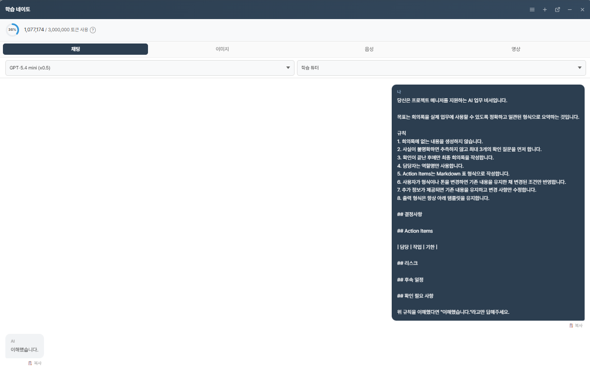

## 3. 실행 로그

다음 내용은 실제 대화의 흐름을 유지하면서 사용자 입력과 AI 응답의 핵심을 요약한 것이다. 전체 대화 원본은 `자료` 폴더의 Turn별 캡처로 유지한다.

※ 전체 원본 대화는 자료 폴더의 Turn01~Turn10 캡처 파일로 보관하여 재현 가능하도록 구성하였다.

### Turn 1

| 구분 | 내용 |
|---|---|
| 사용자 입력 | 6월 21일 신규 앱 출시 일정 점검 회의록을 제공하고 요약을 요청함. UI 시안 7월 10일, API 연동 7월 12일, 출시일 7월 15일, 사내 공지 7월 12일 및 QA 기간 관련 우려가 포함됨. |
| AI 응답 요약 | 결정사항, Action Items, 리스크, 후속 일정, 확인 필요 사항으로 구분함. 담당자를 역할명으로 표시하고 날짜별 일정을 정리함. |

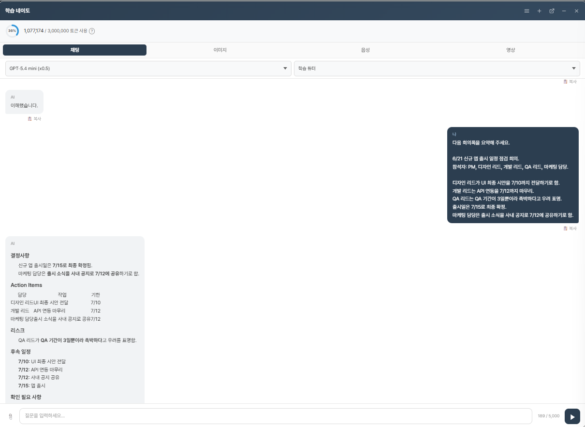

### Turn 2

| 구분 | 내용 |
|---|---|
| 사용자 입력 | 결정사항, Action Items 표, 리스크, 후속 일정, 확인 필요 사항의 지정 형식으로 다시 작성하고 회의록 외 내용은 추가하지 말라고 요청함. |
| AI 응답 요약 | 기존 회의 내용을 유지하면서 지정된 항목과 Action Items 표 형식으로 다시 작성함. |

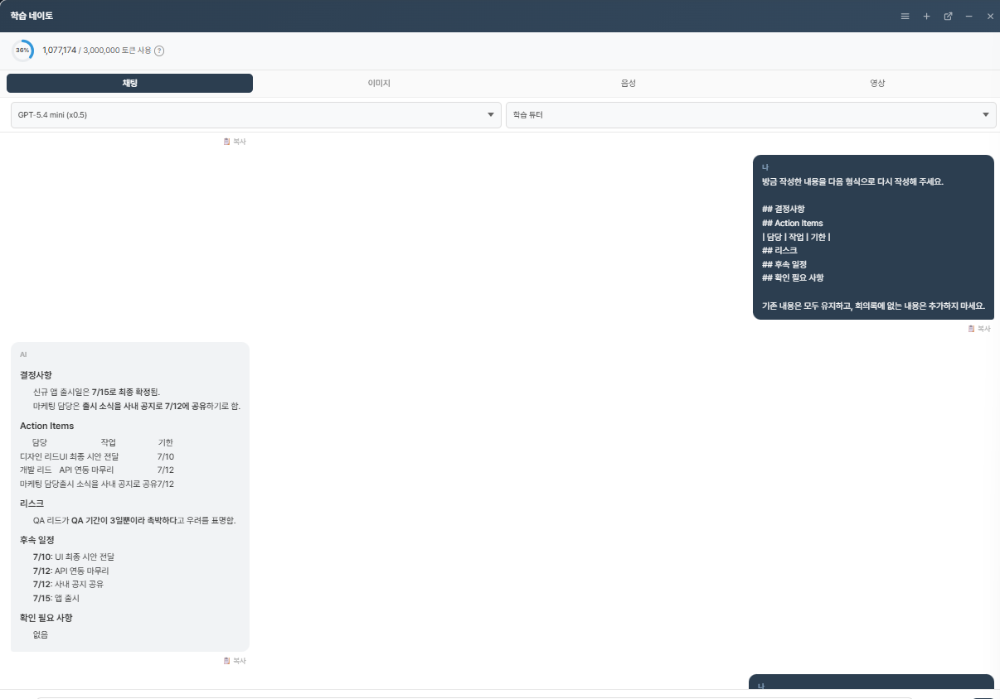

### Turn 3

| 구분 | 내용 |
|---|---|
| 사용자 입력 | Action Items의 담당자를 회의록에 나온 역할명으로 표시하고 나머지 내용과 형식은 유지하도록 요청함. |
| AI 응답 요약 | 디자인 리드, 개발 리드, 마케팅 담당을 역할명으로 표시하고 기존 항목과 내용을 유지함. |

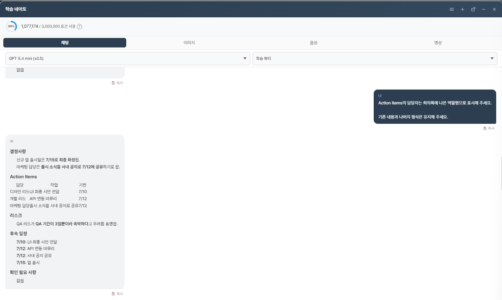

### Turn 4

| 구분 | 내용 |
|---|---|
| 사용자 입력 | 기존 정보와 출력 항목을 유지하면서 임원 보고용 문체로 더 간결하게 작성하도록 요청함. |
| AI 응답 요약 | 결정사항과 일정 표현을 간결하게 조정하고 기존 출력 항목을 유지함. |

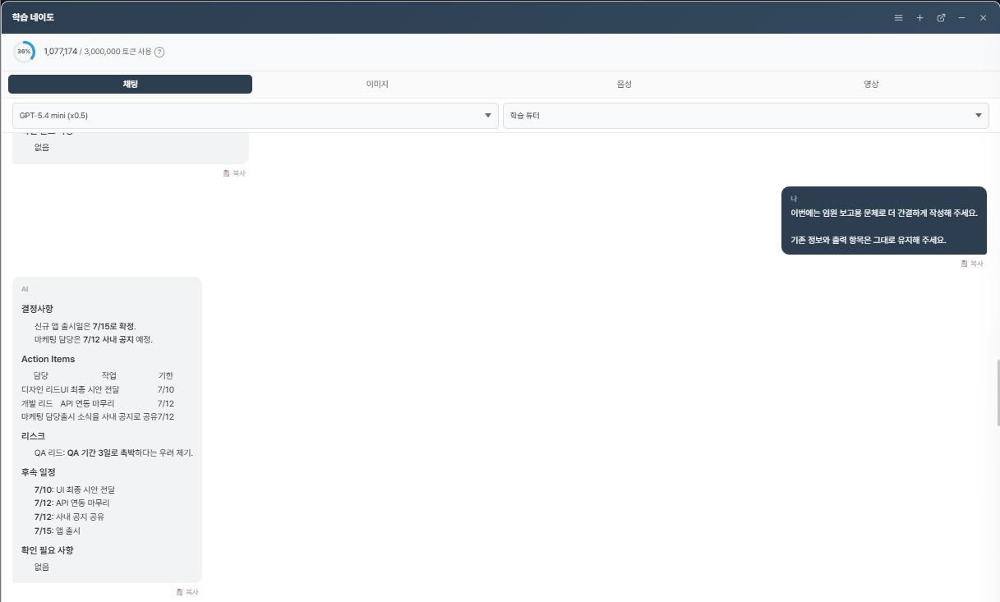

### Turn 5

| 구분 | 내용 |
|---|---|
| 사용자 입력 | 마케팅 담당의 사내 공지 시각이 7월 12일 오전으로 확정되었다는 추가 정보를 제공하고 변경된 부분만 반영하도록 요청함. |
| AI 응답 요약 | 기존 결정사항과 Action Items를 유지하면서 마케팅 담당의 기한과 후속 일정을 7월 12일 오전으로 반영함. |

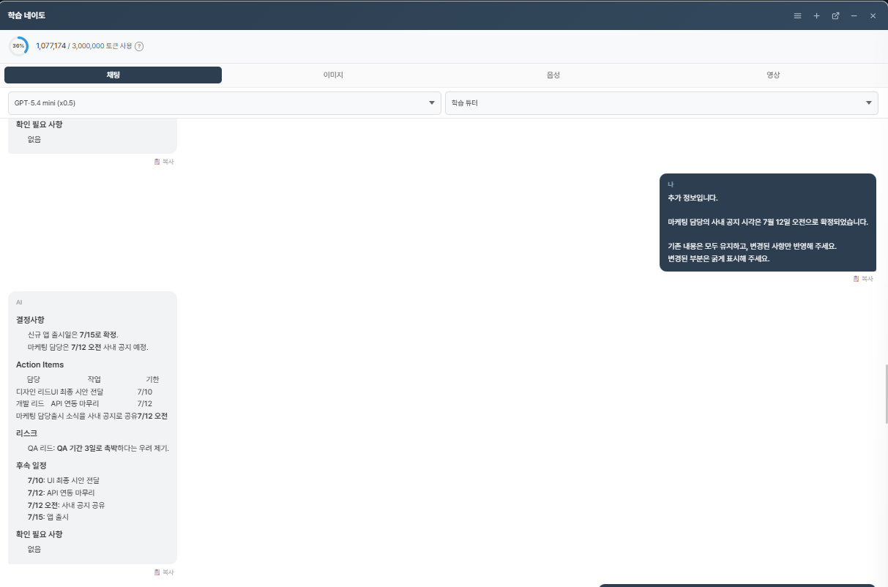

### Turn 6

| 구분 | 내용 |
|---|---|
| 사용자 입력 | 출시일을 7월 15일에서 7월 16일로 변경하고, 다른 일정과 담당자는 유지하며 필요한 확인 사항은 추측하지 않도록 요청함. |
| AI 응답 요약 | 출시일을 7월 16일로 변경하고 다른 Action Items를 유지함. 출시일 변경에 따른 QA 일정 조정 필요 여부를 확인 필요 사항으로 표시함. |

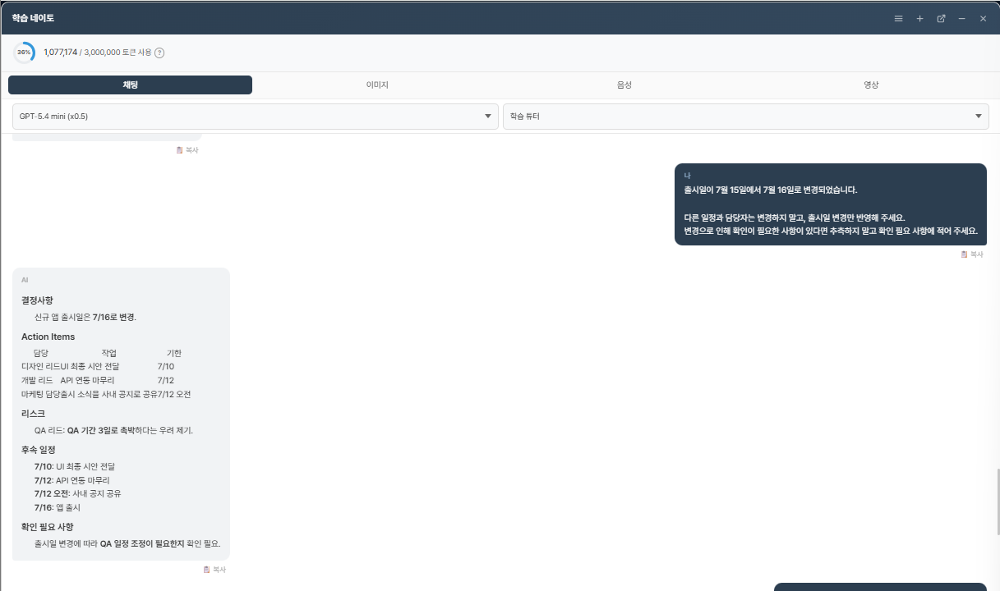

### Turn 7

| 구분 | 내용 |
|---|---|
| 사용자 입력 | UI 최종 시안 전달 기한은 기존 7월 10일을 유지한다고 명시하고, 현재까지 확정된 내용을 모두 반영하도록 요청함. |
| AI 응답 요약 | 변경된 출시일 7월 16일과 사내 공지 시각 7월 12일 오전을 유지하면서 UI 시안 기한 7월 10일을 반영함. |

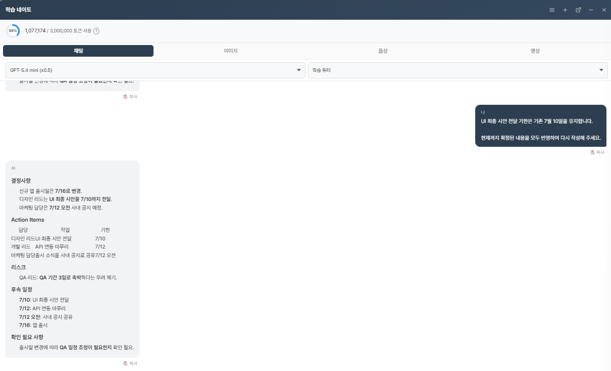

### Turn 8

| 구분 | 내용 |
|---|---|
| 사용자 입력 | 현재 내용에서 날짜가 포함된 Action Items만 Markdown 표로 정리하고 담당자, 작업, 기한은 유지하도록 요청함. |
| AI 응답 요약 | 디자인 리드, 개발 리드, 마케팅 담당의 Action Items만 표로 작성함. |

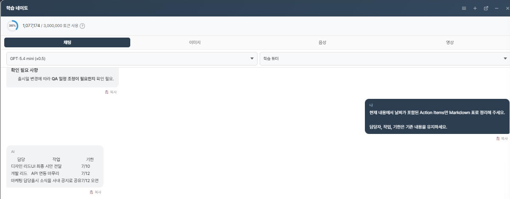

### Turn 9

| 구분 | 내용 |
|---|---|
| 사용자 입력 | 회의록에 QA 시작일이 명시되어 있는지 확인하고, 없다면 임의로 계산하지 말고 명시되어 있지 않다고 답하도록 요청함. |
| AI 응답 요약 | QA 시작일은 명시되어 있지 않다고 답함. |

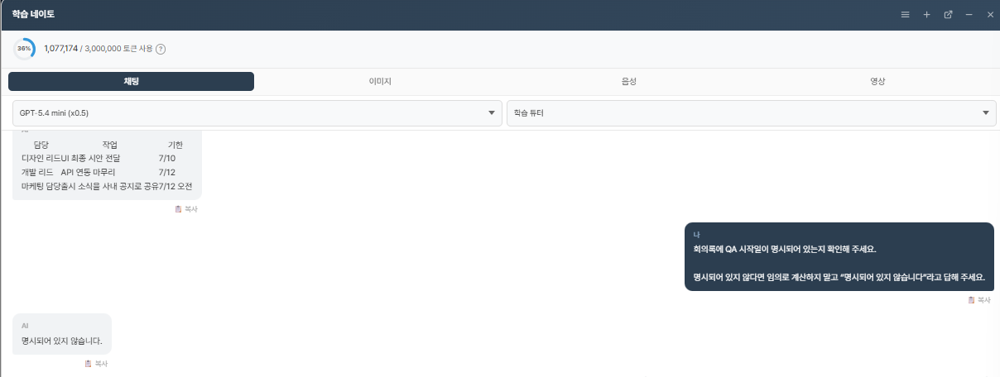

### Turn 10

| 구분 | 내용 |
|---|---|
| 사용자 입력 | 지금까지 제공된 정보와 변경 사항을 모두 반영하고, 가장 최근 정보를 적용하여 지정 형식의 최종 회의록을 작성하도록 요청함. |
| AI 응답 요약 | 출시일 7월 16일, UI 시안 7월 10일, API 연동 7월 12일, 사내 공지 7월 12일 오전을 반영함. QA 시작일은 명시되지 않았다고 확인 필요 사항에 작성함. |

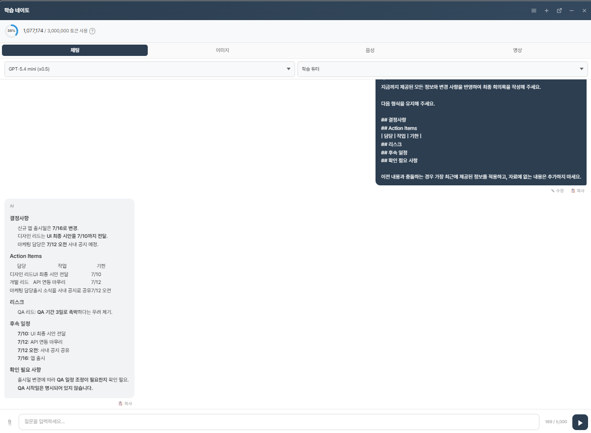

## 4. 조건 변경 및 추가 정보 반영

| 순서 | 변경 또는 추가 내용 | 반영 결과 |
|---:|---|---|
| 1 | 출력 형식을 결정사항, Action Items, 리스크, 후속 일정, 확인 필요 사항으로 지정 | 지정된 항목과 Action Items 표로 재작성 |
| 2 | 담당자를 역할명으로 표시 | 디자인 리드, 개발 리드, 마케팅 담당으로 표시 |
| 3 | 임원 보고용 문체로 변경 | 기존 정보와 출력 항목을 유지하면서 문장을 간결하게 조정 |
| 4 | 마케팅 담당의 사내 공지 시각을 7월 12일 오전으로 추가 | Action Items와 후속 일정에 반영 |
| 5 | 출시일을 7월 15일에서 7월 16일로 변경 | 결정사항과 후속 일정에 반영 |
| 6 | UI 최종 시안 전달 기한 7월 10일 유지 | 변경된 출시일 및 추가 정보와 함께 유지 |
| 7 | 날짜가 포함된 Action Items만 표로 요청 | 해당 Action Items만 표로 출력 |
| 8 | 최종 회의록 요청 | 가장 최근의 조건과 추가 정보를 반영하여 작성 |

## 5. 문맥 유지 검증

| 검증 항목 | 결과 | 근거 |
|---|---|---|
| 이전 요구사항 유지 | PASS | 출시일 변경 이후에도 UI 시안, API 연동, 마케팅 공지 및 QA 리스크가 유지됨. |
| 조건 변경 반영 | PASS | 출시일이 7월 15일에서 7월 16일로 변경됨. |
| 역할명 유지 | PASS | 담당자를 디자인 리드, 개발 리드, 마케팅 담당으로 표시함. |
| 출력 형식 유지 | PASS | 최종 응답에서 결정사항, Action Items, 리스크, 후속 일정, 확인 필요 사항 형식을 사용함. |
| 회의록 외 정보 생성 여부 | PASS | QA 시작일을 임의로 계산하지 않고 명시되어 있지 않다고 답함. |

## 6. Hallucination 검증 결과

| 번호 | 검증 질문 | AI 응답 요약 | 결과 |
|---:|---|---|---|
| 1 | 회의록에 명시된 신규 앱 출시일은 언제인가요? | 7월 15일로 답함. | PASS |
| 2 | QA 리드는 회의에서 어떤 우려를 제기했나요? | QA 기간이 3일뿐이라 촉박하다는 우려로 답함. | PASS |
| 3 | 회의록에서 QA는 며칠부터 시작한다고 되어 있나요? | 명시되어 있지 않다고 답함. | PASS |
| 4 | 회의록에서 API 연동은 몇 시에 완료하기로 했나요? | 명시되어 있지 않다고 답함. | PASS |
| 5 | 회의록에 신규 앱 개발 예산이 명시되어 있나요? | 명시되어 있지 않다고 답함. | PASS |

## 7. 문제 발생 지점

| Prompt v1의 문제 지점 | 실제 개선 필요 내용 |
|---|---|
| 고정 출력 형식 없음 | 결정사항, Action Items, 리스크, 후속 일정, 확인 필요 사항으로 출력 형식 지정 필요 |
| Action Items 표 규칙 없음 | 담당, 작업, 기한을 Markdown 표로 구분할 필요 |
| 불명확한 정보 처리 규칙 없음 | 추측하지 않고 확인 질문을 하도록 규칙 추가 필요 |
| 회의록 외 정보 생성 금지 규칙 없음 | 원문에 없는 내용을 생성하지 않도록 명시할 필요 |
| 조건 변경 및 추가 정보 반영 규칙 없음 | 기존 문맥을 유지하고 변경된 사항만 반영하도록 규칙 추가 필요 |

## 8. 개선 결과

| 비교 항목 | Prompt v1 | Prompt v2 적용 결과 |
|---|---|---|
| 출력 형식 | 고정 형식 없음 | 결정사항, Action Items, 리스크, 후속 일정, 확인 필요 사항으로 구분하고 Action Items를 표로 작성함. |
| Hallucination 방지 | 별도 금지 규칙 없음 | 회의록 외 정보 생성 금지 규칙을 적용하고, QA 시작일과 API 완료 시각이 명시되지 않았다고 답함. |
| 확인 질문 | 별도 규칙 없음 | 불명확한 경우 최대 3개의 확인 질문을 하도록 규칙을 추가함. |
| 문맥 유지 | 별도 규칙 없음 | 문체, 일정 및 출력 범위가 변경되어도 기존 정보와 최근 변경 사항을 반영함. |

## 9. 최종 평가

| 평가 항목 | 확인 결과 |
|---|---|
| Prompt v2 적용 효과 | 역할, 출력 형식, 확인 질문, 원문 근거 및 변경 반영 규칙을 적용한 회의록을 작성함. |
| Hallucination 감소 | 회의록에 없는 QA 시작일과 API 완료 시각을 생성하지 않고 명시되어 있지 않다고 답함. |
| 문맥 유지 | 10턴 동안 기존 일정과 담당자를 유지하고 마케팅 공지 시각 및 출시일 변경을 반영함. |
| 업무 활용성 | 담당, 작업, 기한을 Action Items 표로 구분하고 결정사항, 리스크 및 후속 일정을 함께 정리함. |

## 10. 과제 요구사항 충족 여부

| 요구사항 | 충족 여부 |
|---|---|
| 10턴 이상 대화 | ✅ |
| 조건 변경 | ✅ |
| 추가 정보 반영 | ✅ |
| 문맥 유지 검증 | ✅ |
| Hallucination 검증 | ✅ |
| 문제 발생 지점 | ✅ |
| 개선 결과 | ✅ |
| 문제 발생 지점 및 개선 요약 | ✅ |
