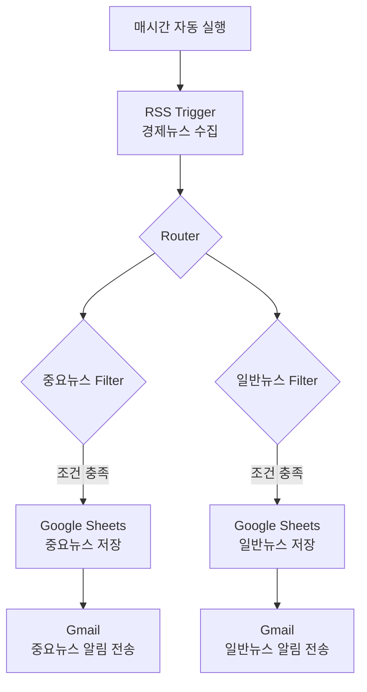

# 프로젝트 2 자유 주제 자동화 설계 및 구현

## 1. 자동화할 반복 업무 정의

### 주제

매시간 경제뉴스 RSS를 자동으로 수집하고, 중요뉴스 여부에 따라 분류하여 Google Sheets에 저장한 뒤 Gmail로 자동 알림을 보내는 업무를 자동화한다.

## 2. 자동화 도구 선정 및 선정 이유

### 도구

`Make`

### 선정 이유

Make는 다음 기능을 하나의 플랫폼에서 구현할 수 있으며, 노코드 방식으로 구성되어 유지보수가 쉽다.

- RSS
- Google Sheets
- Gmail
- Filter
- Router

## 3. 워크플로우 설계

Make의 스케줄 기능으로 시나리오를 매시간 실행한다. RSS 모듈이 새로운 경제뉴스를 수집하면 Router와 Filter가 중요뉴스 여부를 판별한다. 분류된 뉴스는 해당 Google Sheets에 저장되고, Gmail을 통해 분류 결과에 맞는 알림 메일이 전송된다.

## 4. 구현 화면

### Make Scenario

### RSS Trigger

### Filter

### Google Sheets

%20설정.png)

%20설정.png)

### Gmail

.png)

.png)

## 5. 실행 결과

### Google Sheets 저장 및 시나리오 실행 결과

시나리오를 실행한 결과 중요뉴스와 일반뉴스 두 개의 Filter 경로가 모두 실제로 실행되었다. 각 경로에서 Google Sheets 저장 및 Gmail 전송까지 정상적으로 수행되었으며, 이를 통해 조건 분기의 모든 경로가 최소 1회 이상 실행되었음을 확인하였다.

%20설정.png)

%20설정.png)

%20화면.png)

### Gmail 수신 결과

중요뉴스와 일반뉴스가 각각 분류되어 Gmail로 정상 수신되었다.

.png)

.png)

## 6. 요구사항 충족 여부

| 항목 | 충족 여부 | 증빙 |
|---|:---:|---|
| 자동화 반복 업무 정의 | O | 경제뉴스 수집·분류·저장·알림 업무 정의 |
| 자동화 도구 선정 | O | Make 사용 |
| 워크플로우 설계 | O | Mermaid 다이어그램 포함 |
| Trigger 1개 이상 | O | RSS Trigger |
| Action 2개 이상 | O | Google Sheets 저장, Gmail 전송 |
| 조건 분기(Filter/Router) | O | 중요뉴스 Filter, 일반뉴스 Filter |
| 자동 실행 구조 | O | 매시간 자동 실행 |
| 중요뉴스 경로 실행 | O | 중요뉴스 Sheets 저장 및 Gmail 수신 결과 |
| 일반뉴스 경로 실행 | O | 일반뉴스 Sheets 저장 및 Gmail 수신 결과 |
| 구현 화면 캡처 | O | Scenario, RSS, Filter, Google Sheets, Gmail 설정 화면 |
| 실행 결과 화면 캡처 | O | Google Sheets 저장 결과, Gmail 수신 결과 |

## 7. 워크플로우 흐름 설명

매시간 자동 실행되면 **RSS Trigger**가 새로운 경제뉴스를 수집한다. 수집된 뉴스는 Router를 거쳐 **Filter**에서 중요뉴스 여부에 따라 분류된다. 각 분류 조건을 충족한 뉴스는 해당 **Google Sheets에 저장**되며, 저장 후 **Gmail 전송** 모듈이 중요뉴스 또는 일반뉴스 알림 메일을 자동으로 발송한다.

`Trigger` → `Filter` → `Google Sheets 저장` → `Gmail 전송`

## 8. 보너스 과제

### 실패 알림 및 재시도 전략 설계

1. Gmail 전송 실패 시 오류 처리 경로를 통해 관리자 이메일로 실패 알림을 전송하도록 설계한다.
2. Google Sheets 저장 실패 시 Router가 오류 경로로 분기하여 `Backup` 시트에 저장하도록 설계한다.
3. 추후 일시적인 네트워크 오류 등에 대응할 수 있도록 재시도(Retry) 모듈을 추가할 수 있는 구조로 설계한다.

위 전략은 실제 구현 내용이 아닌 **향후 확장 가능한 설계**이다.
