# Python & Git 기초 프로젝트 수행 보고서

## Git과 함께하는 Python 첫 발자국 - 프롬프트 관리자

이 보고서는 `ia-codyssey` 저장소의 `미션04_Python_Git_기초` 폴더에 있는 실제 코드와 결과물, 증빙 이미지, Git 기록을 기준으로 작성하였다. 보고서 작성 직전에는 `main` 브랜치가 `origin/main`과 같은 `bfa78a5`를 가리키고 있었고 작업 트리는 깨끗한 상태였다. 명령 실행 여부가 기록으로 확인되지 않는 경우에는 완료했다고 추측하지 않고 별도로 표시하였다.

### 1. 프로젝트 개요

#### 1.1 미션 배경

이번 미션의 목표는 Python의 기본 문법으로 콘솔 프로그램을 만들고, 개발 과정을 Git과 GitHub로 관리하는 것이었다. 이전 미션에서 만든 프롬프트를 한곳에서 확인하고 필요한 프롬프트를 빠르게 찾을 수 있도록 프로젝트 주제를 "프롬프트 관리자"로 정했다.

프롬프트는 제목과 내용만 저장하는 것보다 카테고리와 즐겨찾기 상태를 함께 관리할 때 다시 활용하기 쉽다. 따라서 한 개의 프롬프트를 딕셔너리로 표현하고, 여러 딕셔너리를 리스트에 저장하는 구조를 사용하였다.

#### 1.2 프로젝트 목적

프로그램을 만들면서 다음 내용을 실제 코드에 적용하는 것을 목적으로 하였다.

- 리스트와 딕셔너리를 이용한 데이터 관리
- 조건문과 반복문을 이용한 메뉴 및 입력 검증
- 기능별 함수 분리
- JSON과 Markdown 파일 입출력
- Git 커밋을 이용한 단계별 버전 관리
- 별도 브랜치에서 기능을 개발한 뒤 `main` 브랜치로 병합하는 과정

#### 1.3 최종 구현 결과

최종 `main.py`에는 0번 종료 메뉴와 1번부터 13번까지의 기능이 연결되어 있다. 필수 기능인 추가, 목록, 카테고리 조회, 검색, 상세 보기, 즐겨찾기 관리뿐 아니라 JSON 저장·불러오기, 카테고리별 Markdown 내보내기, 수정, 삭제, 조회수 기록과 TOP 목록도 구현되어 있다.

프로그램은 시작할 때 다음 세 개의 프롬프트를 기본 데이터로 준비한다.

| 제목 | 카테고리 | 초기 즐겨찾기 | 초기 조회수 |
|---|---|---:|---:|
| LLM 프롬프트 엔지니어링 글 작성 | 텍스트 생성 | `False` | 0 |
| EchoLens 광고 이미지 제작 | 이미지 생성 | `False` | 0 |
| AI 뉴스 자동화 | 자동화 | `False` | 0 |

### 2. 개발 환경

프로젝트 파일과 증빙 화면에서 확인한 개발 환경은 다음과 같다.

| 구분 | 확인 내용 |
|---|---|
| 편집기 | Visual Studio Code |
| 운영체제 | Windows PowerShell 경로와 `git version` 결과에서 Windows 환경 확인 |
| Python | Python 3.14.7 |
| Git | git version 2.55.0.windows.2 |
| 원격 저장소 | GitHub의 `ia-codyssey` 저장소(계정 정보 비공개) |
| 현재 브랜치 | `main` |

Python 3.14.7은 프로젝트 실행 조건인 Python 3.10 이상을 충족한다. `.gitignore`에는 `__pycache__/`, `*.pyc`, `.vscode/`가 등록되어 있어 실행 중 만들어질 수 있는 캐시 파일과 개인 편집기 설정을 버전 관리에서 제외한다.

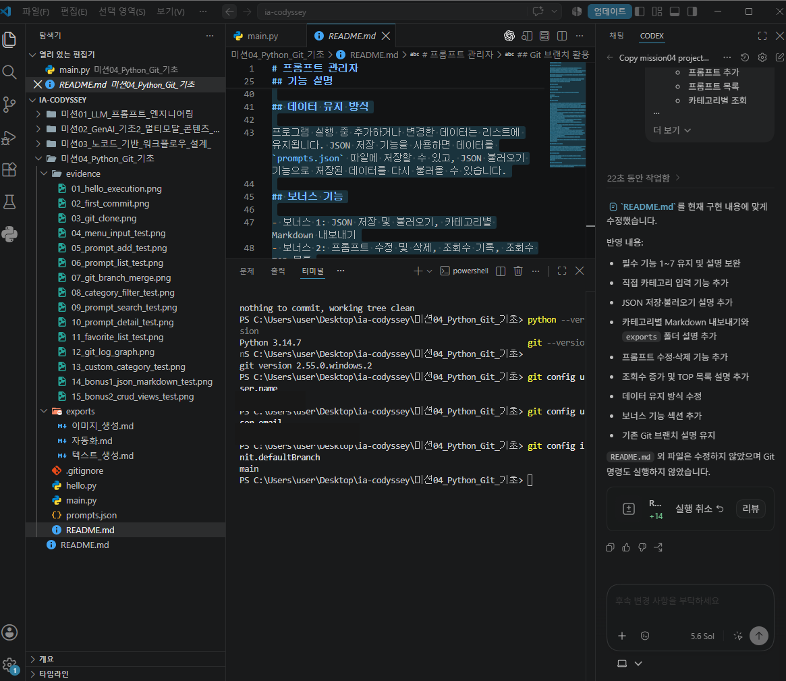

그림 1. Python, Git 버전과 Git 기본 설정을 확인한 개발 환경 화면

### 3. 프로젝트 구조

보고서 작성 시점의 실제 폴더 구조는 다음과 같다.

```text
미션04_Python_Git_기초/
├── evidence/
│   ├── 01_hello_execution.png
│   ├── 02_first_commit.png
│   ├── 03_git_clone.png
│   ├── 04_menu_input_test.png
│   ├── 05_prompt_add_test.png
│   ├── 06_prompt_list_test.png
│   ├── 07_git_branch_merge.png
│   ├── 08_category_filter_test.png
│   ├── 09_prompt_search_test.png
│   ├── 10_prompt_detail_test.png
│   ├── 11_favorite_list_test.png
│   ├── 12_git_log_graph.png
│   ├── 13_custom_category_test.png
│   ├── 14_bonus1_json_markdown_test.png
│   ├── 15_bonus2_crud_views_test.png
│   └── 16_development_environment.png
├── exports/
│   ├── 이미지_생성.md
│   ├── 자동화.md
│   └── 텍스트_생성.md
├── .gitignore
├── hello.py
├── main.py
├── prompts.json
├── README.md
└── 프로젝트_수행_보고서.md
```

`hello.py`는 Python 실행 환경을 확인하는 첫 프로그램이고, `main.py`는 프롬프트 관리자 본체이다. `prompts.json`은 저장·불러오기용 데이터 파일이며, `exports`에는 기본 프롬프트 세 개를 카테고리별로 내보낸 Markdown 파일이 있다. `evidence`에는 개발 단계와 실행 결과를 보여 주는 16장의 증빙 이미지가 저장되어 있다.

### 4. 프로젝트 개발 과정

Git 기록에서 확인되는 미션04의 작업은 2026년 8월 12일에 초기 구성부터 최종 문서 정리까지 순서대로 진행되었다. 아래 단계는 실제 커밋 순서와 각 커밋에서 변경된 파일을 기준으로 정리하였다.

#### 4.1 개발 환경 준비와 Hello Python 실행

- **목표:** Python 파일을 직접 실행할 수 있는지 확인하고 Git 사용을 위한 기본 환경을 점검하는 것이었다.
- **수행 내용:** `hello.py`에 `print("Hello")`를 작성하고 `python hello.py`로 실행하였다. 개발 환경 화면에서는 Python과 Git 버전, Git 사용자 설정과 기본 브랜치 설정을 확인하였다.
- **확인 결과:** 터미널에 `Hello`가 출력되었고 Python 3.14.7 및 Git 2.55.0.windows.2가 확인되었다.
- **사용 개념:** Python의 `print()` 함수, 터미널 명령 실행, Git 기본 설정이다.

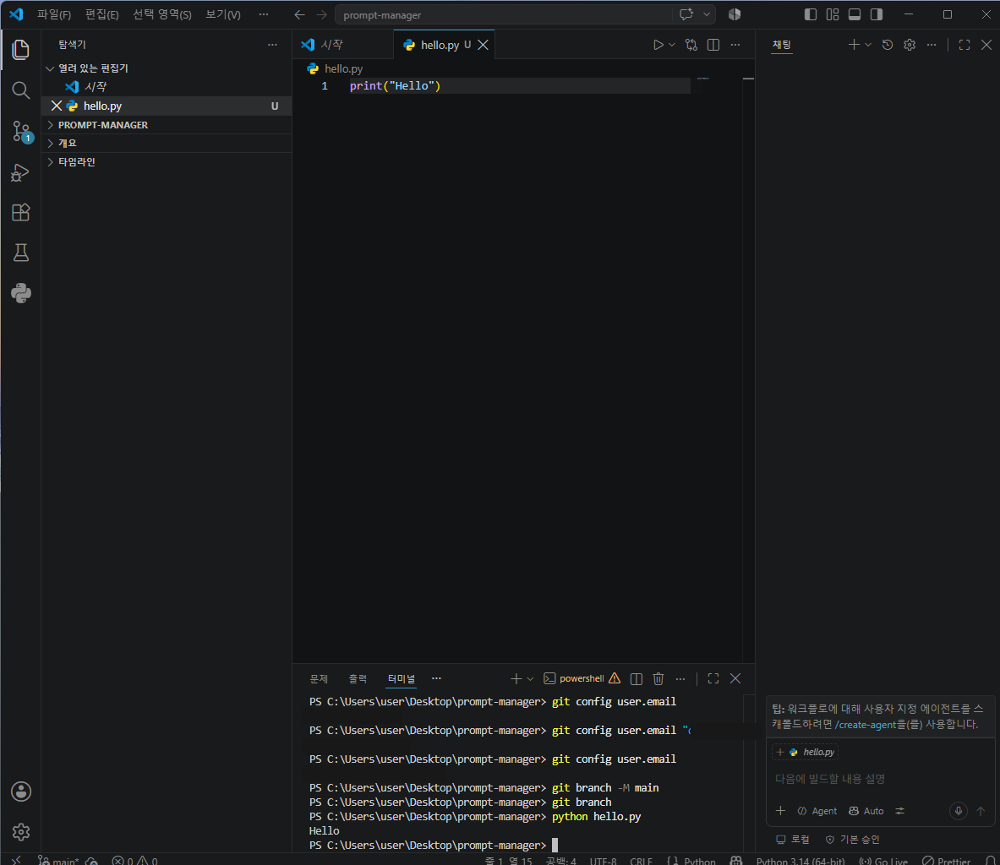

그림 2. `hello.py`의 코드와 `Hello` 출력 결과

#### 4.2 초기 프로젝트 구성과 Git 저장소 확인

- **목표:** 소스 코드, 설명 문서, 제외 규칙과 증빙 폴더를 버전 관리 대상으로 정리하는 것이었다.
- **수행 내용:** 현재 저장소의 미션04 첫 커밋 `0f1fb6b`에서 `.gitignore`, `README.md`, `hello.py`, 초기 증빙 이미지 세 개가 추가되었다. `02_first_commit.png`에는 별도의 `prompt-manager` 작업 폴더에서 `Initial project setup` 루트 커밋을 만든 화면이 남아 있다.
- **확인 결과:** 현재 저장소에서는 `0f1fb6b Add Mission 04 initial project setup`이 미션04 경로의 시작 커밋이다. 최초 커밋 화면에는 네 파일이 커밋된 결과가 보이지만, `git init`이나 `git add` 명령 자체는 화면에 나타나지 않는다.
- **사용 개념:** 저장소, 커밋, `.gitignore`, 작업 단위 기록이다.

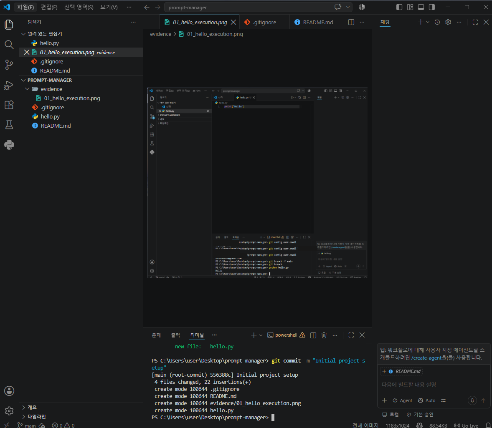

그림 3. 초기 파일을 루트 커밋으로 기록한 화면

이후 `ia-codyssey` 원격 저장소를 복제한 화면과 현재 로컬 reflog의 `clone: from ...` 기록을 모두 확인하였다.

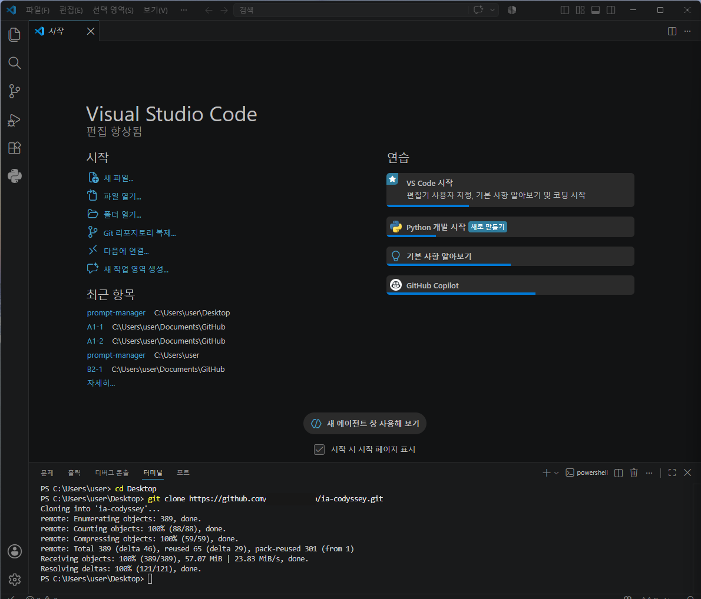

그림 4. GitHub의 `ia-codyssey` 저장소를 로컬로 clone한 결과

#### 4.3 기본 프롬프트 데이터 설계

- **목표:** 프로그램 실행 직후 확인할 수 있는 이전 미션 관련 프롬프트를 최소 세 개 준비하는 것이었다.
- **수행 내용:** `7dc704b Add default prompt data` 커밋에서 `main.py`가 추가되었다. 당시 각 프롬프트는 `title`, `content`, `category`, `favorite` 키를 가진 딕셔너리였고, 이 딕셔너리들을 `prompts` 리스트에 저장하였다. `views` 키와 조회수 기능은 후속 커밋 `0627b1a`에서 추가되었다.
- **확인 결과:** LLM 글 작성, EchoLens 광고 이미지 제작, AI 뉴스 자동화 프롬프트가 각각 텍스트 생성, 이미지 생성, 자동화 카테고리로 등록되어 있다.
- **사용 개념:** 리스트, 딕셔너리, 문자열, 불리언, 정수이다.

#### 4.4 메뉴 출력과 잘못된 입력 처리

- **목표:** 사용자가 번호를 선택하여 기능을 실행하고 잘못된 번호를 입력해도 프로그램이 종료되지 않도록 만드는 것이었다.
- **수행 내용:** `35bea09 feat: add menu input handling`에서 메뉴 입력 처리가 구현되었다. 현재 코드는 `show_menu()`, `get_menu_choice()`, `run_menu_choice()`, `main()`으로 메뉴 표시, 입력, 기능 연결, 반복 실행을 나눈다.
- **확인 결과:** 증빙 화면에는 숫자 범위를 벗어난 값과 문자 입력에 안내 메시지가 표시되고, 0을 입력하면 정상 종료되는 과정이 보인다. 화면은 개발 중 1~7번 메뉴 단계이며, 이후 커밋에서 최종 13개 기능으로 확장되었다.
- **사용 개념:** `input()`, `if`/`elif`/`else`, `while`, 함수 호출이다.

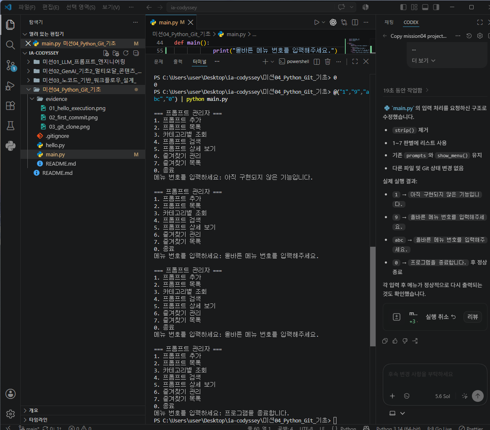

그림 5. 메뉴 반복 출력, 잘못된 입력 안내와 종료 테스트

#### 4.5 프롬프트 추가와 빈 입력 검증

- **목표:** 사용자가 제목, 내용, 카테고리를 입력하여 새로운 프롬프트를 등록하도록 만드는 것이었다.
- **수행 내용:** `228545c feat: implement prompt add feature`에서 `add_prompt()`가 구현되었다. 제목과 내용에는 `strip()`을 적용하고 빈 문자열이면 다시 입력받는다. 카테고리 번호가 올바르지 않을 때도 선택을 반복하며, 당시 새 데이터의 `favorite`은 `False`로 시작하였다. 새 데이터에 `views`를 0으로 설정하는 처리는 후속 커밋 `0627b1a`에서 추가되었다.
- **확인 결과:** 증빙 화면에는 빈 제목과 내용, 잘못된 카테고리 번호 9에 대한 재입력 안내와 정상 등록 결과가 함께 보인다.
- **사용 개념:** 반복문 기반 입력 검증, 리스트 `append()`, 딕셔너리 생성이다.

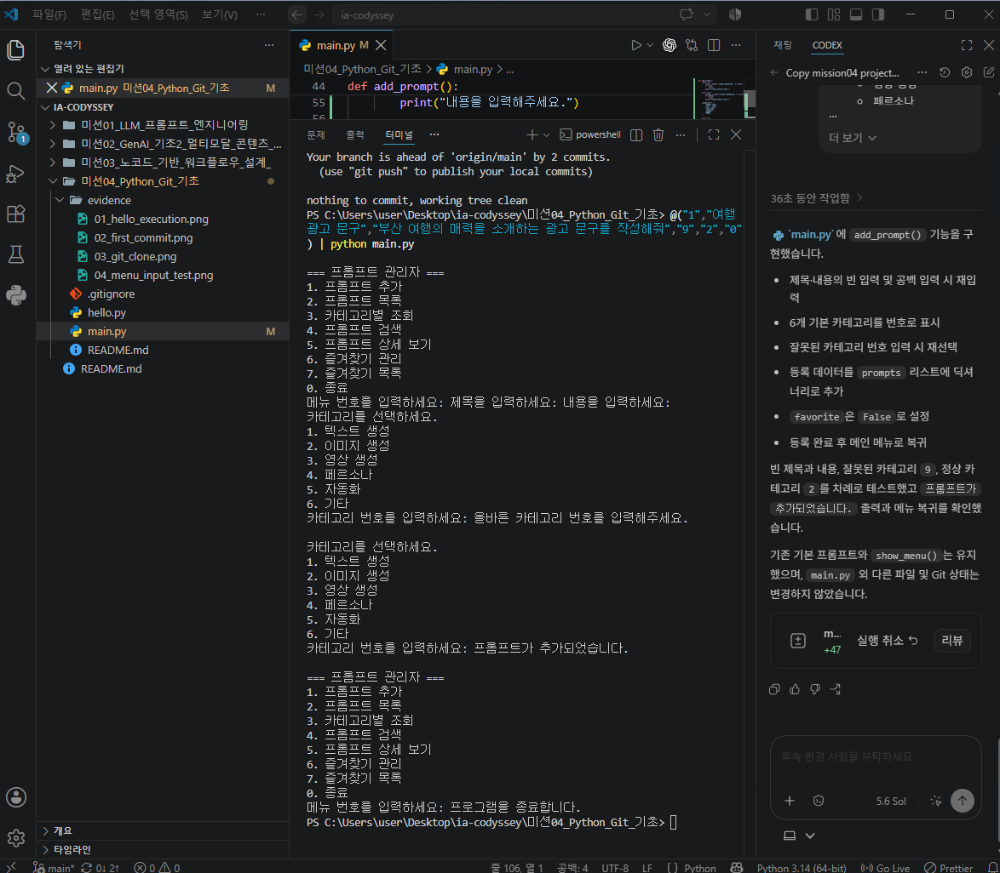

그림 6. 빈 입력과 잘못된 카테고리를 처리한 뒤 프롬프트를 추가한 결과

#### 4.6 별도 브랜치의 프롬프트 목록 개발과 병합

- **목표:** 목록 기능을 `main`과 분리된 브랜치에서 개발하고 완료 후 병합하는 것이었다.
- **수행 내용:** `7a3770a feat: implement prompt list feature`에서 `show_list()`가 작성되었고, 그래프 증빙에는 이 커밋에 `feature/prompt-list` 브랜치가 표시된다. 다음 병합 커밋 `935f98a merge: prompt list feature`는 `228545c`와 `7a3770a`를 두 부모로 가진다.
- **확인 결과:** 목록에는 번호, 제목, 카테고리와 즐겨찾기 O/X가 출력된다. 현재 `git branch -a`에는 정리된 `main`과 `origin/main`만 남아 있지만, 병합 커밋과 당시 증빙 화면으로 별도 브랜치 개발 이력을 확인할 수 있다.
- **사용 개념:** `enumerate()`, 조건 표현식, Git branch와 merge이다.

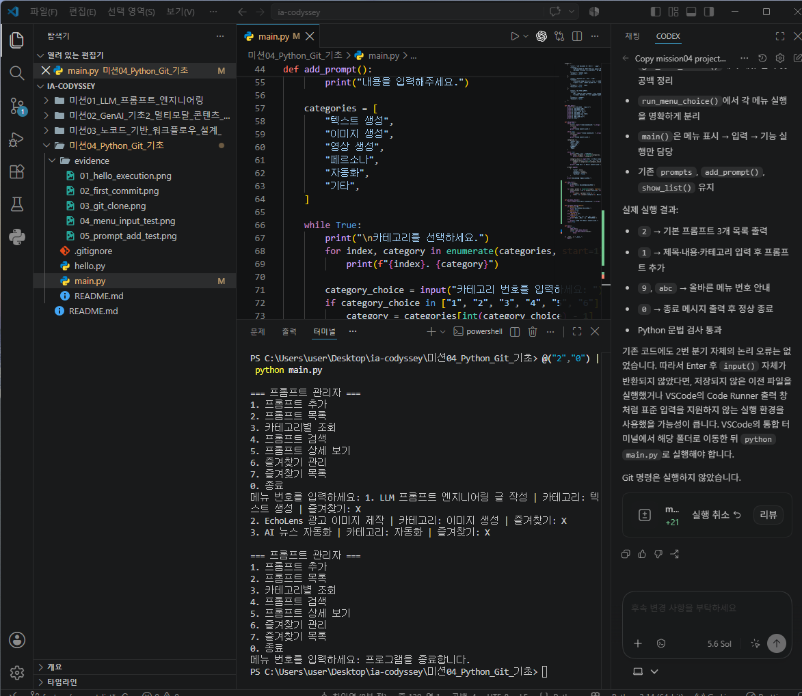

그림 7. 기본 프롬프트 세 개를 목록으로 출력한 결과

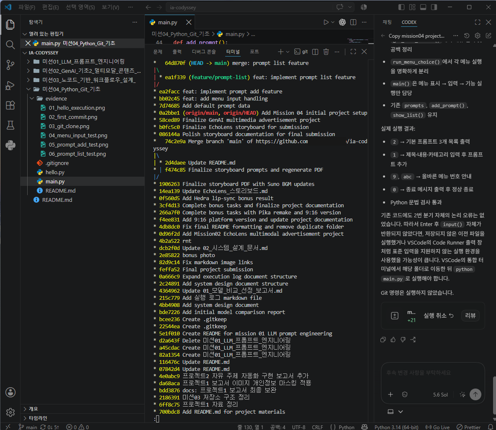

그림 8. `feature/prompt-list`의 목록 기능 커밋과 `main` 병합 그래프

#### 4.7 카테고리별 조회 구현

- **목표:** 전체 목록을 모두 읽지 않고 원하는 카테고리의 프롬프트만 확인하도록 만드는 것이었다.
- **수행 내용:** `ef8fa9c feat: implement category filter feature`에서 `category_list()`가 추가되었다. 현재 데이터에 존재하는 카테고리를 중복 없이 모으고, 선택한 카테고리와 같은 프롬프트만 리스트 컴프리헨션으로 찾는다.
- **확인 결과:** 텍스트 생성 카테고리를 선택했을 때 해당하는 LLM 프롬프트만 출력된 화면이 확인된다.
- **사용 개념:** 리스트, 반복문, 멤버십 검사, 리스트 컴프리헨션이다.

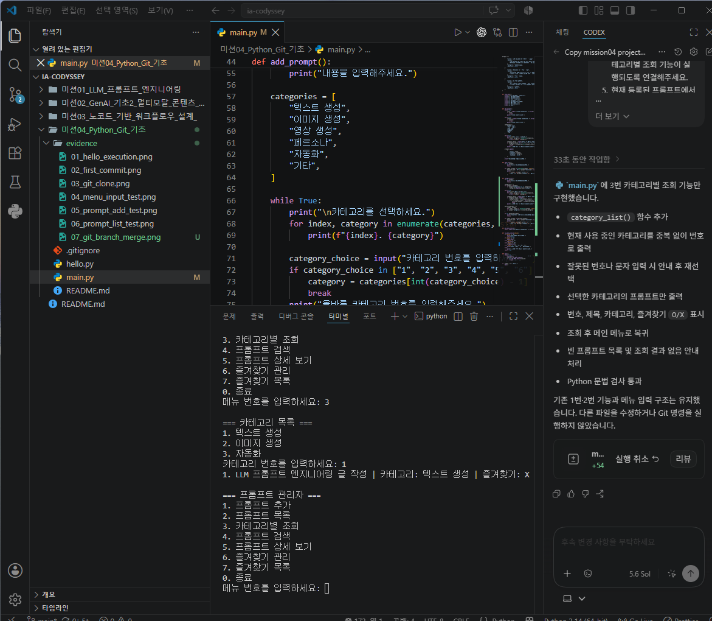

그림 9. 선택한 카테고리에 속한 프롬프트만 조회한 결과

#### 4.8 제목과 내용 검색 구현

- **목표:** 제목이나 내용 일부만 알고 있어도 프롬프트를 찾을 수 있도록 만드는 것이었다.
- **수행 내용:** `c5cef69 feat: implement prompt search feature`에서 `search_prompt()`가 추가되었다. 빈 검색어는 다시 입력받고, 검색어와 대상 문자열에 `casefold()`를 적용하여 대소문자의 영향을 줄였다.
- **확인 결과:** `AI`를 검색했을 때 제목에 해당 문자열이 포함된 `AI 뉴스 자동화`가 출력된 화면이 확인된다.
- **사용 개념:** 문자열 정규화, 부분 문자열 검색, `or` 조건, 리스트 컴프리헨션이다.

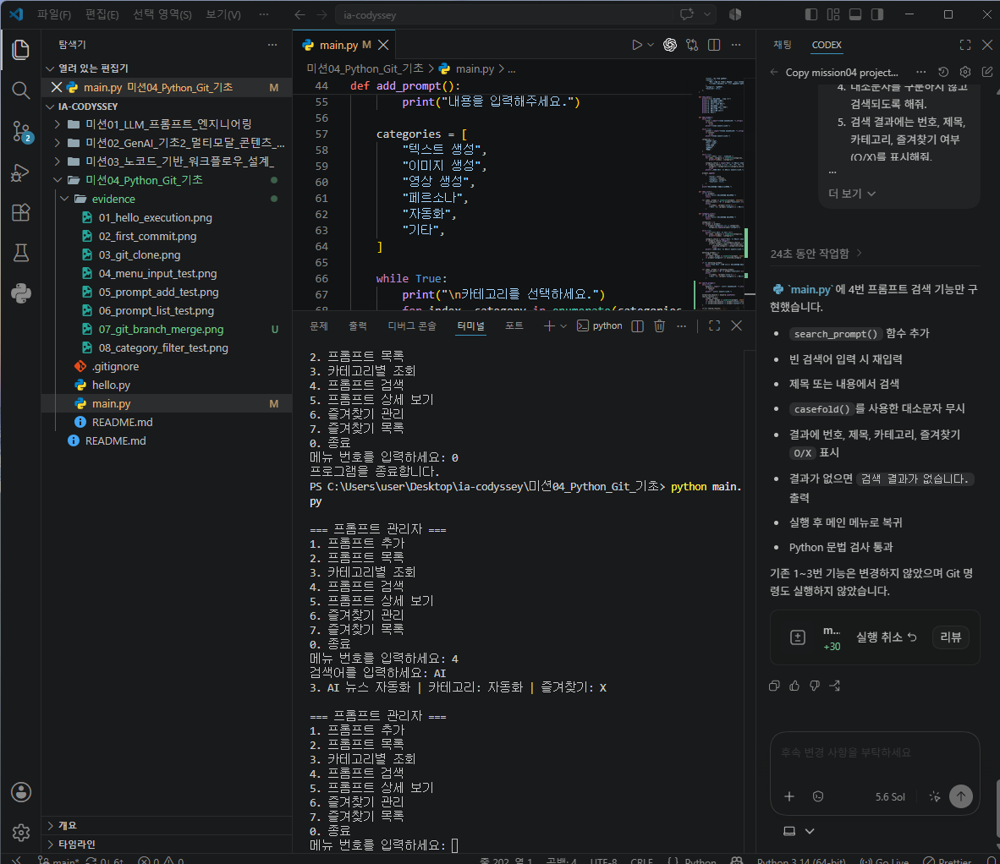

그림 10. 제목 또는 내용에서 검색어를 찾아 출력한 결과

#### 4.9 프롬프트 상세 보기 구현

- **목표:** 목록의 요약 정보보다 자세한 제목, 내용, 카테고리와 즐겨찾기 상태를 확인하도록 만드는 것이었다.
- **수행 내용:** `1472d6e feat: implement prompt detail feature`에서 `show_prompt_detail()`이 추가되었다. 번호가 숫자인지와 리스트 범위 안에 있는지를 검사한 뒤 선택된 딕셔너리의 세부 값을 출력한다.
- **확인 결과:** 증빙 화면에는 첫 번째 LLM 프롬프트의 전체 내용이 출력되어 있다. 이 화면은 조회수 보너스가 추가되기 전 단계이며, 현재 코드는 상세 조회 때마다 `views`를 1 증가시켜 조회수도 함께 출력한다.
- **사용 개념:** `isdigit()`, 리스트 인덱스, 딕셔너리 값 조회이다.

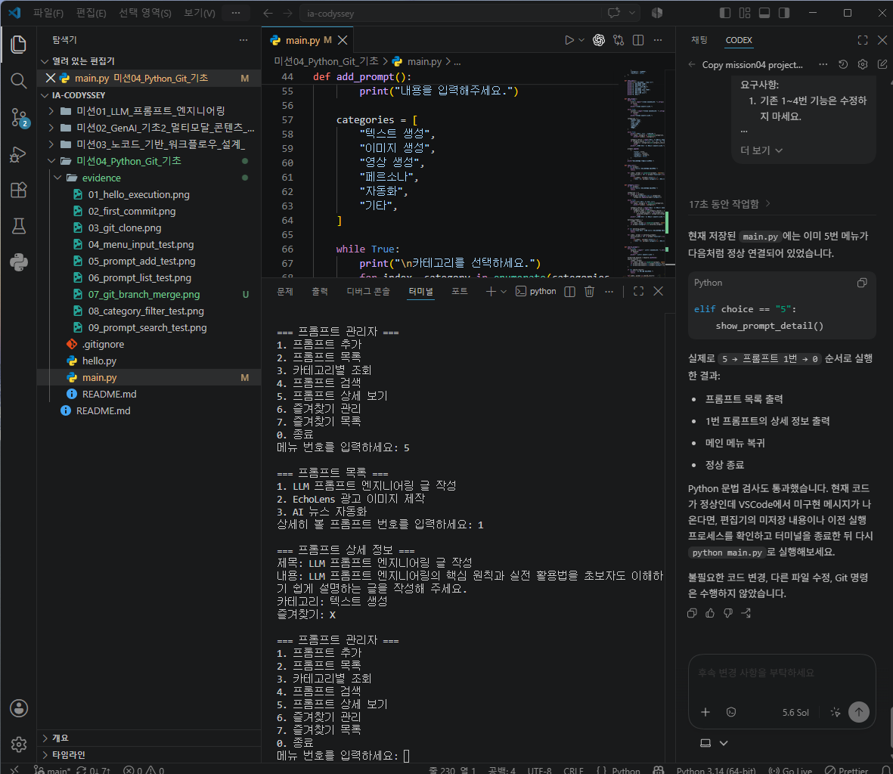

그림 11. 선택한 프롬프트의 상세 정보를 출력한 결과

#### 4.10 즐겨찾기 관리와 목록 구현

- **목표:** 자주 사용하는 프롬프트를 표시하고 따로 모아 볼 수 있도록 만드는 것이었다.
- **수행 내용:** `b9a5484 feat: implement favorites feature`에서 `manage_favorite()`와 `show_favorites()`가 구현되었다. 선택한 프롬프트의 불리언 값을 `not`으로 반전하고, 값이 `True`인 프롬프트만 즐겨찾기 목록에 포함한다.
- **확인 결과:** 첫 번째 프롬프트를 즐겨찾기에 추가한 뒤 7번 목록에서 즐겨찾기 O로 출력한 화면이 확인된다.
- **사용 개념:** 불리언, 논리 연산자 `not`, 조건 필터링이다.

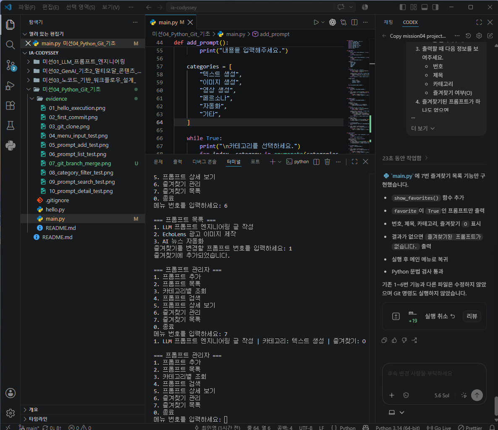

그림 12. 즐겨찾기 상태를 변경하고 즐겨찾기 목록을 조회한 결과

#### 4.11 README와 Git 그래프 증빙 정리

- **목표:** 실행 방법과 기능, Git 개발 흐름을 다른 사람이 확인할 수 있도록 문서와 증빙을 정리하는 것이었다.
- **수행 내용:** `18d9205 docs: complete mission04 README and evidence`에서 README와 브랜치 병합 이미지가 정리되었고, `400c7d9 docs: add git log graph evidence`에서 전체 로그 그래프 이미지가 추가되었다.
- **확인 결과:** 그래프에서 초기 구성부터 목록, 카테고리, 검색, 상세 보기, 즐겨찾기까지 기능별 커밋이 순서대로 분리되어 있음을 확인할 수 있다.
- **사용 개념:** 의미 있는 커밋 메시지, `git log --oneline --graph --all`, 개발 증빙 관리이다.

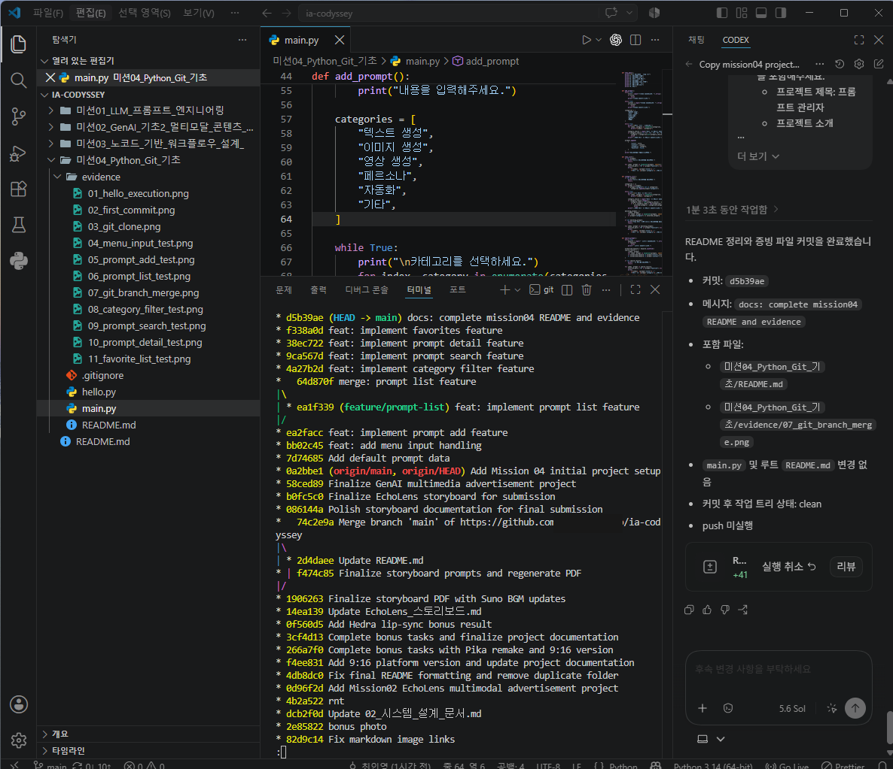

그림 13. 기능별 커밋과 목록 기능 병합이 표시된 Git 로그

#### 4.12 사용자 정의 카테고리 추가

- **목표:** 기본 여섯 카테고리에 없는 주제도 사용자가 직접 등록할 수 있도록 만드는 것이었다.
- **수행 내용:** `ef89d8f feat: add custom category input`에서 7번 `직접 입력` 선택지가 추가되었다. 직접 입력한 이름도 빈 문자열이면 다시 입력받는다.
- **확인 결과:** `AI 학습`이라는 새 카테고리로 프롬프트를 추가하고 목록에서 해당 카테고리를 확인한 화면이 있다.
- **사용 개념:** 중첩 반복문, 사용자 입력, 동적 데이터 저장이다.

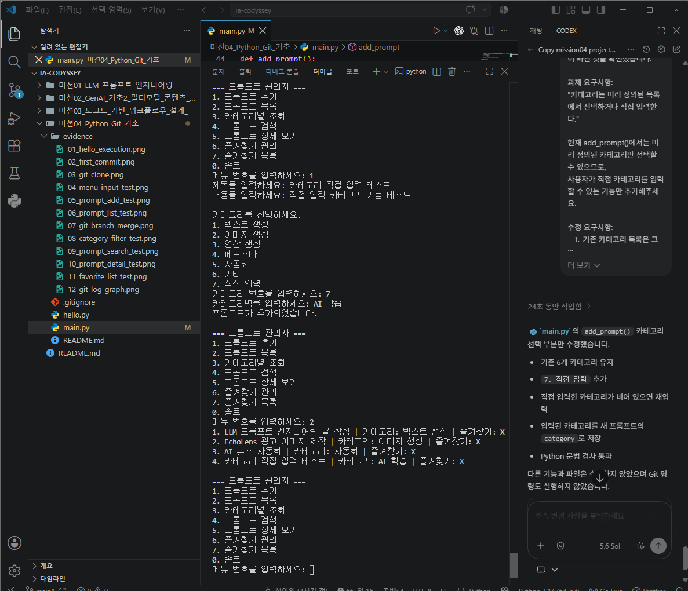

그림 14. 직접 입력한 `AI 학습` 카테고리로 프롬프트를 추가한 결과

#### 4.13 보너스 1: JSON과 Markdown 파일 입출력

- **목표:** 메모리에 있는 데이터를 파일로 보존하고, 카테고리별 문서로 활용할 수 있도록 만드는 것이었다.
- **수행 내용:** `1b21645 feat: add JSON persistence and Markdown export`에서 `save_prompts()`, `load_prompts()`, `export_markdown()`이 추가되었다. 같은 커밋에 `prompts.json`과 세 개의 카테고리별 Markdown 파일도 포함되었다.
- **확인 결과:** 화면에서는 JSON 불러오기와 Markdown 내보내기 완료 메시지, 생성된 `exports` 폴더와 세 파일을 확인할 수 있다. JSON 저장 과정 전체는 이 화면에 직접 나타나지 않으며, 저장 기능은 `main.py`의 `save_prompts()`와 실제 `prompts.json` 파일을 함께 확인하여 판단하였다.
- **사용 개념:** `open()`, `with`, `json.dump()`, `json.load()`, UTF-8, `os.path`, 폴더 생성이다.

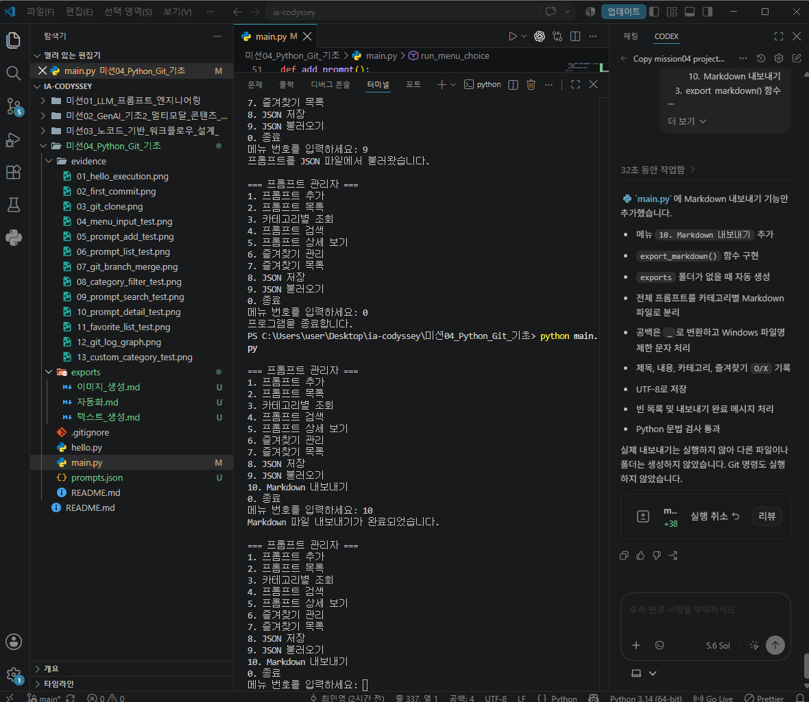

그림 15. JSON 불러오기와 카테고리별 Markdown 내보내기 결과

#### 4.14 보너스 2: 수정, 삭제와 조회수

- **목표:** 등록 후에도 프롬프트를 관리하고 사용 빈도를 확인할 수 있도록 만드는 것이었다.
- **수행 내용:** `0627b1a feat: add prompt CRUD and view count features`에서 `edit_prompt()`, `delete_prompt()`, `show_top_prompts()`가 추가되고 상세 조회에 조회수 증가가 연결되었다.
- **확인 결과:** 화면에서 선택한 프롬프트의 제목을 수정하고, 삭제할 프롬프트를 확인한 후 삭제한 결과가 보인다. 조회수 증가와 TOP 목록의 전체 실행 과정은 이 화면에 직접 나타나지 않으며, 해당 기능의 구현 여부는 현재 `main.py`의 `show_prompt_detail()`과 `show_top_prompts()`를 함께 확인하여 판단하였다.
- **사용 개념:** 딕셔너리 값 수정, 리스트 `pop()`, 확인 입력, `sorted()`와 `lambda`이다.

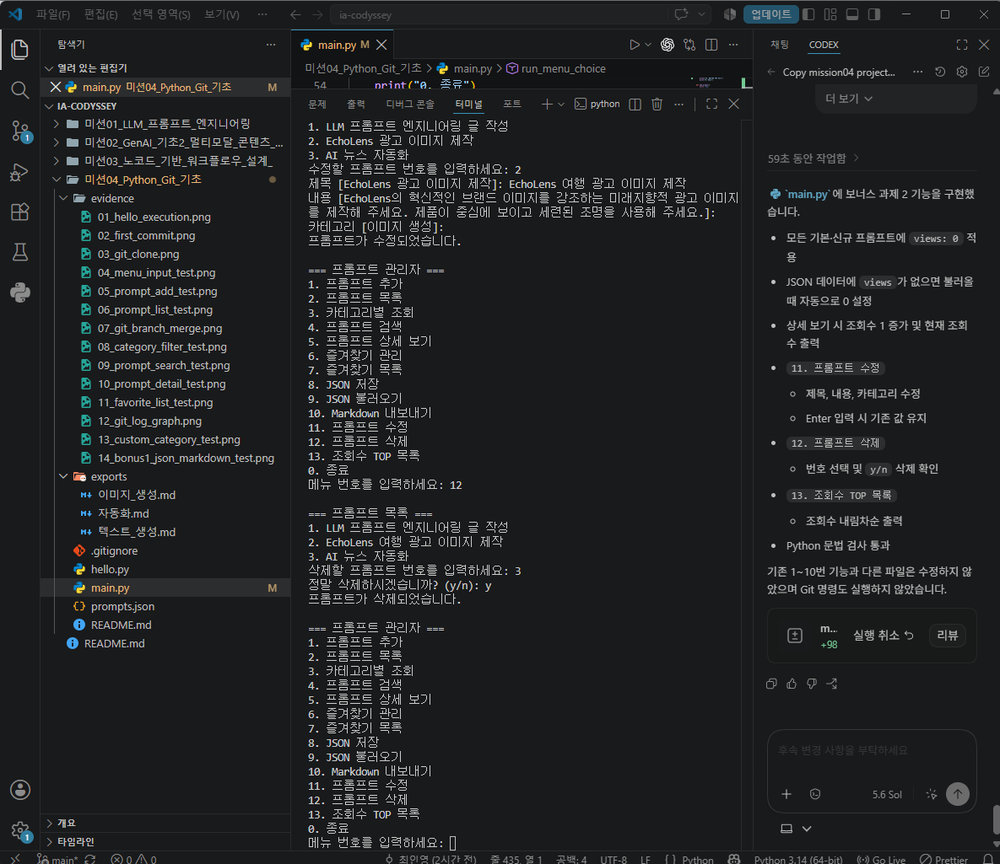

그림 16. 프롬프트 수정과 삭제 및 보너스 메뉴 구성 확인

#### 4.15 최종 문서와 환경 증빙 정리

- **목표:** 최종 기능과 실행 환경을 README 및 증빙 자료에 반영하는 것이었다.
- **수행 내용:** `bca53cf docs: update README for bonus features`에서 보너스 기능 설명을 보완했고, `bfa78a5 docs: add development environment evidence`에서 개발 환경 이미지와 README 설명을 추가하였다.
- **확인 결과:** 현재 README에는 최종 13개 기능, 기본 카테고리, 데이터 유지 방식, 보너스 기능과 브랜치 활용 내용이 정리되어 있다.
- **사용 개념:** 프로젝트 문서화, 코드와 문서의 일치 여부 확인이다.

### 5. 프롬프트 관리자 최종 기능

최종 메뉴는 `show_menu()`와 `run_menu_choice()`에서 다음과 같이 연결되어 있다.

| 번호 | 기능 | 연결 함수 | 설명 |
|---:|---|---|---|
| 1 | 프롬프트 추가 | `add_prompt()` | 제목, 내용, 카테고리를 입력하여 새 딕셔너리를 추가한다. |
| 2 | 프롬프트 목록 | `show_list()` | 전체 프롬프트의 번호, 제목, 카테고리, 즐겨찾기 상태를 출력한다. |
| 3 | 카테고리별 조회 | `category_list()` | 현재 데이터의 카테고리를 제시하고 선택한 항목만 출력한다. |
| 4 | 프롬프트 검색 | `search_prompt()` | 제목 또는 내용에 검색어가 포함된 프롬프트를 찾는다. |
| 5 | 프롬프트 상세 보기 | `show_prompt_detail()` | 상세 정보를 출력하고 조회수를 1 증가시킨다. |
| 6 | 즐겨찾기 관리 | `manage_favorite()` | 선택한 프롬프트의 즐겨찾기 상태를 추가 또는 해제한다. |
| 7 | 즐겨찾기 목록 | `show_favorites()` | 즐겨찾기가 `True`인 프롬프트만 출력한다. |
| 8 | JSON 저장 | `save_prompts()` | 현재 `prompts` 리스트를 `prompts.json`에 UTF-8 JSON으로 저장한다. |
| 9 | JSON 불러오기 | `load_prompts()` | `prompts.json`을 읽어 현재 목록을 교체한다. |
| 10 | Markdown 내보내기 | `export_markdown()` | 프롬프트를 카테고리별 `.md` 파일로 내보낸다. |
| 11 | 프롬프트 수정 | `edit_prompt()` | 제목, 내용, 카테고리를 수정하며 빈 입력은 기존 값을 유지한다. |
| 12 | 프롬프트 삭제 | `delete_prompt()` | 번호 선택과 `y/n` 확인 후 프롬프트를 삭제한다. |
| 13 | 조회수 TOP 목록 | `show_top_prompts()` | 조회수를 기준으로 내림차순 정렬하여 출력한다. |
| 0 | 종료 | `run_menu_choice()` | `False`를 반환하여 메인 반복문을 끝낸다. |

메뉴 번호가 위 범위에 없으면 `올바른 메뉴 번호를 입력해주세요.`를 출력한 뒤 메뉴를 다시 표시한다. 기능도 한 함수에 몰아넣지 않고 메뉴, 입력, 추가, 조회, 검색, 즐겨찾기, 파일 처리, 수정·삭제와 정렬 기능으로 나누었다.

### 6. Python에서 사용한 핵심 개념

| Python 개념 | 프로젝트에서 사용한 위치와 역할 |
|---|---|
| 변수 | `choice`, `title`, `content`, `category`, `keyword` 등에 사용자의 입력과 처리 중간값을 저장한다. |
| 리스트 | `prompts`에 여러 프롬프트를 저장하고 `categories`에 기본 카테고리를 저장한다. |
| 딕셔너리 | 한 프롬프트의 제목, 내용, 카테고리, 즐겨찾기, 조회수를 키와 값으로 묶는다. |
| 조건문 | 메뉴 분기, 빈 입력 확인, 번호 범위 확인, 즐겨찾기 상태와 삭제 확인을 처리한다. |
| 반복문 | 메뉴를 계속 실행하고 올바른 입력이 들어올 때까지 다시 질문하며 목록을 순회한다. |
| 함수 | `add_prompt()`, `search_prompt()`처럼 기능을 작은 단위로 분리하여 읽기와 수정을 쉽게 한다. |
| `input()` | 메뉴 번호, 제목, 내용, 카테고리, 검색어, 수정값과 삭제 확인을 입력받는다. |
| 문자열 처리 | `strip()`으로 공백 입력을 걸러내고 `casefold()`로 대소문자 차이를 줄여 검색한다. |
| 파일 입출력 | `with open(..., encoding="utf-8")`으로 JSON과 Markdown 파일을 안전하게 읽고 쓴다. |
| JSON | `json.dump()`로 저장하고 `json.load()`로 불러와 프로그램 데이터로 복원한다. |
| 정렬 | `sorted()`와 `lambda`로 조회수 기준 TOP 목록을 만든다. |
| 예외 처리 | JSON 파일이 없거나 형식이 잘못된 경우 `FileNotFoundError`, `JSONDecodeError`를 처리한다. |

외부 설치가 필요한 라이브러리는 사용하지 않았다. import 목록은 Python 표준 라이브러리인 `json`과 `os` 두 개이다.

### 7. Git과 GitHub 활용 과정

#### 7.1 실제 커밋 흐름

현재 Git 기록에는 미션04 폴더를 직접 변경한 커밋이 16개 있다. 여기에 목록 기능을 결합한 병합 커밋 `935f98a`가 별도로 존재하므로, 미션04 개발 흐름에서 확인되는 커밋은 병합을 포함해 17개이다.

| 순서 | 커밋 | 메시지 | 확인된 작업 |
|---:|---|---|---|
| 1 | `0f1fb6b` | Add Mission 04 initial project setup | `.gitignore`, README, Hello 코드와 초기 증빙 추가 |
| 2 | `7dc704b` | Add default prompt data | 기본 프롬프트와 `main.py` 추가 |
| 3 | `35bea09` | feat: add menu input handling | 메뉴 입력 처리와 테스트 증빙 추가 |
| 4 | `228545c` | feat: implement prompt add feature | 프롬프트 추가 기능 구현 |
| 5 | `7a3770a` | feat: implement prompt list feature | 별도 브랜치에서 목록 기능 구현 |
| 6 | `935f98a` | merge: prompt list feature | 목록 기능을 `main` 흐름에 병합 |
| 7 | `ef8fa9c` | feat: implement category filter feature | 카테고리별 조회 구현 |
| 8 | `c5cef69` | feat: implement prompt search feature | 제목·내용 검색 구현 |
| 9 | `1472d6e` | feat: implement prompt detail feature | 상세 보기 구현 |
| 10 | `b9a5484` | feat: implement favorites feature | 즐겨찾기 관리와 목록 구현 |
| 11 | `18d9205` | docs: complete mission04 README and evidence | README와 병합 증빙 정리 |
| 12 | `400c7d9` | docs: add git log graph evidence | Git 로그 그래프 증빙 추가 |
| 13 | `ef89d8f` | feat: add custom category input | 사용자 정의 카테고리 구현 |
| 14 | `1b21645` | feat: add JSON persistence and Markdown export | JSON, Markdown 보너스 기능과 결과물 추가 |
| 15 | `0627b1a` | feat: add prompt CRUD and view count features | 수정, 삭제, 조회수 기능 구현 |
| 16 | `bca53cf` | docs: update README for bonus features | 최종 보너스 기능 문서화 |
| 17 | `bfa78a5` | docs: add development environment evidence | 개발 환경 증빙 추가 |

기능을 메뉴, 추가, 목록, 카테고리, 검색, 상세 보기, 즐겨찾기처럼 작은 단위로 나누어 커밋했기 때문에 어느 시점에 어떤 기능이 추가되었는지 추적할 수 있다.

#### 7.2 Git 명령별 확인 결과

Git은 명령 자체를 항상 영구 기록하지 않는다. 따라서 현재 로그, reflog, 설정과 증빙 화면에서 직접 확인할 수 있는 범위를 다음과 같이 구분하였다.

| 명령/개념 | 의미 | 이 프로젝트에서 확인된 내용 | 판정 |
|---|---|---|---|
| `git init` | 새 로컬 저장소를 초기화한다. | 최초 커밋 증빙에는 루트 커밋이 보이지만 `git init` 명령 줄은 보이지 않는다. 현재 `ia-codyssey` 작업 사본은 clone으로 생성되었다. | 명령 실행 확인 불가 |
| `git add` | 변경 파일을 다음 커밋 대상으로 올린다. | 커밋에 새 파일이 포함된 사실은 확인되지만 `git add` 명령 자체는 로그와 이미지에 없다. | 명령 실행 확인 불가 |
| `git commit` | 준비된 변경에 메시지와 버전을 남긴다. | `git log`의 66개 저장소 전체 커밋, 미션04 경로 변경 16개와 최초 커밋 화면에서 확인된다. | 확인 |
| `git push` | 로컬 커밋을 원격 저장소에 올린다. | `origin`의 fetch/push URL과 현재 `origin/main`이 `bfa78a5`인 상태는 확인된다. 다만 현재 작업 사본이 최종 상태에서 clone되었으므로 실제 `git push` 실행 기록으로 단정할 수 없다. | 부분 확인 |
| `git pull` | 원격 변경을 가져와 현재 브랜치에 통합한다. | 현재 reflog와 증빙에는 pull 항목이 없어 과거 프로젝트 수행 중 `git pull` 명령을 실행했는지 확인할 수 없다. | 명령 실행 확인 불가 |
| `git checkout` | 브랜치나 특정 버전으로 작업 위치를 전환한다. | 현재 로컬 reflog에 2026-08-13 `main`에서 `checkout-test`로, 다시 `main`으로 이동한 `checkout:` 기록이 있다. 이는 최종 검증 과정의 기록이며 프로젝트 기능 개발 당시의 checkout 기록으로 직접 볼 수 없다. | 부분 확인 |
| `git clone` | 원격 저장소를 새 로컬 폴더로 복제한다. | `03_git_clone.png`와 현재 reflog의 clone 기록에서 확인된다. 원격 계정 정보는 공개하지 않았다. | 확인 |
| `git branch` | 독립된 개발 흐름을 만든다. | `07_git_branch_merge.png`에 `feature/prompt-list`가 표시된다. 현재 브랜치 목록에는 정리된 `main`과 `origin/main`만 남아 있다. | 과거 증빙에서 확인 |
| `git merge` | 다른 브랜치의 작업을 현재 브랜치에 합친다. | 두 부모를 가진 `935f98a merge: prompt list feature` 커밋에서 확인된다. | 확인 |

`git remote -v` 결과에서는 fetch와 push가 같은 GitHub 원격 저장소를 사용한다. 원격 계정 정보는 공개하지 않았으며, 보고서 작성 전 상태에서 로컬 `main`, `origin/main`, `origin/HEAD`는 모두 `bfa78a5`를 가리켰다.

### 8. Git 브랜치 활용

프롬프트 목록 기능은 추가 기능 커밋 `228545c` 이후의 별도 흐름에서 개발되었다. 당시 그래프를 간단히 나타내면 다음과 같다.

```text
*   935f98a merge: prompt list feature
|\
| * 7a3770a feat: implement prompt list feature
|/
* 228545c feat: implement prompt add feature
```

`7a3770a`은 증빙 화면에서 `feature/prompt-list` 브랜치로 표시되며, `935f98a`는 `228545c`와 `7a3770a`를 부모로 가진 실제 병합 커밋이다. 즉, 목록 기능을 기존 `main` 개발 흐름에서 분리해 작업한 뒤 병합하여 두 흐름을 하나로 합쳤다.

별도 브랜치를 사용하면 새로운 기능을 개발하는 동안 기준 브랜치를 안정적으로 유지할 수 있고, 병합 커밋을 통해 어떤 기능이 언제 합쳐졌는지도 그래프에서 확인할 수 있다. 현재는 해당 기능 브랜치 참조가 남아 있지 않지만 커밋과 병합 관계는 Git 이력에 보존되어 있다.

관련 증빙은 그림 8의 `07_git_branch_merge.png`와 그림 13의 `12_git_log_graph.png`이다.

### 9. 보너스 기능 구현

#### 9.1 JSON 저장

`save_prompts()`는 현재 `prompts` 리스트를 `prompts.json`에 저장한다. `ensure_ascii=False`를 사용하므로 한글을 그대로 기록하고, `indent=4`로 사람이 읽기 쉬운 형태를 만든다.

#### 9.2 JSON 불러오기

`load_prompts()`는 JSON 데이터를 읽은 뒤 기존 리스트를 `clear()`하고 불러온 데이터로 교체한다. 현재 `prompts.json`에는 `views` 키가 없지만, 불러올 때 각 프롬프트에 `setdefault("views", 0)`을 적용하므로 보너스 기능 추가 전 형식과도 함께 사용할 수 있다. 파일이 없거나 JSON 형식이 잘못된 경우에는 예외를 처리하고 안내 메시지를 출력한다.

#### 9.3 Markdown 내보내기

`export_markdown()`은 카테고리를 키로 하는 딕셔너리에 프롬프트를 묶고 `exports` 폴더에 카테고리별 파일을 생성한다. 공백은 밑줄로 바꾸고 Windows 파일명에 사용할 수 없는 문자는 `_`로 치환한다. 현재 실제 결과물은 `텍스트_생성.md`, `이미지_생성.md`, `자동화.md` 세 개이다.

#### 9.4 프롬프트 수정

`edit_prompt()`는 선택한 프롬프트의 제목, 내용, 카테고리를 수정한다. 수정 입력을 비워 두면 기존 값을 유지하므로 바꾸고 싶은 항목만 선택적으로 변경할 수 있다.

#### 9.5 프롬프트 삭제

`delete_prompt()`는 번호 범위를 먼저 검사하고 `정말 삭제하시겠습니까? (y/n)` 질문을 거친다. `y`일 때만 `pop()`으로 삭제하고 `n`이면 취소하므로 실수로 바로 삭제되는 것을 막는다.

#### 9.6 조회수 기록과 TOP 목록

`show_prompt_detail()`을 실행하면 선택한 프롬프트의 `views`가 1 증가한다. `show_top_prompts()`는 `views` 값을 기준으로 전체 데이터를 내림차순 정렬하여 순위, 원래 번호, 제목과 조회수를 출력한다.

### 10. 요구사항 충족 결과

판정에서 `O`는 실제 코드·파일·Git 기록 또는 증빙으로 확인된 항목이고, `확인 불가`는 명령 실행 자체를 현재 자료만으로 증명할 수 없는 항목이다.

| 요구사항 | 판정 | 확인 방법 |
|---|---|---|
| Python 3.10 이상 | O | 개발 환경 증빙에서 Python 3.14.7 확인 |
| Hello Python 실행 | O | `hello.py`, `01_hello_execution.png` |
| 콘솔 메뉴와 번호 입력 | O | `show_menu()`, `get_menu_choice()`, 메뉴 테스트 이미지 |
| 잘못된 입력 처리 | O | 메뉴 분기와 각 입력 반복문, 실행 증빙 |
| 기본 프롬프트 3개 이상 | O | `main.py`와 `prompts.json`의 세 데이터 |
| 리스트와 딕셔너리 활용 | O | `prompts` 리스트와 프롬프트 딕셔너리 |
| 프롬프트 추가 | O | `add_prompt()`, `05_prompt_add_test.png` |
| 제목·내용·카테고리 빈 입력 검증 | O | `add_prompt()`의 반복 입력 검사 |
| 새 프롬프트 즐겨찾기 기본값 `False` | O | `add_prompt()`의 추가 딕셔너리 |
| 프롬프트 전체 목록 | O | `show_list()`, `06_prompt_list_test.png` |
| 카테고리별 조회 | O | `category_list()`, `08_category_filter_test.png` |
| 제목 또는 내용 검색 | O | `search_prompt()`, `09_prompt_search_test.png` |
| 상세 보기 | O | `show_prompt_detail()`, `10_prompt_detail_test.png` |
| 즐겨찾기 추가·해제 및 목록 | O | `manage_favorite()`, `show_favorites()`, 관련 증빙 |
| 직접 입력 카테고리 | O | `add_prompt()`의 7번 선택지, 관련 증빙 |
| 실행 중 리스트 데이터 관리 | O | 전역 `prompts` 리스트를 각 함수가 갱신 |
| 종료 후 기본값으로 초기화 | O | 실행 때 `main.py`의 기본 리스트를 새로 구성하며, 영구 보존은 사용자가 JSON 저장·불러오기를 선택할 때만 수행 |
| 기능별 함수 분리 | O | 메뉴와 13개 기능을 여러 함수로 분리 |
| 표준 라이브러리만 사용 | O | import는 `json`, `os`만 사용 |
| JSON 저장·불러오기 | O | `save_prompts()`, `load_prompts()`, `prompts.json` 확인. 증빙 화면에서는 불러오기 결과 확인 |
| 카테고리별 Markdown 내보내기 | O | 코드와 `exports`의 세 파일 |
| 프롬프트 수정·삭제 | O | `edit_prompt()`, `delete_prompt()`, 보너스 2 증빙 |
| 조회수 증가와 TOP 목록 | O | `show_prompt_detail()`, `show_top_prompts()` |
| Git 저장소 사용 | O | 현재 저장소와 Git 상태 확인 |
| GitHub 원격 저장소 연결 | O | `git remote -v`의 origin URL |
| 최소 10개 이상의 의미 있는 커밋 | O | 미션04 경로 변경 16개와 별도 병합 커밋 확인 |
| 별도 브랜치에서 기능 개발 | O | `feature/prompt-list` 증빙과 `7a3770a` |
| `main` 브랜치로 merge | O | 병합 커밋 `935f98a` |
| `.gitignore` | O | 실제 파일과 제외 규칙 확인 |
| `README.md` | O | 실제 파일과 최종 기능 설명 확인 |
| `git log --oneline --graph --all` 확인 | O | 현재 로그와 `12_git_log_graph.png` |
| `git commit` | O | 실제 커밋 로그와 최초 커밋 증빙 |
| `git clone` | O | 증빙 이미지와 reflog |
| `git checkout` | 부분 확인 | 현재 로컬 reflog에서 검증용 `checkout-test` 전환은 확인되지만 프로젝트 기능 개발 당시의 실행 기록으로는 직접 확인하기 어려움 |
| `git init` | 확인 불가 | 초기화 명령 줄이 현재 기록과 이미지에 없음 |
| `git add` | 확인 불가 | 커밋 내용은 있으나 명령 자체는 기록되지 않음 |
| `git push` | 부분 확인 | 원격 반영 상태는 확인되지만 실행 명령 기록은 없음 |
| `git pull` | 확인 불가 | 현재 reflog와 증빙에 pull 명령 기록 없음 |

프로그램 필수 기능과 두 보너스 기능은 모두 현재 코드와 파일에서 확인되었다. Git 요구사항 중 저장소, 원격 연결, 커밋 수, 브랜치, 병합과 clone은 확인되었다. checkout은 최종 검증 과정의 현재 로컬 기록만 확인되었고, `init`, `add`, `pull`은 과거 프로젝트 수행 중 실행 여부를 확인할 수 없으며 push는 원격 반영 상태만 부분적으로 확인되었다.

### 11. 문제 해결 과정

#### 11.1 잘못된 입력으로 인한 프로그램 중단 방지

메뉴와 프롬프트 번호를 바로 정수로 변환하면 문자가 입력될 때 오류가 발생할 수 있다. 현재 코드는 먼저 문자열로 입력받고 `isdigit()`과 범위 조건을 확인한 후에만 정수로 변환한다. 제목, 내용, 검색어와 직접 입력 카테고리는 `strip()` 결과가 비어 있으면 반복해서 질문한다. 메뉴와 프롬프트 추가 증빙에서 잘못된 값 이후에도 프로그램이 계속 실행되는 것을 확인할 수 있다.

#### 11.2 기능이 한곳에 몰리는 문제 방지

기능이 늘어나면서 하나의 반복문 안에 모든 코드를 넣으면 읽기 어려워진다. 이를 해결하기 위해 메뉴 출력, 기능 선택, 추가, 목록, 검색, 즐겨찾기, 파일 처리와 보너스 기능을 각각 함수로 나눴다. `main()`은 메뉴를 반복하고 종료 여부만 판단하므로 전체 실행 흐름을 쉽게 확인할 수 있다.

#### 11.3 실행 중 데이터와 파일 데이터의 차이 처리

기본 요구사항의 데이터는 프로그램 실행 중 리스트에 유지되고 종료하면 초기화된다. 필요한 경우에만 8번 JSON 저장과 9번 JSON 불러오기를 사용하여 파일로 보존하도록 선택 기능을 추가했다. 또한 기존 `prompts.json`에 조회수 키가 없어도 `setdefault()`로 0을 넣어 현재 코드에서 사용할 수 있도록 하였다.

#### 11.4 카테고리 이름을 안전한 파일명으로 변환

사용자 정의 카테고리에는 파일명으로 사용할 수 없는 문자가 들어갈 수 있다. Markdown 내보내기에서는 공백을 밑줄로 바꾸고 `< > : " / \\ | ? *` 문자를 `_`로 치환한다. 이 처리로 Windows에서도 카테고리 이름을 이용해 파일을 만들 수 있다.

#### 11.5 독립된 기능 개발과 병합

목록 기능을 `feature/prompt-list`에서 작성한 뒤 `935f98a`로 병합하여 기능 개발 흐름을 분리하였다. 병합 그래프와 두 부모 커밋을 통해 목록 기능이 어느 기준에서 갈라져 다시 합쳐졌는지 확인할 수 있다.

#### 11.6 Git 명령 증빙의 한계 구분

커밋 객체에는 결과가 남지만 `git add`처럼 개별 명령 실행이 항상 기록되는 것은 아니다. 또한 현재 로컬 저장소는 완성된 원격 저장소를 clone한 작업 사본이므로 `origin/main`과 같은 상태만으로 과거 push 명령을 증명할 수 없다. 이 보고서에서는 저장소 상태와 실제 명령 기록을 구분하여 확인되지 않은 명령을 임의로 완료 처리하지 않았다.

### 12. 프로젝트를 통해 배운 점

이번 프로젝트에서는 Python 문법을 각각 연습하는 데서 끝나지 않고 하나의 프로그램 안에서 연결해 볼 수 있었다. 리스트에 여러 딕셔너리를 저장하니 프롬프트를 추가하거나 삭제해도 같은 자료 구조로 목록, 검색, 즐겨찾기와 조회수 기능을 만들 수 있었다.

입력값을 바로 사용하지 않고 `strip()`, `isdigit()`과 범위 조건으로 먼저 검사하는 과정도 중요했다. 잘못된 입력이 들어왔을 때 프로그램이 끝나는 대신 다시 안내하도록 만들면서 반복문과 조건문이 실제 프로그램에서 어떤 역할을 하는지 이해할 수 있었다.

기능을 함수와 커밋 단위로 나누는 방법도 익혔다. `main()`에 모든 코드를 작성하는 대신 각 기능에 이름을 붙여 함수로 분리하니 메뉴와 세부 기능의 관계가 명확해졌다. Git에서도 한 기능씩 커밋하여 변경 과정을 확인할 수 있었고, 목록 기능을 별도 브랜치에서 개발하고 병합하면서 branch와 merge의 목적을 실제 그래프로 확인했다.

마지막으로 JSON 저장·불러오기와 Markdown 내보내기를 구현하면서 메모리에만 있는 데이터와 파일에 남는 데이터의 차이를 경험했다. 코드뿐 아니라 README, 실행 화면과 Git 로그를 함께 정리해야 프로젝트의 수행 과정을 다른 사람에게 정확하게 전달할 수 있다는 점도 배웠다.

### 13. 최종 결과

최종 결과물은 Python 표준 라이브러리만으로 실행되는 콘솔 기반 프롬프트 관리자이다. 세 개의 기본 프롬프트를 시작 데이터로 제공하고, 필수 관리 기능과 사용자 정의 카테고리, JSON·Markdown 파일 처리, 수정·삭제·조회수 보너스 기능을 포함한다.

Git 기록에서는 기능별 커밋, 10개를 넘는 미션 관련 커밋, `feature/prompt-list` 개발과 `main` 병합을 확인하였다. 원격 저장소 연결과 clone 기록도 확인되었다. 다만 기록이 남지 않은 Git 명령은 사실로 추정하지 않고 요구사항 확인표에 별도로 표시하였다.

기존 `main.py`, `hello.py`, `prompts.json`, `.gitignore`, `README.md`, `exports`와 `evidence`는 분석 대상으로만 사용하였으며 이 보고서를 작성하기 위해 내용을 변경하지 않았다. 새로 추가한 결과물은 `프로젝트_수행_보고서.md` 한 파일이다.
