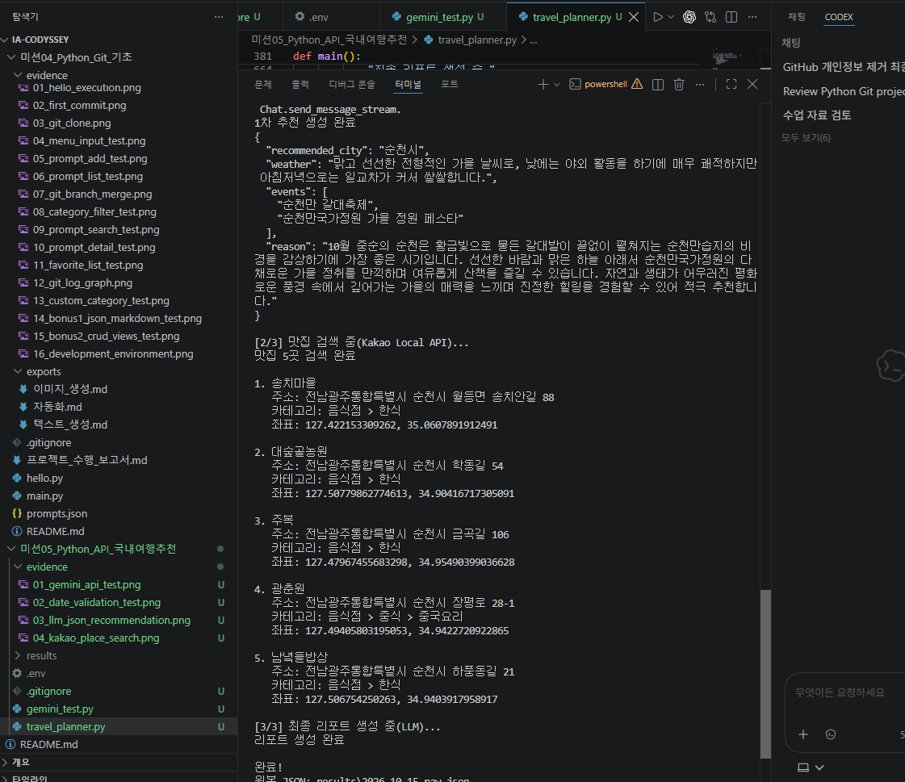
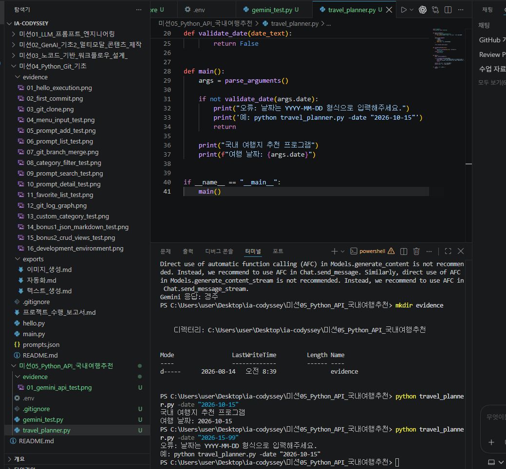
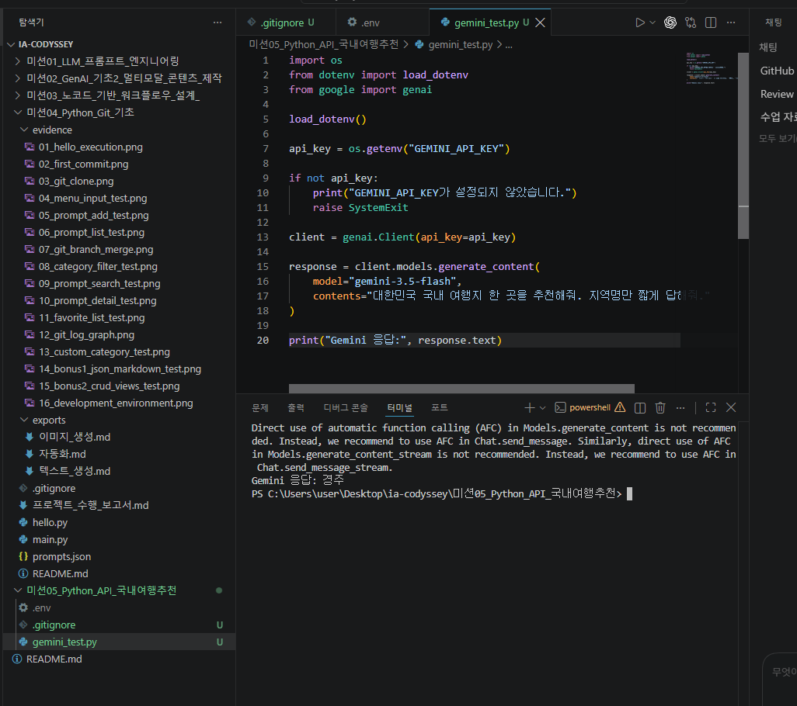
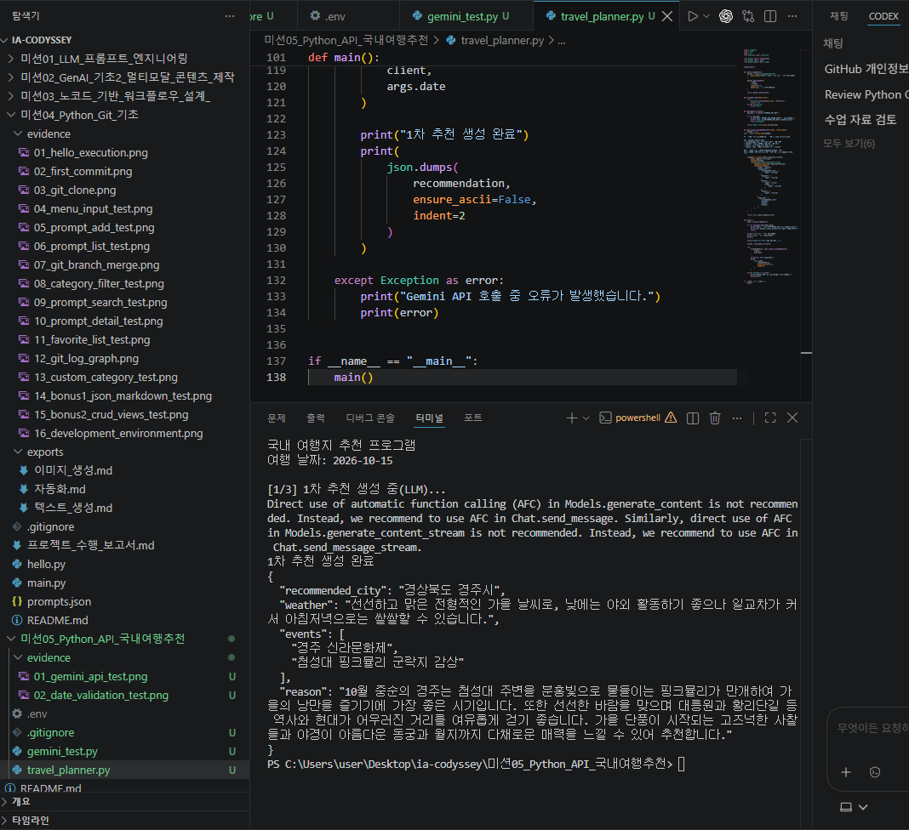
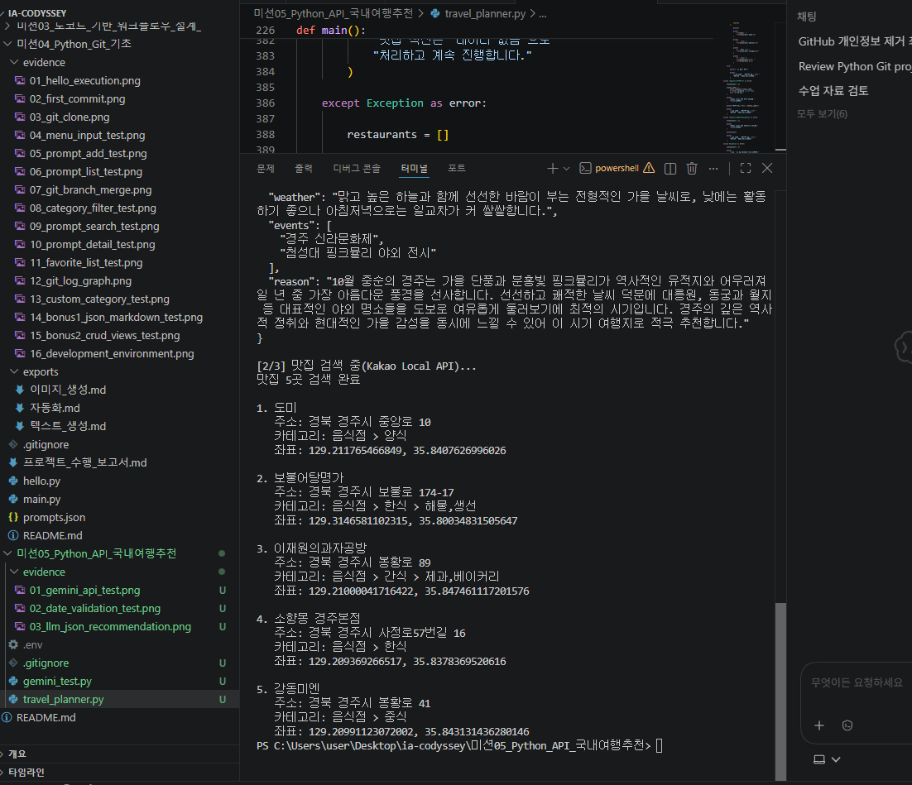
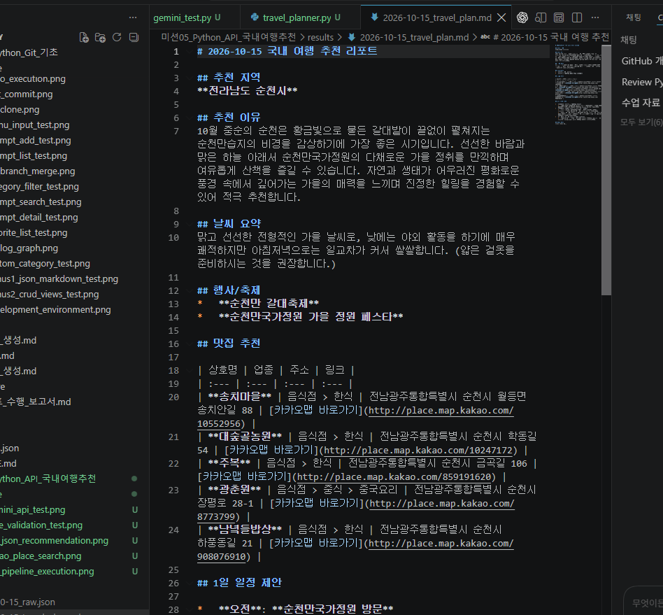
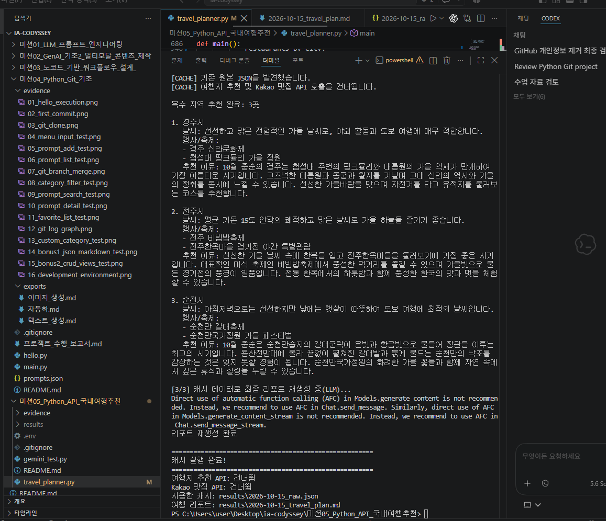

# Python 응용: API 활용 국내 여행지 추천 프로그램
## 프로젝트 수행 보고서

이 보고서는 `travel_planner.py`, `gemini_test.py`, `README.md`, `.gitignore`, `results`의 JSON·Markdown 파일, `evidence`의 증빙 이미지 7개를 직접 확인한 뒤 작성했다. `.env` 내용은 화면에 출력하지 않았으며, 실제 값은 보고서에 기록하지 않았다. 보안 검사는 `.env`의 값과 다른 텍스트 파일을 프로그램 안에서 비교해 같은 문자열이 노출되지 않았는지만 확인했다.

## 1. 프로젝트 개요

이 프로젝트의 목적은 사용자가 입력한 여행 날짜를 바탕으로 국내 여행지를 추천하고, 추천 지역의 맛집 정보를 결합해 Markdown 여행 리포트를 만드는 것이다. 현재 구현은 한 지역만 추천하는 기본 형태를 넘어 경주시, 전주시, 순천시의 3개 지역을 한 번에 처리한다.

검토한 `results/2026-10-15_raw.json`에는 세 지역의 추천 이유, 날씨, 행사 후보와 각 지역당 맛집 5곳이 저장되어 있다. `results/2026-10-15_travel_plan.md`에는 같은 데이터를 바탕으로 지역별 오전·오후·저녁 일정까지 정리되어 있다.

## 2. 개발 환경

| 구분 | 확인 내용 |
|---|---|
| 운영 환경 | 증빙 화면에서 Windows PowerShell과 Visual Studio Code 사용 확인 |
| Python | 설치된 인터프리터의 `python --version` 결과 Python 3.14.6 확인 |
| 주요 라이브러리 | `google-genai`, `requests`, `python-dotenv`, Python 표준 라이브러리의 `argparse`, `json`, `datetime`, `pathlib` |
| Gemini 모델 | 현재 코드의 `MODEL_NAME`은 `gemini-3.5-flash` |
| 외부 서비스 | Google Gemini API, Kakao Local API |
| 저장 형식 | UTF-8 JSON, Markdown |

라이브러리의 정확한 버전 목록을 담은 `requirements.txt`는 현재 폴더에서 확인되지 않았다.

## 3. 프로젝트 파일 구조

```text
미션05_Python_API_국내여행추천/
├─ .env                         # API 키 보관, 값은 검토·기록하지 않음
├─ .gitignore                   # .env, 캐시 파일, results 제외
├─ gemini_test.py               # Gemini 연결 확인
├─ travel_planner.py            # 메인 프로그램
├─ README.md                    # 프로젝트 설명과 실행 방법
├─ 프로젝트_수행_보고서.md       # 본 보고서
├─ evidence/
│  ├─ 01_gemini_api_test.png
│  ├─ 02_date_validation_test.png
│  ├─ 03_llm_json_recommendation.png
│  ├─ 04_kakao_place_search.png
│  ├─ 05_full_pipeline_execution.png
│  ├─ 06_travel_report_result.png
│  └─ 07_bonus_multi_city_cache_test.png
└─ results/
   ├─ 2026-10-15_raw.json
   └─ 2026-10-15_travel_plan.md
```

`README.md`는 존재하고 기본 설명과 보너스 기능을 담고 있다. 제출 전 점검에서 실행 예제와 캐시 로그의 닫히지 않은 코드 블록 두 곳을 닫았으며, 현재 코드 블록의 시작과 끝이 모두 짝을 이룬다.

## 4. 전체 프로그램 동작 흐름

프로그램의 기본 흐름은 다음과 같다.

1. `argparse`로 `-date` 또는 `--date` 값을 받는다.
2. `datetime.strptime()`으로 날짜를 검사한다.
3. 같은 날짜의 `results/{날짜}_raw.json`이 있는지 확인한다.
4. 캐시가 없으면 Gemini로 3개 지역을 추천받고 JSON으로 파싱한다.
5. `recommended_cities`를 반복하면서 각 `city`를 Kakao 검색어인 `"{city} 맛집"`으로 사용한다.
6. 추천 정보, 지역별 맛집, 오류 목록을 하나의 원본 JSON으로 저장한다.
7. 결합한 JSON 데이터를 Gemini에 전달해 최종 Markdown 리포트를 만들고 저장한다.

캐시가 있으면 4~6단계 중 여행지 추천과 Kakao 검색을 생략한다. 다만 기존 데이터를 사용한 최종 Markdown 리포트 재생성을 위해 Gemini의 `generate_content()`는 다시 호출한다.

증빙 이미지는 보너스 확장 전의 단일 지역 전체 파이프라인이 JSON 저장과 리포트 생성까지 완료된 모습을 보여 준다. 최종 복수 지역 구현은 07번 이미지와 현재 코드·결과 파일에서 별도로 확인했다.



## 5. CLI 인터페이스 구현

`parse_arguments()`는 `argparse.ArgumentParser`를 만들고 `-date`와 `--date`를 같은 옵션으로 등록한다. `required=True`이므로 날짜를 주지 않으면 `argparse`가 사용법과 오류를 출력한다. README의 실행 예시는 다음 형식이다.

```bash
python travel_planner.py --date "2026-10-15"
```

코드의 오류 안내에는 짧은 옵션을 사용한 `python travel_planner.py -date "2026-10-15"` 예시도 들어 있다.

## 6. 날짜 입력 검증

`validate_date()`는 입력 문자열을 `%Y-%m-%d` 형식으로 변환해 보고, 성공하면 `True`, `ValueError`가 발생하면 `False`를 반환한다. 따라서 글자 모양만 확인하는 정규식과 달리 존재하지 않는 월과 일도 걸러 낸다. 검증 실패 시 API를 호출하지 않고 올바른 입력 예시를 출력한 뒤 종료한다.

증빙에서는 `2026-10-15`가 통과하고 `2026-15-99`가 오류 처리되는 것을 확인했다.



## 7. Gemini API 연결

`create_gemini_client()`는 `GEMINI_API_KEY` 환경 변수를 읽고, 값이 없으면 안내 메시지와 함께 종료한다. 값이 있으면 `genai.Client(api_key=api_key)`를 반환한다. 별도의 `gemini_test.py`도 같은 방식으로 클라이언트를 만든 뒤 짧은 국내 여행지 추천을 요청한다.

현재 두 파일 모두 모델로 `gemini-3.5-flash`를 사용한다. 증빙 화면에는 테스트 응답으로 지역명이 반환된 결과가 보인다.



## 8. LLM 여행지 추천 및 JSON 구조화

`get_travel_recommendations()`는 Gemini가 설명이나 Markdown 코드 블록 없이 JSON만 반환하도록 프롬프트를 구성한다. 최종 구조는 다음과 같다.

```json
{
  "recommended_cities": [
    {
      "city": "지역명",
      "weather": "일반적인 날씨 요약",
      "events": ["행사 후보 1", "행사 후보 2"],
      "reason": "추천 이유"
    }
  ]
}
```

응답에 코드 블록 표시가 섞인 경우 이를 제거한 뒤 `json.loads()`로 파싱한다. 이어서 `recommended_cities`가 배열인지, 지역이 최소 2개인지, 각 항목에 `city`, `weather`, `events`, `reason`이 있는지와 주요 값의 자료형을 검사한다. 파싱 또는 검증에 실패하면 프롬프트에 수정 요청을 덧붙여 한 번 더 호출한다.

날씨와 행사 정보는 별도의 실시간 날씨·행사 API 조회 결과가 아니라 Gemini가 생성한 일반적인 시기 정보와 후보이다. 실제 방문 전에 공식 정보로 다시 확인해야 한다.

03번 증빙은 보너스 확장 전 `recommended_city` 단일 구조가 JSON으로 출력된 개발 중간 단계이다. 현재 코드는 `recommended_cities` 배열 구조로 확장되어 있으며, 최종 구조는 07번 증빙과 원본 JSON에서 확인된다.



## 9. LLM 결과를 Kakao Local API 입력으로 연결한 과정

Gemini 응답을 단순히 화면에 출력하는 데서 끝내지 않고, 파싱된 `recommendation["recommended_cities"]`를 다음 API의 입력으로 사용했다. `search_all_cities()`가 배열을 반복하면서 각 항목의 `city`를 꺼내 `search_restaurants(city, ...)`에 전달한다. 이 함수는 지역명 뒤에 `맛집`을 붙여 Kakao의 `query` 파라미터로 보낸다.

즉 데이터 연결은 `Gemini 응답 → JSON 파싱 → city 추출 → Kakao query 생성` 순서이다. Kakao 응답은 다시 도시명을 키로 하는 `restaurants_by_city`에 넣어 추천 JSON과 결합한다.

## 10. Kakao Local API 맛집 검색

`search_restaurants()`는 Kakao 키워드 검색 주소인 `https://dapi.kakao.com/v2/local/search/keyword.json`에 `requests.get()`으로 요청한다. 헤더에는 `KakaoAK` 인증 값을 넣고, 쿼리 파라미터에는 `"{도시명} 맛집"`과 최대 결과 수 5를 넣는다. 연결이 오래 멈추지 않도록 제한 시간은 10초로 설정했다.

`response.raise_for_status()`로 HTTP 오류를 예외로 바꾸고, 성공 응답의 `documents` 배열을 필요한 필드만 가진 목록으로 변환한다. 증빙에서는 경주시 맛집 5곳과 주소·카테고리·좌표가 출력된 것을 확인했다.



## 11. 지역별 맛집 데이터 구조

원본 JSON의 `restaurants_by_city`는 도시명을 키로 사용한다. 각 도시 값은 최대 5개의 맛집 객체를 가진 배열이다.

| 필드 | 생성 방식 |
|---|---|
| `name` | Kakao 응답의 `place_name` |
| `address` | `road_address_name`을 우선 사용하고 없으면 `address_name` 사용 |
| `category` | `category_name` |
| `url` | `place_url` |
| `x`, `y` | 문자열 좌표가 있으면 `float`로 변환하고 없으면 `null` |

검토한 JSON에는 경주시, 전주시, 순천시가 각각 5곳씩 있어 총 15개의 맛집 항목이 있다. 검색 결과가 0건이거나 호출이 실패한 도시도 키 자체는 유지하고 빈 배열로 저장한다.

## 12. 최종 Markdown 여행 리포트 생성

`generate_final_report()`는 날짜, 추천 정보, 지역별 맛집, 오류 목록을 다시 하나의 JSON으로 묶어 Gemini에 전달한다. 프롬프트는 각 지역의 추천 이유, 날씨, 행사, 맛집, 오전·오후·저녁 일정을 Markdown으로 작성하도록 요구한다. 맛집이 없으면 `데이터 없음`, 오류가 없으면 `발생한 오류 없음`으로 표시하도록 지시한다.

`save_markdown_report()`는 응답을 `results/{날짜}_travel_plan.md`에 UTF-8로 저장한다. 06번 증빙은 단일 지역 단계에서 생성된 Markdown이고, 현재 결과 파일은 세 지역을 모두 포함한 이후 버전이다.



## 13. 원본 JSON 저장

`save_raw_json()`은 `results` 폴더를 자동으로 만든 뒤 다음 네 최상위 필드를 저장한다.

- `date`: 사용자가 입력한 여행 날짜
- `recommendation`: Gemini가 만든 `recommended_cities` 구조
- `restaurants_by_city`: Kakao 검색 결과를 도시별로 묶은 객체
- `errors`: 검색 또는 최종 리포트 단계에서 수집한 오류 배열

`ensure_ascii=False`와 `indent=2`를 사용하므로 한글이 이스케이프 문자로 바뀌지 않고 사람이 읽기 좋은 형태로 저장된다.

## 14. results 폴더 구조

현재 `results`에는 다음 두 파일이 있다.

- `2026-10-15_raw.json`: 세 지역, 지역별 맛집 5곳, 오류 이력을 포함한 원본 데이터
- `2026-10-15_travel_plan.md`: 세 지역별 추천 설명과 1일 일정을 포함한 최종 리포트

원본 JSON의 `errors`에는 최초 최종 리포트 생성 중 발생한 `503 UNAVAILABLE` 기록 1건이 남아 있다. 이후 캐시 실행에서 Markdown 재생성은 성공했지만, 캐시의 기존 `errors` 배열도 입력으로 다시 사용하므로 현재 Markdown의 오류 요약에 이 과거 오류가 함께 표시된다. 현재 리포트 파일이 있다는 사실과 오류 이력이 남아 있다는 사실은 서로 모순이 아니라 실행 시점이 다른 결과이다.

## 15. 에러 처리

코드에서 확인한 오류 처리는 다음과 같다.

- 날짜 오류: API 호출 전에 안내 후 종료한다.
- 환경 변수 누락: Gemini 또는 Kakao 키가 없으면 명확한 메시지와 함께 종료한다.
- LLM JSON 오류: 최초 호출 후 한 번 재시도한다.
- Kakao HTTP 오류: 해당 도시를 빈 배열로 저장하고 `errors`에 `HTTP_ERROR` 또는 `AUTH_ERROR`를 추가한 뒤 다음 도시를 계속 처리한다.
- Kakao 네트워크 오류: `NETWORK_ERROR`로 기록하고 다음 도시를 계속 처리한다.
- 검색 결과 0건: `EMPTY_RESULT`를 기록한다.
- 캐시 읽기 오류 또는 이전 형식: 캐시를 사용하지 않고 새 호출로 진행한다.
- 최종 리포트 오류: 원본 JSON의 `errors`에 `LLM_ERROR`를 추가해 다시 저장한다.

추천 생성부는 JSON 파싱 오류뿐 아니라 API 예외도 같은 `except Exception`에서 처리하기 때문에 첫 실패 시 같은 재시도 안내가 출력된다. 최종 리포트 생성부에는 자동 재시도가 없으며, 실제 503 사례는 이후 재실행으로 처리되었다.

## 16. API 키 보안 관리

API 키는 소스에 직접 작성하지 않고 `.env`에서 `GEMINI_API_KEY`와 `KAKAO_REST_API_KEY` 환경 변수로 읽는다. `.gitignore` 첫 줄에 `.env`가 등록되어 있고, `git check-ignore -v`로 실제 제외되는 것도 확인했다.

이번 검토에서는 `.env`의 실제 값을 출력하거나 보고서에 복사하지 않았다. Python 코드, README, 결과 텍스트, 증빙 화면에서도 실제 키 문자열이 보이지 않았다. 다만 여러 증빙 화면의 PowerShell 프롬프트에는 로컬 Windows 사용자 경로가 보이므로 공개 제출 전 이미지의 해당 부분을 가리는 추가 조치가 필요하다.

## 17. REST API 요청/응답 구조 설명

Request는 클라이언트가 API 서버에 보내는 요청이고, Response는 서버가 처리 후 돌려주는 응답이다.

이 프로젝트에서 직접 확인되는 Kakao 요청은 다음 요소로 구성된다.

- URL: 키워드 검색 엔드포인트
- Method: GET
- Header: 인증 정보
- Query parameter: 검색어와 결과 개수
- Timeout: 10초

응답은 JSON이며, 코드에서는 `documents`를 읽어 장소명, 주소, 카테고리, URL, 좌표로 변환한다. 오류 응답은 `raise_for_status()`를 통해 예외로 처리한다.

Gemini는 `google-genai` SDK의 `client.models.generate_content()`를 호출한다. 코드가 SDK 내부의 HTTP 메서드를 직접 지정하지 않으므로 이 보고서에서는 Gemini 요청을 개발자가 직접 POST로 구현했다고 단정하지 않는다.

## 18. GET과 POST 차이

- GET은 서버의 데이터를 조회할 때 주로 사용한다. 이 프로젝트의 Kakao Local 키워드 검색은 `requests.get()`으로 직접 확인된다.
- POST는 데이터를 서버에 전달해 처리나 생성을 요청할 때 주로 사용한다.

두 방식의 개념은 구분할 수 있지만, 현재 소스에서 직접 지정한 HTTP 메서드는 Kakao 검색의 GET이다. Gemini는 SDK 메서드를 통해 호출하므로 SDK 내부 전송 방식을 현재 코드만으로 확인한 것처럼 작성하지 않았다.

## 19. HTTP 상태 코드와 실제 문제 해결 경험

| 상태 코드 | 의미 | 이 프로젝트에서 확인한 범위 |
|---|---|---|
| 200 | 요청 성공 | Gemini 테스트 응답과 Kakao 맛집 결과가 정상 생성된 성공 상태는 확인했지만 화면에 숫자 200을 직접 출력하지는 않음 |
| 400 | 요청 형식이나 파라미터가 잘못됨 | 개념 설명 대상이며 현재 결과·증빙에 실제 발생 기록은 없음 |
| 401 | 인증 정보가 없거나 올바르지 않음 | 코드가 Kakao 401을 `AUTH_ERROR`로 분류하지만 실제 발생 기록은 없음 |
| 403 | 권한 또는 API 사용 설정 문제 | 개발 과정에서 Kakao 지도 사용 설정이 꺼진 상태를 확인해 Kakao Developers에서 ON으로 변경한 뒤 해결함. 현재 결과와 04번 증빙은 해결 후 성공 상태이며, 403 오류 화면 자체는 7개 증빙에 남아 있지 않음 |
| 429 | 요청량 또는 쿼터 초과 | 개념 설명 대상이며 현재 결과·증빙에 실제 발생 기록은 없음 |
| 503 | 서버가 일시적으로 요청을 처리하지 못함 | 원본 JSON의 `errors`에 Gemini `503 UNAVAILABLE`가 실제 기록되어 있음. 모델 수요 증가에 따른 일시 오류로 확인했고 이후 캐시 데이터로 리포트를 다시 생성함 |

개발 기록상 Gemini 모델 404 오류도 있었다. 사용 가능한 모델 목록을 확인한 뒤 현재 모델명으로 조정했으며, `gemini_test.py`와 01번 증빙에서 이후 호출 성공을 확인할 수 있다. 다만 당시 404 응답 화면이나 로그는 현재 7개 증빙과 결과 파일에 보존되어 있지 않다.

## 20. 보너스 1 - 복수 지역 추천

프롬프트는 서로 다른 3개 지역을 요청하고, 결과 검증은 최소 2개 이상인지 확인한다. 실제 `2026-10-15_raw.json`에는 경주시, 전주시, 순천시가 저장되어 있다. `search_all_cities()`는 이 배열을 반복하면서 각 지역마다 최대 5곳을 검색하므로 복수 지역 추천과 지역별 후속 API 연결이 모두 구현되어 있다.

단일 지역 단계의 증빙과 최종 코드가 혼동되지 않도록, 최종 복수 지역 결과는 07번 증빙과 현재 원본 JSON을 기준으로 판단했다.

## 21. 보너스 2 - 결과 캐싱

`load_cache()`는 날짜에 대응하는 원본 JSON이 있는지 확인하고, `recommendation.recommended_cities`가 있는 새 구조인지 검사한다. 유효하면 추천과 맛집 데이터를 그대로 읽어 다음 두 호출을 생략한다.

- 여행지 추천용 Gemini 호출
- 지역별 Kakao 맛집 호출

캐시는 동일 요청의 불필요한 호출을 줄여 API 쿼터를 절약하고, 실행 속도를 높이며, 비용이 발생할 수 있는 호출의 반복을 방지한다. 다만 최종 Markdown 리포트를 다시 만들기 위한 Gemini 호출은 수행되므로 모든 API 호출이 0회가 되는 구조는 아니다.

07번 증빙에서는 기존 JSON 발견, 3개 지역 출력, 캐시 데이터 기반 LLM 리포트 재생성, 여행지 추천 API와 Kakao 맛집 API의 `건너뜀` 결과를 모두 확인했다.



## 22. 프로젝트 수행 중 발생한 문제와 해결

1. **Gemini 모델 404**: 개발 기록상 처음 지정한 모델을 사용할 수 없어 모델 목록을 확인했고, 현재 코드의 모델로 변경한 뒤 `gemini_test.py` 호출에 성공했다. 오류 당시 로그는 현재 제출 자료에 남아 있지 않다.
2. **Gemini 503 UNAVAILABLE**: 원본 JSON에 실제 오류가 남아 있다. 메시지 내용상 서버의 일시적 과부하였고 코드 문법 문제가 아니었다. 이후 같은 캐시 데이터로 재실행해 Markdown 생성을 완료했다.
3. **Kakao Local API 403**: 개발 기록상 인증 문자열 자체가 아니라 Kakao Developers의 카카오맵 사용 설정이 OFF였던 것이 원인이었다. 설정을 ON으로 변경한 뒤 세 지역에서 총 15개의 검색 결과를 받았다. 오류 화면은 현재 증빙에 없고 해결 후 성공 결과가 남아 있다.
4. **API 키 노출 위험**: 키를 `.env`로 분리하고 `.gitignore`에 등록했다. 실제 `git check-ignore` 결과로 제외 상태를 확인했다.
5. **단일 지역에서 복수 지역으로 구조 변경**: 초기 `recommended_city` 객체를 `recommended_cities` 배열로 바꾸고, 지역별 검색 결과를 `restaurants_by_city`에 저장하도록 확장했다. 캐시도 새 배열 구조만 받아들이도록 검사한다.

## 23. evidence 증빙 자료 설명

| 파일 | 실제 확인 내용 |
|---|---|
| `01_gemini_api_test.png` | `gemini_test.py` 실행 후 Gemini가 지역명을 반환함 |
| `02_date_validation_test.png` | 정상 날짜 통과와 잘못된 날짜 거부 |
| `03_llm_json_recommendation.png` | 단일 지역 단계에서 LLM 응답이 JSON으로 파싱된 모습 |
| `04_kakao_place_search.png` | 경주시 키워드 검색 후 맛집 5곳과 세부 정보 출력 |
| `05_full_pipeline_execution.png` | 단일 지역 단계의 추천, Kakao 검색, 리포트 생성 완료 |
| `06_travel_report_result.png` | 단일 지역 단계의 Markdown 리포트 내용 |
| `07_bonus_multi_city_cache_test.png` | 최종 3개 지역 구조, 캐시 발견, 추천·Kakao 호출 생략, 최종 LLM 리포트 재생성 |

7개 파일은 모두 실제로 존재하고 본 보고서의 상대 경로 링크와 일치한다. 01·02·03·04·07 이미지에는 로컬 Windows 사용자 경로가 보이므로 공개 전 마스킹을 권장한다. API 키 값은 화면에서 확인되지 않았다.

## 24. 요구사항 체크리스트

| 요구사항 | 수행 여부 | 실제 확인 내용 |
|---|---|---|
| Python 3.10 이상 | O | `python --version`으로 Python 3.14.6 확인 |
| CLI 실행 | O | 증빙 화면의 명령 실행과 `main()` 진입 확인 |
| argparse | O | `ArgumentParser` 사용 |
| `-date` 필수 옵션 | O | `-date`, `--date`, `required=True` 확인 |
| 날짜 형식 검증 | O | `%Y-%m-%d`와 `ValueError` 처리 확인 |
| Gemini API | O | 클라이언트 생성 코드와 성공 증빙 확인 |
| Kakao Local API | O | GET 요청 코드, 증빙, 결과 JSON 확인 |
| JSON 구조화 | O | `json.loads`, 구조 검증, 저장 결과 확인 |
| `recommended_city` 또는 복수 지역 구조 | O | 최종 코드는 `recommended_cities` 배열 사용 |
| `weather` | O | 필수 키 검증과 결과 값 확인 |
| `events` | O | 배열 자료형 검증과 결과 값 확인 |
| `reason` | O | 필수 키 검증과 결과 값 확인 |
| LLM 결과를 장소 API 입력으로 사용 | O | 각 `city`로 `"{city} 맛집"` 쿼리 생성 |
| 맛집 이름 | O | `name` 저장 확인 |
| 주소 | O | 도로명 주소 우선 저장 확인 |
| 카테고리 | O | `category` 저장 확인 |
| URL | O | `url` 저장 확인 |
| x/y 좌표 | O | 실수형 변환 결과 확인 |
| 0건 처리 | O | 빈 배열과 `EMPTY_RESULT` 기록 코드 확인 |
| API 오류 try-except | O | 추천, 지도, 리포트 단계 예외 처리 확인 |
| 지도 API 실패 시 계속 진행 | O | 도시별 예외 처리 후 반복 계속 |
| LLM JSON 파싱 실패 재시도 | O | 최초 요청 후 1회 재시도 확인 |
| `errors` 배열 | O | 코드와 원본 JSON에서 확인 |
| `.env` | 코드상 확인 | 파일 존재와 환경 변수 로딩 확인. 값 자체는 출력·기록하지 않고 다른 텍스트 파일에 같은 문자열이 없는지만 검사 |
| `.gitignore` | O | `.env`, `__pycache__/`, `*.pyc`, `results/` 등록 확인 |
| `results` 자동 생성 | O | 두 저장 함수의 `mkdir(parents=True, exist_ok=True)` 확인 |
| raw JSON | O | `2026-10-15_raw.json` 존재 및 파싱 가능한 구조 확인 |
| Markdown 여행 리포트 | O | `2026-10-15_travel_plan.md` 존재 확인 |
| README | O | 파일과 주요 설명이 있으며 코드 블록의 시작과 끝이 정상적으로 대응함 |
| 복수 지역 추천 | O | 실제 결과에 3개 지역 확인 |
| 지역별 맛집 검색 | O | 3개 지역 각각 5곳 확인 |
| 캐싱 | O | 날짜별 원본 JSON 검사와 구조 검증 확인 |
| 캐시 사용 시 API 호출 생략 | O | 추천 Gemini와 Kakao 호출 생략 확인. 최종 리포트용 Gemini는 재호출 |

## 25. 프로젝트를 통해 배운 점

이 프로젝트를 통해 한 API의 결과를 다음 API의 입력으로 연결하려면 먼저 데이터 구조를 명확하게 정의해야 한다는 점을 배웠다. Gemini 응답을 바로 문자열로 사용하지 않고 JSON으로 파싱하고 필수 키와 자료형을 검사했기 때문에, 추천 지역을 Kakao 검색에 안정적으로 넘길 수 있었다.

또한 외부 API는 코드가 올바르더라도 모델 지원 상태, 서비스 설정, 서버 과부하 때문에 실패할 수 있다는 점을 확인했다. 그래서 상태 코드와 예외를 구분하고, 한 도시의 검색 실패가 전체 실행을 멈추지 않게 처리하는 것이 중요했다. 캐시는 속도뿐 아니라 쿼터와 비용을 줄이는 데도 도움이 되지만, 어떤 호출을 생략하고 어떤 호출을 다시 하는지 정확히 구분해야 한다는 점도 알게 되었다.

## 26. 최종 평가 및 결론

현재 코드와 결과 파일을 기준으로 CLI 입력, 날짜 검증, Gemini 추천, JSON 구조화, Kakao 맛집 검색, 원본 JSON 저장, Markdown 리포트 생성이 연결되어 있다. 보너스 1의 3개 지역 반복 처리와 보너스 2의 날짜별 캐시도 코드·결과·증빙에서 확인했다.

코드 내용은 Python 3.14.6의 `compile()`로 문법 검사를 마쳤고 README의 코드 블록도 정상화했다. 다만 공개되는 증빙 이미지에서 로컬 Windows 사용자 경로를 가리는 것이 안전하다. 해당 부분을 보완하면 기능 구현과 수행 과정이 비교적 명확하게 드러나는 제출물이 된다.
