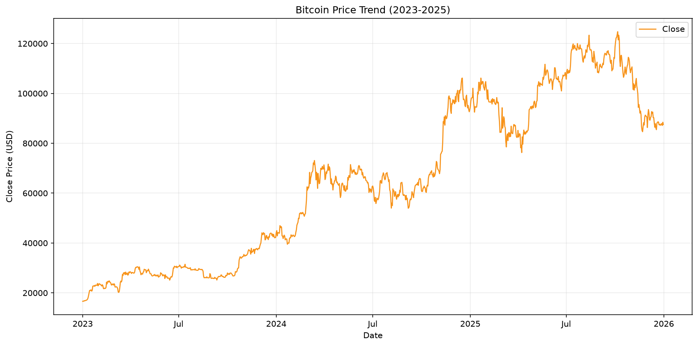
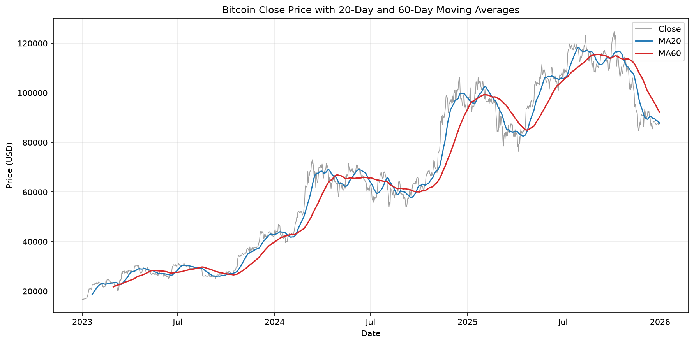
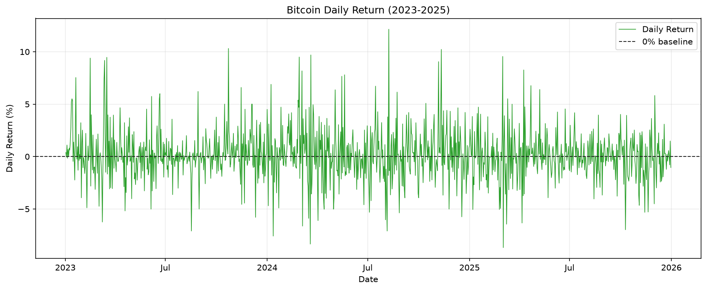
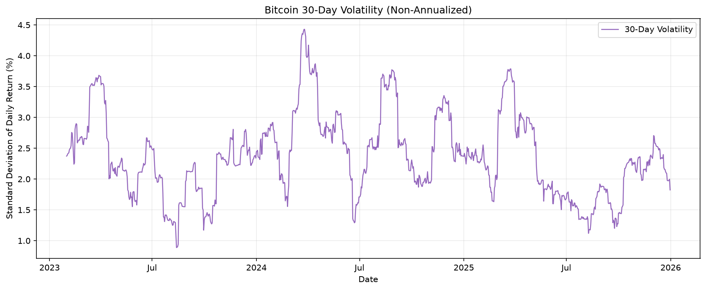

# 비트코인 시계열 데이터 분석 리포트

## 1. 분석 주제 및 선정 이유

Bitcoin은 매일 거래되어 연속적인 시계열 데이터를 확보할 수 있고 가격 변화와 변동성이 크게 나타나는 자산이다. 따라서 가격 추세, 이동평균, 일별 수익률, 변동성 같은 기본 시계열 분석 방법을 적용하고 결과를 해석하는 주제로 선정했다.

## 2. 분석 질문

- 비트코인 가격은 분석 기간 동안 전체적으로 어떤 추세를 보였는가?
- 비트코인이 가장 크게 상승하거나 하락한 시기는 언제였는가?
- 20일 이동평균과 60일 이동평균을 비교했을 때 추세 변화는 어떻게 나타났는가?
- 변동성이 특히 높았던 시기는 언제였는가?

## 3. 데이터 설명

- 데이터: Bitcoin BTC-USD
- 출처: Yahoo Finance
- 수집 방법: Python yfinance
- 기간: 2023-01-01 ~ 2025-12-31
- 전체 데이터 개수: 1,096개
- 주요 컬럼: Adj Close, Close, High, Low, Open, Volume
- 결측치 여부: 없음
- 중복 여부: 없음
- 컬럼 구조: yfinance 원본은 MultiIndex이며, 단일 종목 가격 컬럼 레벨로 정리하여 CSV에 저장

## 4. 데이터 정제 및 분석 방법

- 원본 데이터의 결측치는 0개이며 중복 데이터도 0개로 확인했다.
- Date 인덱스가 날짜 형식이며 시간 오름차순으로 정렬되어 있음을 확인했다.
- 원본 데이터 자체를 삭제하거나 보간하지 않았다.
- 급등·급락과 같은 극단적인 가격 변화는 실제 시장에서 관측된 데이터이므로 단순히 이상치라는 이유로 제거하지 않았다.
- 20일 이동평균(MA20)은 현재 날짜를 포함한 최근 20개 Close 가격의 산술평균으로 정의했다.
- 60일 이동평균(MA60)은 현재 날짜를 포함한 최근 60개 Close 가격의 산술평균으로 정의했다.
- 일별 수익률(Daily_Return)은 전일 대비 Close 가격 변화율에 100을 곱한 값으로 정의했다.
- 30일 변동성 = 최근 30일 일별 수익률의 표준편차로 정의했으며 연율화하지 않았다.
- 이동평균과 변동성 계산 초반의 NaN은 원본 결측치가 아니라 계산에 필요한 기간이 부족해서 발생한 정상적인 값이다. Daily_Return의 첫 번째 NaN도 비교할 이전 날짜가 없어서 발생한다.

## 5. 시각화 및 분석 결과

### 5.1 분석 질문별 핵심 수치

#### 전체 가격 추세

- 시작 Close: 2023-01-01, 16,625.08달러
- 종료 Close: 2025-12-31, 87,508.83달러
- 전체 변화: 70,883.75달러 증가, 426.366356% 상승
- 최고 Close: 2025-10-06, 124,752.53달러
- 최저 Close: 2023-01-01, 16,625.08달러

종료 가격은 시작 가격보다 높지만 기간 중 최고 가격보다는 낮다.

#### 일별 수익률 상위 5개

| 순위 | Date | Daily_Return |
|---:|:---:|---:|
| 1 | 2024-08-08 | 12.144256% |
| 2 | 2023-10-23 | 10.309891% |
| 3 | 2024-11-11 | 10.223523% |
| 4 | 2024-03-20 | 9.692505% |
| 5 | 2025-03-02 | 9.550453% |

#### 일별 수익률 하위 5개

| 순위 | Date | Daily_Return |
|---:|:---:|---:|
| 1 | 2025-03-03 | -8.682040% |
| 2 | 2024-03-19 | -8.343357% |
| 3 | 2024-01-12 | -7.581465% |
| 4 | 2024-08-05 | -7.098648% |
| 5 | 2023-08-17 | -7.097917% |

기존에 확인한 최고 일별 수익률 12.144256%와 최저 일별 수익률 -8.682040%가 재계산 결과와 일치한다. 이 절에서는 수치만 제시하고, 외부 배경을 활용한 가능한 해석은 6절에서 관찰(Fact)과 구분해 다룬다.

#### MA20과 MA60 교차

- 상승 교차 10회: 2023-03-18, 2023-06-27, 2023-10-06, 2024-02-11, 2024-05-27, 2024-07-29, 2024-09-26, 2025-01-20, 2025-04-25, 2025-09-29
- 하락 교차 11회: 2023-03-13, 2023-05-14, 2023-08-10, 2024-01-28, 2024-04-24, 2024-06-27, 2024-08-12, 2025-01-09, 2025-02-17, 2025-08-30, 2025-10-25

교차는 단기 이동평균과 중기 이동평균의 관계가 바뀐 시점이며 매수·매도 신호로 표현하지 않는다. 각 시점의 Close, MA20, MA60 값은 Notebook의 전체 교차 표에 기록했다.

#### 30일 변동성

- 평균: 2.367130%
- 중앙값: 2.315939%
- 최고: 2024-03-26, 4.429025%

| 순위 | Date | Volatility_30 |
|---:|:---:|---:|
| 1 | 2024-03-26 | 4.429025% |
| 2 | 2024-03-25 | 4.427042% |
| 3 | 2024-03-24 | 4.393709% |
| 4 | 2024-03-27 | 4.365763% |
| 5 | 2024-03-22 | 4.359530% |

상위 5개 날짜는 모두 2024-03-22~2024-03-27의 6일 범위에 모여 있어 동일한 고변동 구간을 중복해 보여준다.

### 5.2 비트코인 전체 가격 추세

2023-01-01부터 2025-12-31까지의 Bitcoin Close 가격 변화를 전체 기간에 걸쳐 보여준다.

### 5.3 비트코인 가격과 이동평균

Close 가격과 20일 이동평균(MA20), 60일 이동평균(MA60)을 함께 표시해 단기 및 중기 추세의 움직임을 비교한다.

### 5.4 비트코인 일별 수익률

전일 대비 Close 가격 변화율을 백분율로 나타내며, 0% 기준선을 중심으로 일별 상승과 하락 폭을 보여준다.

### 5.5 비트코인 30일 변동성

최근 30일 일별 수익률의 표준편차를 표시해 기간별 변동성 수준을 보여준다. 이 값은 연율화하지 않았다.

## 6. 인사이트

### 인사이트 1

- 관찰(Fact): 분석 기간 중 가장 높은 30일 변동성은 2024-03-26의 4.429025%였으며, 변동성 상위 5개 날짜가 2024-03-22~2024-03-27 구간에 집중됐다.
- 외부 배경: Reuters는 2024년 2월 미국 현물 Bitcoin ETF로의 자금 유입과 함께 Bitcoin 가격이 빠르게 상승했다고 보도했다. 2024년 3월에는 Bitcoin이 당시 사상 최고가 영역에 진입했고 현물 ETF 시장도 확대되는 흐름이 보도됐다(참고 자료 1, 2).
- 해석(Hypothesis): 현물 Bitcoin ETF 자금 유입, 빠른 가격 상승, 사상 최고가 부근의 큰 가격 움직임이 이 시기의 높은 변동성과 함께 나타났을 가능성이 있다. 다만 ETF가 변동성을 발생시켰다는 인과관계를 이 분석만으로 확정할 수는 없다.
- 의미: 강한 상승 추세가 나타나는 기간에도 가격 움직임의 불확실성과 변동성이 동시에 커질 수 있으므로, 가격 수준뿐 아니라 수익률의 분산도 함께 확인할 필요가 있다.

### 인사이트 2

- 관찰(Fact): Bitcoin은 2024-08-05에 -7.098648% 하락한 뒤 2024-08-08에 분석 기간 최대 일일 상승률인 +12.144256%를 기록했다.
- 외부 배경: Reuters는 2024년 8월 초 미국 경기 둔화 우려와 약한 경제·고용 데이터, 일본 금리 상승에 따른 엔화 캐리트레이드 청산 등이 글로벌 위험자산 매도와 함께 나타났다고 보도했다. 8월 6일에는 전일 급락 이후 글로벌 주식시장이 반등하는 흐름도 보도됐다(참고 자료 3~5).
- 해석(Hypothesis): 글로벌 위험자산 매도와 시장 불안이 Bitcoin 급락과 동시에 나타났고, 이후 시장 심리가 일부 안정되는 과정에서 큰 반등이 나타났을 가능성이 있다. 해당 외부 요인들이 Bitcoin 가격 움직임의 유일한 원인이라고 단정하지 않는다.
- 의미: 짧은 기간에 큰 하락과 큰 상승이 연속될 수 있다는 점은 Bitcoin의 높은 단기 변동성을 보여주며, 하루의 수익률만으로 추세를 판단하는 데 주의가 필요함을 시사한다.

### 인사이트 3

- 관찰(Fact): Bitcoin은 2025-03-02에 +9.550453% 상승했고 바로 다음 날인 2025-03-03에 분석 기간 최저 일일 수익률인 -8.682040%를 기록했다.
- 외부 배경: Reuters는 2025-03-02 Donald Trump 미국 대통령이 Bitcoin과 Ether 등을 포함한 전략적 암호화폐 비축 계획을 발표했으며, 발표 직후 Bitcoin을 비롯한 주요 암호화폐 가격이 급등했다고 보도했다(참고 자료 6).
- 해석(Hypothesis): 전략적 암호화폐 비축 계획에 대한 기대가 단기적인 강한 상승과 함께 나타났고, 이후 기대와 불확실성이 빠르게 재평가되면서 큰 가격 되돌림이 나타났을 가능성이 있다. 이 정책 발표 하나만으로 다음 날 하락까지 모두 설명할 수는 없다.
- 의미: 정책 및 규제 관련 뉴스와 Bitcoin의 큰 단기 가격 움직임이 같은 시기에 나타날 수 있음을 보여준다. 다만 관계를 더 정확히 평가하려면 장중 가격, 거래량, 다른 시장 변수까지 함께 분석해야 한다.

## 7. 결론 및 한계점

### 결론

2023-01-01부터 2025-12-31까지 Bitcoin 가격은 16,625.08달러에서 87,508.83달러로 상승해 시작 대비 종료 가격 변화율이 +426.366356%였다. 전체적으로는 큰 폭의 상승 추세였지만, 기간 중 최고 일일 상승률 +12.144256%와 최저 일일 수익률 -8.682040%처럼 여러 차례 급등과 급락이 나타났다.

MA20과 MA60의 관계는 상승 교차 10회, 하락 교차 11회로 여러 차례 바뀌어 단기와 중기 추세가 지속적으로 변했음을 보여줬다. 또한 2024년 3월 말에는 30일 변동성이 분석 기간 최고 수준으로 확대됐다. 따라서 가격 추세만 보는 것보다 일별 수익률과 변동성을 함께 분석해야 시장 움직임을 더 입체적으로 이해할 수 있었다.

### 한계점

1. Yahoo Finance의 BTC-USD 데이터만 사용했기 때문에 다른 거래소의 가격 차이나 시장별 특성을 반영하지 못했다.
2. 가격과 거래량 중심의 분석이며 거시경제 지표, 온체인 데이터, ETF 자금 흐름 등을 분석 모델에 직접 포함하지 않았다.
3. 이동평균 교차는 단순한 추세 관찰 방법이며 매수·매도 신호 또는 미래 가격 예측으로 볼 수 없다.
4. 외부 뉴스와 가격 변화가 같은 시기에 나타났다는 사실만으로 두 현상 사이의 인과관계가 증명되는 것은 아니다.
5. 분석 기간이 2023~2025년으로 제한되어 장기적인 Bitcoin 시장의 모든 국면을 설명하지 못한다.

## 8. AI 사용 로그

### 사용 작업

- 프로젝트 구조 설계 보조
- yfinance 데이터 수집 코드 작성 보조
- 데이터 품질 확인 코드 작성 보조
- 이동평균/수익률/변동성 계산 코드 작성 보조
- matplotlib 시각화 코드 작성 보조
- 데이터에서 발견한 주요 변동 구간 선정 보조
- 외부 자료와 데이터 Fact를 연결한 인사이트 구조 작성 보조

### 사용 이유

- Python 입문 단계에서 코드 작성 시간 절감
- 분석 방법의 대안 탐색
- 오류 가능성 감소

### 검증 방법

- 데이터 행 수/기간 직접 확인
- 결측치/중복 확인
- MA20과 MA60 샘플 직접 재계산
- Daily_Return 직접 수식 재계산
- Volatility_30 직접 재계산
- Notebook 전체 재실행 및 오류 여부 확인
- 외부 자료의 날짜가 분석 데이터의 날짜와 일치하는지 확인
- Reuters 기사 내용보다 해석을 과도하게 확대하지 않았는지 확인
- 관찰(Fact)과 해석(Hypothesis)을 별도로 작성
- 외부 사건과 가격 변화의 인과관계를 단정하지 않음

### 활용 원칙

AI가 제시한 해석을 그대로 사실로 사용하지 않았으며, 데이터에서 확인한 관찰(Fact)과 추가 검토가 필요한 해석(Hypothesis)을 구분했다.

## 9. 참고 자료

1. Reuters. **Bitcoin hits $60,000 as 'FOMO' rally gathers pace**. 2024-02-28. 미국 현물 Bitcoin ETF 자금 유입과 Bitcoin 가격 상승 배경 참고. [Reuters 배포본(ThePrint)](https://theprint.in/tech/bitcoin-hits-60000-as-fomo-rally-gathers-pace/1982409/)
2. Reuters. **Grayscale plans spin off of spot bitcoin ETF**. 2024-03-12. 2024년 3월 Bitcoin이 당시 최고가 영역을 기록하고 현물 ETF 시장이 확대되고 있던 상황 참고. [Reuters 원문](https://www.reuters.com/technology/grayscale-pursues-spin-off-spot-bitcoin-etf-2024-03-12/)
3. Reuters. **Crypto sell-off deepens as weak economic data dampens risk-taking**. 2024-08-05 업데이트(2024-08-04 최초 게시). 미국 경기침체 우려와 위험자산 매도, Bitcoin 및 암호화폐 급락 배경 참고. [Reuters 원문](https://www.reuters.com/technology/bitcoin-falls-569-58987-2024-08-04/)
4. Reuters. **Markets give off 'Black Monday' vibes as stocks tank**. 2024-08-05. 미국 고용 데이터, 일본 금리 상승, 엔화 캐리트레이드 청산, 글로벌 시장 급락 배경 참고. [Reuters 원문](https://www.reuters.com/markets/us/global-markets-milestones-graphic-2024-08-05/)
5. Reuters. **Global stocks rebound from sell-off; Treasury yields, dollar higher**. 2024-08-06. 8월 초 글로벌 시장 급락 이후 반등 흐름 참고. [Reuters 배포본(MarketScreener)](https://www.marketscreener.com/news/latest/Global-stocks-rebound-from-sell-off-Treasury-yields-dollar-higher-47570905/)
6. Reuters. **Trump names cryptocurrencies in strategic reserve, sending prices up**. 2025-03-02. 미국 전략적 암호화폐 비축 계획 발표 및 발표 직후 암호화폐 급등 참고. [Reuters 원문](https://www.reuters.com/world/us/trump-says-cryptocurrency-strategic-reserve-includes-xrp-sol-ada-2025-03-02/)

1번과 5번은 Reuters 원문 URL을 독립적으로 확정하지 못해 기사 제목·언론사·날짜가 확인되는 Reuters 배포본 링크를 기록했다. 나머지 항목은 Reuters 원문 URL을 외부 인용 자료와 교차 확인했다.
