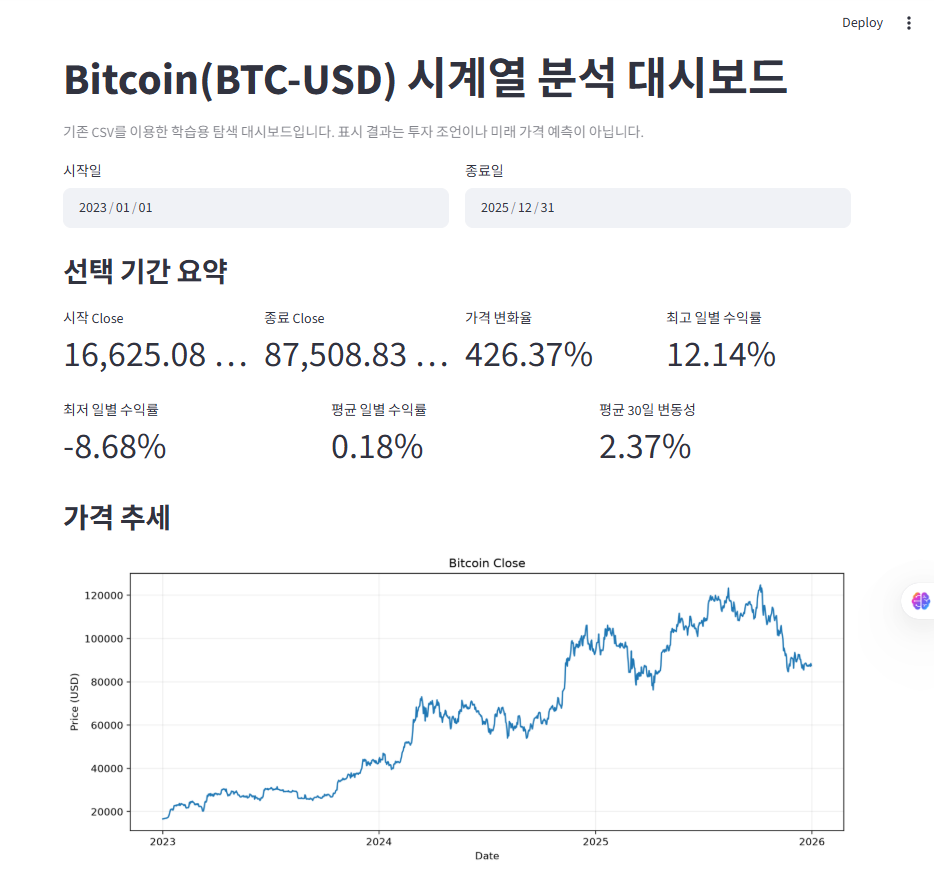
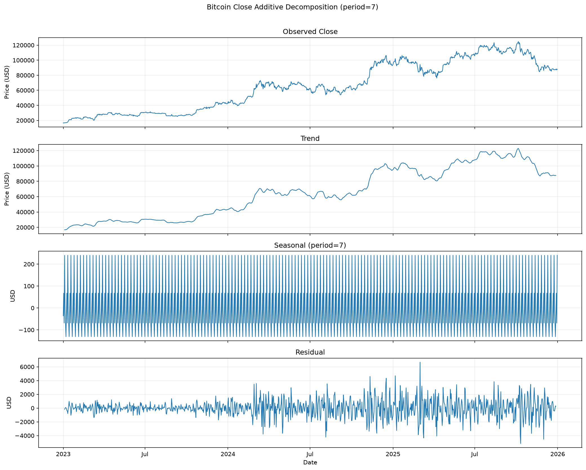

# 미션07 Bitcoin 시계열 분석 프로젝트 설명서

2023~2025년 실제 Bitcoin(BTC-USD) 데이터를 이용하여 가격 추세, 수익률, 이동평균, 변동성을 분석하고, 데이터에서 확인한 사실과 가능한 원인 가설을 구분하여 해석한 프로젝트입니다.

이 문서는 프로젝트를 처음 보는 평가자가 전체 흐름과 주요 개념을 쉽게 이해할 수 있도록 작성한 안내서입니다. 정확한 수치, 시각화, 참고 자료와 정식 분석 결과는 [REPORT.md](REPORT.md)에 기록되어 있습니다.

**1분 요약:** 실제 BTC-USD 일별 데이터 1,096개로 질문 4개를 먼저 정한 뒤 가격·이동평균·수익률·변동성을 분석했습니다. 데이터에서 확인한 Fact와 가능한 원인 Hypothesis를 구분했으며, 결과를 Streamlit 대시보드·시계열 분해·Naive Forecast로 확장했습니다.

## 1. 프로젝트 한눈에 보기

| 항목 | 내용 |
|---|---|
| 분석 대상 | Bitcoin (BTC-USD) |
| 데이터 출처 | Yahoo Finance |
| 수집 방법 | Python `yfinance` |
| 분석 기간 | 2023-01-01 ~ 2025-12-31 |
| 데이터 수 | 1,096개 |
| 분석 단위 | 일별 |
| 분석 접근 | 질문 4개를 먼저 정의하고 적합한 방법 선택 |
| 주요 분석 | 가격 추세, MA20/MA60, 일별 수익률, 30일 변동성 |
| 기본 시각화 | 가격, 이동평균, 일별 수익률, 30일 변동성 등 4개 |
| 보너스 | Streamlit 대시보드, 시계열 분해, Naive Forecast |
| 해석 원칙 | Fact, Hypothesis, Action을 구분 |

## 2. 프로젝트 전체 흐름

```text
Yahoo Finance
    ↓
yfinance로 실제 BTC-USD 데이터 수집
    ↓
CSV 저장
    ↓
데이터 품질 확인
    ↓
분석 질문 4개 설정
    ↓
가격 추세 / 이동평균 / 수익률 / 변동성 분석
    ↓
그래프 생성
    ↓
데이터에서 Fact 발견
    ↓
외부 자료 확인
    ↓
가능한 원인을 Hypothesis로 제시
    ↓
추가 검증 방법을 Action으로 제안
    ↓
Streamlit / 시계열 분해 / Naive Forecast로 확장
```

- **수집:** 실제 시장 데이터를 Python으로 가져왔습니다.
- **검사:** 빠진 값이나 중복처럼 분석을 방해할 수 있는 문제가 있는지 확인했습니다.
- **분석:** 먼저 질문을 정한 뒤 질문에 답할 수 있는 계산 방법을 선택했습니다.
- **시각화:** 숫자의 변화를 시간 순서대로 쉽게 볼 수 있도록 그래프로 표현했습니다.
- **해석:** 데이터에서 직접 확인한 사실과 가능한 원인을 구분했습니다.
- **확장:** 분석 결과를 대시보드, 분해 분석, 간단한 예측 기준선으로 확장했습니다.

## 3. 왜 Bitcoin을 선택했는가

Bitcoin은 주말을 포함해 24시간 거래됩니다. 단기간에도 가격 변화가 크게 나타날 수 있어 장기 추세, 급등·급락, 변동성 같은 여러 시계열 특징을 함께 관찰하기 좋습니다.

선정 이유는 Bitcoin을 좋은 투자 대상으로 추천하기 위해서가 아닙니다. 시간에 따른 변화가 뚜렷해 시계열 분석의 기본 개념을 학습하고 적용하기 적합하다고 판단했기 때문입니다.

## 4. 시계열 데이터란 무엇인가

시계열 데이터는 시간 순서대로 기록된 데이터입니다. 예를 들면 다음과 같습니다.

| 날짜 | Bitcoin 종가(USD) |
|---|---:|
| 2023-01-01 | 16,625.08 |
| 2023-01-02 | 다음 날 종가 |
| 2023-01-03 | 그다음 날 종가 |

가격은 앞선 날짜와 비교해 수익률이나 이동평균을 계산하므로 날짜 순서가 중요합니다. 날짜가 뒤섞이면 “전날”이나 “최근 20일”의 의미가 달라져 잘못된 결과가 나올 수 있습니다.

## 5. 데이터 수집과 저장

사용한 데이터는 Yahoo Finance의 실제 BTC-USD 일별 데이터입니다. `yfinance`는 Python에서 Yahoo Finance 데이터를 쉽게 가져올 수 있도록 도와주는 라이브러리입니다.

```text
Yahoo Finance → yfinance → Python → CSV → 분석
```

- 기간: 2023-01-01 ~ 2025-12-31
- 관측치: 1,096개
- 단위: 일별
- 저장 파일: `data/bitcoin_2023_2025.csv`
- 주요 컬럼: Open, High, Low, Close, Adj Close, Volume

프로젝트를 다시 실행할 때 기존 CSV가 있으면 원본을 덮어쓰지 않고 사용하도록 구성했습니다. 데이터 이용이나 재배포 시에는 Yahoo Finance와 원 제공자의 최신 이용 조건을 별도로 확인해야 합니다.

## 6. 왜 일별 데이터를 사용했는가

Bitcoin은 짧은 기간에도 큰 가격 변화가 나타날 수 있습니다. 급등·급락 날짜와 변동성의 변화를 확인하기 위해 하루 단위 데이터를 사용했습니다.

주별이나 월별로 묶으면 여러 날의 값이 하나로 합쳐져 하루 동안의 큰 움직임이 완화되어 보일 수 있습니다. 이번 질문에는 단기 움직임을 보존하는 일별 단위가 더 적절했습니다.

## 7. 분석 질문 4개

1. 비트코인 가격은 분석 기간 동안 전체적으로 어떤 추세를 보였는가?
2. 비트코인이 가장 크게 상승하거나 하락한 시기는 언제였는가?
3. 20일 이동평균과 60일 이동평균을 비교했을 때 추세 변화는 어떻게 나타났는가?
4. 변동성이 특히 높았던 시기는 언제였는가?

분석 방법을 먼저 정한 것이 아니라 질문을 먼저 만들고, 각 질문에 답하기 위해 가격 추세, 이동평균, 일별 수익률, 30일 변동성을 선택했습니다.

## 8. 데이터 품질 확인

| 점검 항목 | 쉬운 설명 | 실제 결과 |
|---|---|---|
| 결측치 | 기록되어야 할 값이 비어 있는 상태 | 0개 |
| 중복 | 같은 데이터가 반복해서 들어간 상태 | 0개 |
| 날짜 정렬 | 과거부터 미래 순서로 배치됐는지 확인 | 오름차순 확인 |
| 이상치 | 다른 값과 비교해 매우 크거나 작은 값 | 극단적인 가격 변화 확인 |

품질 확인은 계산 오류나 잘못된 해석을 줄이기 위해 필요합니다. 극단적인 수익률이 있는 날짜는 날짜 형식, 결측·중복, 가격이 양수인지, High와 Low 범위가 자연스러운지 확인했습니다.

확인 결과 데이터 오류로 판단할 근거가 없었던 급등·급락은 제거하지 않았습니다. 금융 시계열에서는 큰 가격 움직임 자체가 중요한 분석 대상이기 때문입니다. IQR이나 z-score를 이용한 별도의 통계적 이상치 탐지는 수행하지 않았으므로, 수행했다고 주장하지 않습니다.

## 9. 가격 추세 분석


| 항목 | 결과 |
|---|---:|
| 시작 Close | 16,625.08 USD |
| 종료 Close | 87,508.83 USD |
| 시작 대비 변화율 | +426.366356% |
| 기간 최고 Close | 124,752.53 USD |
| 최고 Close 날짜 | 2025-10-06 |

분석 시작일과 종료일을 비교하면 가격은 약 426.37% 상승했습니다. 그러나 기간 내내 계속 상승한 것은 아닙니다. 그래프에는 큰 상승과 하락이 여러 차례 반복되며, 종료 가격도 기간 최고 가격보다는 낮습니다.

가격 자체의 수준과 절대 변화 폭을 직관적으로 보여주기 위해 선형 축을 사용했습니다. 가격 범위가 크게 확대된 만큼 초기의 상대적인 변화가 후기보다 평평하게 보일 수 있다는 한계가 있습니다.

## 10. 이동평균 MA20과 MA60

이동평균(Moving Average)은 최근 여러 날의 가격을 평균 내어 매일의 큰 흔들림을 부드럽게 보여주는 방법입니다.

- **MA20:** 현재 날짜를 포함한 최근 20개 Close의 평균
- **MA60:** 현재 날짜를 포함한 최근 60개 Close의 평균

매일의 가격은 크게 흔들릴 수 있습니다. 평균을 사용하면 단기 변동이 완화되어 단기 흐름과 중기 흐름을 비교하기 쉬워집니다.

| 교차 유형 | 의미 | 횟수 |
|---|---|---:|
| 상승 교차 | MA20이 MA60 아래 또는 같은 위치에서 위로 바뀐 시점 | 10회 |
| 하락 교차 | MA20이 MA60 위 또는 같은 위치에서 아래로 바뀐 시점 | 11회 |

여기서 교차는 단기 평균과 중기 평균의 상대적 위치가 바뀐 시점입니다. 미래 가격을 보장하는 매수·매도 신호로 해석하지 않았습니다.

## 11. 일별 수익률

일별 수익률(Daily Return)은 “전날과 비교해 오늘 가격이 몇 % 변했는가”를 나타냅니다.

```text
전날 가격 100 → 오늘 가격 110
일별 수익률 = (110 ÷ 100 - 1) × 100 = +10%
```

| 항목 | 날짜 | 결과 |
|---|---|---:|
| 최고 일별 수익률 | 2024-08-08 | +12.144256% |
| 최저 일별 수익률 | 2025-03-03 | -8.682040% |

이 계산을 통해 전체 기간의 장기 가격 흐름뿐 아니라 특정 날짜의 급격한 움직임도 찾을 수 있었습니다. 첫 번째 날짜는 비교할 전날이 없어 수익률이 NaN이 되며, 이는 원본 결측치가 아니라 정상적인 계산 결과입니다.

## 12. 30일 변동성

변동성(Volatility)은 가격 수익률이 얼마나 크게 흔들리는지를 나타냅니다. 이번 프로젝트에서는 **최근 30개 일별 수익률의 표준편차**를 사용했으며 연율화하지 않았습니다.

표준편차는 값들이 평균 주변에서 얼마나 넓게 퍼져 있는지를 보여주는 값입니다. 값이 크면 최근 수익률의 흔들림이 컸다는 뜻입니다.

| 항목 | 결과 |
|---|---:|
| 평균 Volatility_30 | 2.367130% |
| 최고 Volatility_30 | 4.429025% |
| 최고 날짜 | 2024-03-26 |

변동성이 높다는 것이 반드시 가격 하락을 뜻하지는 않습니다. 변동성은 상승·하락의 **방향**보다 움직임의 **크기**와 관련된 개념입니다.

## 13. 수익률과 변동성의 차이

| 개념 | 쉽게 말하면 | 확인하는 내용 |
|---|---|---|
| 수익률 | 가격이 얼마나 올랐거나 떨어졌는가 | 변화의 방향과 크기 |
| 변동성 | 수익률이 얼마나 크게 흔들렸는가 | 흔들림의 정도 |

예를 들어 수익률이 큰 양수이면 가격이 크게 올랐다는 뜻입니다. 변동성이 높으면 최근 수익률들이 평균 주변에서 넓게 퍼졌다는 뜻이며, 가격이 어느 방향으로 움직였는지는 이것만으로 알 수 없습니다.

## 14. Trend, Seasonality, Noise

| 개념 | 쉬운 설명 | 프로젝트에서의 적용 |
|---|---|---|
| Trend | 장기간에 나타나는 전체적인 방향 | 전체 가격과 MA20·MA60으로 탐색 |
| Seasonality | 일정한 시간 간격으로 반복되는 패턴 | 기본 분석에서는 월별·요일별 계절성을 주장하지 않음 |
| Noise | 추세나 반복 패턴만으로 설명하기 어려운 불규칙한 움직임 | 일별 수익률의 단기적인 흔들림에서 관찰 가능 |

보너스 분해 분석에서는 `period=7`을 사용했습니다. Bitcoin이 주말에도 거래되기 때문에 7일 반복 가능성을 탐색하기 위한 가정이며, Bitcoin에 7일 계절성이 존재한다고 증명한 것은 아닙니다.

## 15. Fact, Hypothesis, Action

이 프로젝트의 핵심은 **확인한 사실과 가능한 설명을 섞지 않는 것**입니다.

| 구분 | 의미 |
|---|---|
| Fact | 실제 데이터나 그래프에서 직접 확인한 사실 |
| Hypothesis | Fact가 나타난 이유에 대한 가능한 해석 |
| Action | 가설을 더 확인하기 위해 다음에 할 수 있는 분석 |

예를 들면 다음과 같습니다.

- **Fact:** 2024-08-08 일별 수익률은 약 +12.14%였습니다.
- **Hypothesis:** 같은 시기의 글로벌 위험자산 시장 움직임 등이 Bitcoin 가격 변화와 관련됐을 가능성이 있습니다.
- **Action:** S&P 500 또는 Nasdaq의 일별 수익률과 Bitcoin 수익률을 비교해 추가로 확인할 수 있습니다.

“뉴스 때문에 Bitcoin이 올랐다”처럼 인과관계를 단정하지 않았습니다. 대신 “같은 시기에 나타났다”, “영향을 주었을 가능성이 있다”, “추가 검증이 필요하다”는 표현을 사용했습니다.

## 16. 주요 인사이트 3개

### 인사이트 1: 2024년 3월의 높은 변동성

- **Fact:** 최고 30일 변동성은 2024-03-26의 약 4.43%였습니다.
- **Hypothesis:** 현물 Bitcoin ETF 관련 시장 환경과 큰 가격 움직임이 같은 시기에 나타났을 가능성이 있습니다.
- **Action:** ETF 일별 순유입·순유출과 Bitcoin 변동성을 함께 비교할 수 있습니다.

### 인사이트 2: 2024년 8월 급락 후 큰 반등

- **Fact:** 2024-08-05에는 약 -7.10%, 2024-08-08에는 약 +12.14%를 기록했습니다.
- **Hypothesis:** 글로벌 위험자산 매도 이후 시장이 일부 안정되는 과정과 연결됐을 가능성이 있습니다.
- **Action:** S&P 500 또는 Nasdaq과 Bitcoin의 일별 수익률을 비교할 수 있습니다.

### 인사이트 3: 2025년 3월의 연속 급등·급락

- **Fact:** 2025-03-02에는 약 +9.55%, 2025-03-03에는 약 -8.68%를 기록했습니다.
- **Hypothesis:** 암호화폐 비축 정책에 대한 기대와 세부 정책의 불확실성이 재평가된 시기와 연결됐을 가능성이 있습니다.
- **Action:** 정책 발표 전후의 시간 단위 데이터를 추가 분석할 수 있습니다.

세 가설 모두 외부 사건과 가격 변화의 인과관계를 확정한 결론이 아닙니다. 정식 근거와 참고 자료는 [REPORT.md](REPORT.md)의 인사이트 절에 정리되어 있습니다.

## 17. 보너스 1: Streamlit 대시보드

고정된 그래프만 보는 대신 사용자가 원하는 기간을 직접 바꾸며 결과를 탐색할 수 있도록 대시보드를 추가했습니다. Streamlit은 Python 분석 결과를 웹 화면으로 보여줄 수 있도록 도와주는 도구입니다. `dashboard.py`는 저장된 CSV만 읽으며 실행할 때 Yahoo Finance 데이터를 다시 다운로드하지 않습니다.

Streamlit Community Cloud에 실제 배포를 완료하여 웹 브라우저에서 [https://inyoung-bitcoin-analysis.streamlit.app](https://inyoung-bitcoin-analysis.streamlit.app)로 직접 접속할 수 있습니다. 시작일과 종료일을 바꾸면 선택한 기간에 맞게 주요 지표와 시각화가 갱신됩니다.

사용자는 시작일과 종료일을 선택할 수 있습니다. 기간을 바꾸면 다음 내용이 선택 범위에 맞게 갱신됩니다.

- 시작 Close와 종료 Close
- 기간 가격 변화율
- 최고·최저·평균 일별 수익률
- 평균 30일 변동성
- 가격, MA20·MA60, 일별 수익률, 30일 변동성 그래프



실제 화면 증빙은 다음 세 기간으로 구성했습니다.

1. 전체 기간: `images/07_dashboard_full_period.png`
2. 2024년: `images/08_dashboard_2024.png`
3. 단기 기간: `images/09_dashboard_short_period.png`

배포 URL을 추가한 뒤에도 위 스크린샷 3개와 기간 변경 시나리오는 기존 제출 증빙으로 그대로 유지합니다.

이 대시보드는 투자 권유나 미래 가격 예측 도구가 아니라 분석 결과를 기간별로 탐색하는 학습용 화면입니다.

## 18. 보너스 2-A: 시계열 분해

복잡한 가격 움직임에서 장기 흐름과 반복 가능성, 나머지 단기 변동을 나누어 탐색하기 위해 시계열 분해를 추가했습니다. 시계열 분해는 하나의 시계열을 Trend, Seasonal, Residual로 나누어 살펴보는 방법입니다.

- **Trend:** 부드럽게 나타낸 장기 흐름
- **Seasonal:** 가정한 주기에 따라 반복되는 성분
- **Residual:** Trend와 Seasonal로 설명되지 않은 나머지 변동

분석에는 `seasonal_decompose`, additive model(각 성분을 더하는 모형), `period=7`을 사용했습니다.



| 항목 | 실제 결과 |
|---|---:|
| Seasonal 성분 범위 | 371.260735 USD |
| 전체 Close 범위 대비 Seasonal 범위 | 0.343355% |
| Residual 표준편차 | 1,253.300010 USD |

Trend는 장기 가격 흐름을 부드럽게 보여주며 단기적인 불규칙 움직임은 Residual에 남았습니다. 이 결과는 고정된 7일 주기를 가정한 탐색 결과이며, 7일 계절성의 존재나 통계적 유의성을 증명하지 않습니다.

## 19. 보너스 2-B: Naive Forecast

복잡한 예측 모델을 만들기 전에 비교 기준이 되는 가장 단순한 모델을 확인하기 위해 Naive Forecast를 추가했습니다. 이 방법은 다음 날 가격이 오늘 종가와 같다고 가정합니다.

```text
Predicted_Close(t) = Actual_Close(t-1)
```

복잡한 예측 모델을 평가할 때 최소한 이 단순한 방법보다 나은지 비교하기 위한 baseline(기준선)입니다.

| 항목 | 결과 |
|---|---:|
| 테스트 기간 | 2025-12-02 ~ 2025-12-31 |
| 테스트 데이터 | 마지막 30개 관측치 |
| MAE | 1,148.341406 USD |
| RMSE | 1,586.502457 USD |

- **MAE:** 실제 가격과 예측 가격의 오차 절댓값을 평균한 값입니다.
- **RMSE:** 오차를 제곱한 뒤 평균하여 큰 오차에 더 큰 영향을 주는 지표입니다.

RMSE가 MAE보다 큰 것은 일부 날짜에 상대적으로 큰 예측 오차가 있었다는 의미입니다. 시간 순서를 유지하고 각 예측에는 직전 실제값만 사용해 미래 정보가 앞선 시점의 예측에 들어가지 않도록 했습니다.

이 모델은 투자용 미래 가격 예측 모델이 아닙니다. 뉴스, 거시경제, 정책, 시장 심리 같은 외부 변수를 반영하지 않는 단순 기준선입니다.

## 20. AI를 어떻게 활용하고 검증했는가

AI는 다음 작업을 보조했습니다.

- 데이터 수집·품질 확인 코드 작성
- 이동평균·수익률·변동성 분석 코드 작성
- 시각화와 Streamlit 대시보드 구현
- 시계열 분해와 Naive Forecast 구현
- 문서 구조와 표현 정리

AI의 결과를 그대로 사실로 사용하지 않고 다음 방법으로 확인했습니다.

- 데이터 행 수와 기간 확인
- 결측치와 중복 확인
- MA20·MA60 샘플 직접 재계산
- Daily Return 직접 재계산
- Volatility_30 직접 재계산
- Notebook 전체 실행과 오류 셀 확인
- CSV 실행 전·후 SHA-256 비교
- 실제 대시보드 화면 확인
- 외부 자료의 날짜와 내용 확인

최종 수치와 해석은 Python 계산 결과와 검증 기록을 바탕으로 작성했습니다. AI가 최종 결론을 대신 내린 것이 아닙니다.

## 21. 프로젝트 파일 구조

```text
미션07_AI_데이터분석_비트코인/
├─ README.md
├─ REPORT.md
├─ 프로젝트_설명서.md
├─ analysis.ipynb
├─ dashboard.py
├─ requirements.txt
├─ data/
│  └─ bitcoin_2023_2025.csv
└─ images/
   ├─ 01_price_trend.png
   ├─ 02_moving_average.png
   ├─ 03_daily_return.png
   ├─ 04_volatility_30.png
   ├─ 05_decomposition.png
   ├─ 06_naive_forecast.png
   ├─ 07_dashboard_full_period.png
   ├─ 08_dashboard_2024.png
   └─ 09_dashboard_short_period.png
```

| 파일 | 역할 |
|---|---|
| `README.md` | 설치 및 실행 방법과 프로젝트 요약 |
| `REPORT.md` | 정식 분석 결과, 수치, 인사이트, 참고 자료 |
| `프로젝트_설명서.md` | 처음 보는 평가자를 위한 쉬운 해설 |
| `analysis.ipynb` | 데이터 수집, 계산, 검증, 이미지 생성 과정 |
| `dashboard.py` | 기간 선택형 Streamlit 대시보드 |
| `requirements.txt` | 재현에 필요한 Python 패키지 버전 |
| `data/bitcoin_2023_2025.csv` | 분석에 사용한 원본 CSV |
| `images/` | 기본·보너스 그래프와 대시보드 증빙 |

## 22. 관련 문서

- [README.md](README.md): 설치 및 실행 방법
- [REPORT.md](REPORT.md): 정식 분석 결과와 참고 자료
- [analysis.ipynb](analysis.ipynb): 실제 계산과 검증 과정

## 23. 예상 질문과 짧은 답변

### Q1. 왜 Bitcoin을 선택했나요?

24시간 거래되고 가격 변화가 커서 추세와 변동성 같은 시계열 특징을 관찰하기 적합하다고 판단했습니다. 투자 추천을 위한 선택은 아닙니다.

### Q2. 왜 일별 데이터를 사용했나요?

급등·급락과 단기 변동성을 확인하기 위해서입니다. 주별이나 월별로 묶으면 하루의 큰 움직임이 완화되어 보일 수 있습니다.

### Q3. 시계열 데이터란 무엇인가요?

시간 순서대로 기록된 데이터입니다. 이 프로젝트에서는 날짜별 Bitcoin 가격을 앞선 날짜부터 순서대로 분석했습니다.

### Q4. MA20과 MA60은 무엇인가요?

각각 최근 20개와 60개 일별 종가의 평균입니다. 매일의 흔들림을 부드럽게 만들어 단기와 중기 흐름을 비교했습니다.

### Q5. 일별 수익률은 무엇인가요?

전날과 비교해 오늘 종가가 몇 % 변했는지를 나타냅니다. 상승·하락의 방향과 크기를 날짜별로 확인할 수 있습니다.

### Q6. 변동성이 높으면 가격이 떨어진다는 뜻인가요?

아닙니다. 변동성은 방향이 아니라 수익률이 얼마나 크게 흔들렸는지를 나타냅니다.

### Q7. 왜 이상치를 제거하지 않았나요?

데이터 오류가 아닌 실제 급등·급락은 중요한 분석 대상이기 때문입니다. 단순히 값이 크다는 이유로 제거하지 않았습니다.

### Q8. Fact와 Hypothesis를 왜 구분했나요?

확인된 사실과 가능한 원인을 섞으면 인과관계를 과장할 수 있기 때문입니다. Hypothesis는 가능한 해석이므로 추가 검증이 필요합니다.

### Q9. 왜 시계열 분해에 7일을 사용했나요?

Bitcoin은 주말에도 거래되므로 주간 반복 가능성을 탐색하기 위해 7일을 가정했습니다. 7일 계절성이 존재한다고 단정한 것은 아닙니다.

### Q10. Naive Forecast를 왜 사용했나요?

복잡한 모델에 앞서 비교 기준이 필요했기 때문입니다. 직전 종가를 다음 날 예측값으로 사용하는 가장 단순한 baseline입니다.

### Q11. AI가 분석을 모두 대신한 것인가요?

아닙니다. AI는 코드 작성과 방법 탐색을 보조했고, 실제 수치와 결과는 Notebook 재실행, 직접 계산, 파일 해시와 화면 확인으로 검증했습니다.

### Q12. 이 결과를 투자 판단에 사용할 수 있나요?

아닙니다. 이 프로젝트는 시계열 분석 학습을 위한 것이며, 미래 가격이나 투자 수익을 보장하지 않습니다.

## 24. 평가자가 기억하면 좋은 핵심 5가지

1. Yahoo Finance의 실제 Bitcoin 일별 데이터 1,096개를 분석했습니다.
2. 가격뿐 아니라 이동평균·수익률·변동성을 함께 분석했습니다.
3. 데이터에서 확인한 Fact와 가능한 원인 Hypothesis를 구분했습니다.
4. AI가 작성한 코드와 결과를 직접 재실행·재계산해 검증했습니다.
5. Streamlit 대시보드와 시계열 분해·Naive Forecast로 분석을 확장했습니다.
